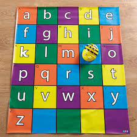

# Equipos

## [BeeBot](https://ro-botica.com/es/tienda/Bee-Bot/)

Alternativa open: [Escornabot](./escornabot.md)

## MakeBlock

Es un mecano con corazón de Arduino.

Programable con bloques

[Recursos](https://www.makeblock.es/soporte/robot-mbot/)

[Empezando con MakeBlock](https://programamos.es/conoce-la-interfaz-de-mblock-y-programa-los-primeros-pasos-de-tu-mbot/)

## micro:bit

## Kit de componentes

Si queremos comprar un kit de componentes de Arduino es muy importante que nos fijemos en la documentación que incluye: no nos va a servir de nada un kit repleto de componentes pero que no sabemos utilizar y que probablemente quemaremos si conectamos mal.

Existen algunas marcas que destacan por la buena calidad de su documentación cómo puede ser [Elegoo](https://www.elegoo.com/) o [Freenove](http://freenove.com/)

También debemos de fijarnos en el tipo de conexión que tienen los componentes que incluyen. Muchas veces nos encontramos kit que lo que incluyen son los componentes electrónicos y que o bien tenemos que soldar o bien necesitamos conocimientos de electrónica para utilizarlos.

En cambio, para los que empiezan se recomienda utilizar los llamados módulos, que son unas plaquitas dónde están soldados los componentes y con una conexión mucho más sencilla.

