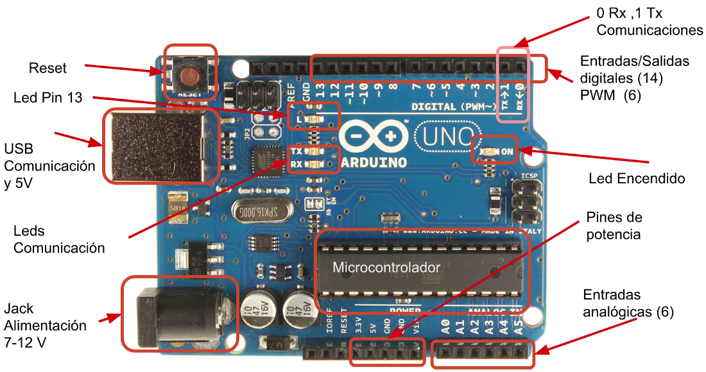
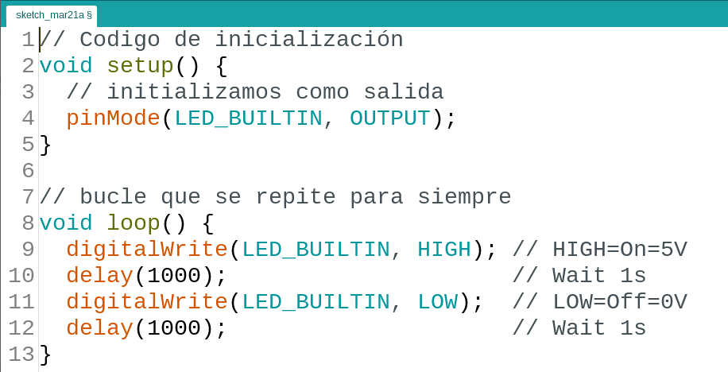
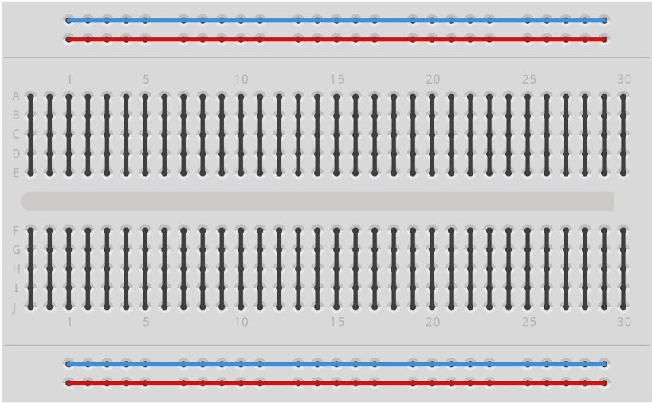
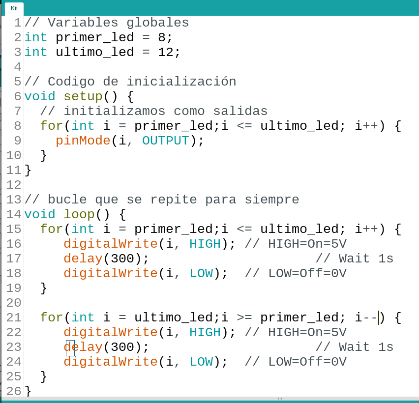
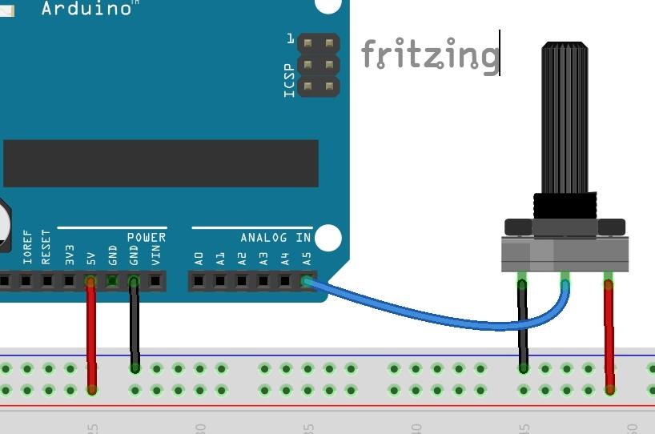
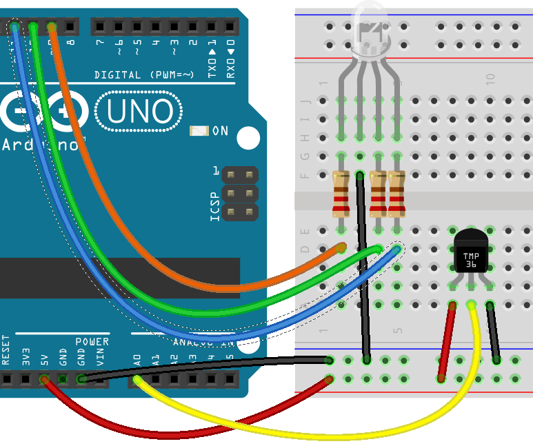

# Primera prueba

Ejemplo 1. Básicos - > Blink

    digitalWrite(pin_led,Estado); // Estado HIGH o LOW

### Programamos la placa

* Conectamos la placa con el cable USB

(instalación de driver en Windows) jiji

En el menú herramientas

* Seleccionamos el puerto
* Seleccionamos el tipo de placa
* Pulsamos el botón subir

## Código

Veamos el código ....

# Led en el pin 9

## ¡¡¡ Resistencia Siempre 

## Código para led en 9

## Cuidados

* Montaje sin alimentación
* Led tiene polaridad
* Resistencia de al menos 220 Ohmios

# Programamos C++

## Está preparado para que sea sencillo

## Ejercicio: Kit o Cylon

#### 5 leds (con sus 5 resistencias)

# No todo es digital

    analogWrite(pin_led,brillo); // brillo entre 0 y 255

(Es un truco llamado PWM)

0 ----- 100 %

0 ----- 255

Ejemplo - > 1.Basic - > FADE

# Leemos voltajes

    int valor = analogRead(pin_analogico);
    // valor entre 0 y 1023

Rangos de lectura

0 ------ 5V

0 ------ 1023

# Potenciómetro

Ejemplos -> 3. Analog -> AnalogInput

# Lo sensores igual

#### Convertiremos voltaje a magnitud física

### Ejemplo TMP36 o LM35

## LM35 - Montaje

## LM35 - Codigo

10 mV/C

by Luis Llamas [luisllamas.es](https://www.luisllamas.es/medir-temperatura-con-arduino-y-sensor-lm35/)

## Ejercicio:
### Ccontrolar brillo con potenciometro

#### Ejercicio: indicador de temperatura

* Leemos temperatura
* "Mapeamos" en brillo del led
* Usamos 2 leds (o led RGB) y
  * A más calor más rojo
  * A más frío más azul

#### Iindicador RGB temperatura

# Librerías

* Instalamos una librería
  * Gestor de librerías o Zip

* Usamos ejemplos
  * Servo -> Servo
  * Pantalla LCD - > LiquidCrystal
  * Sensor DHT - > SimpleDHT

