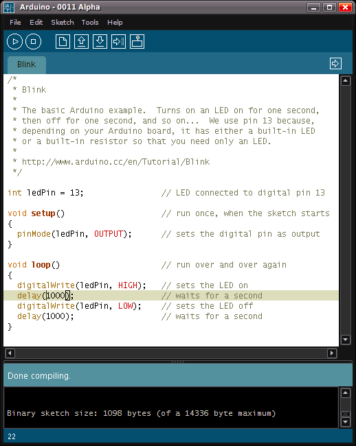
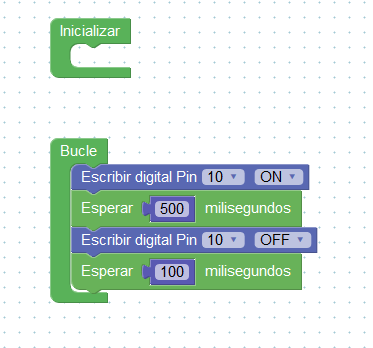
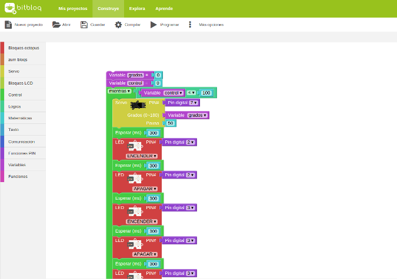

## Programación de Arduino

### Opciones de programación de Arduino

Veamos las diferentes opciones que tenemos para programar Arduino:

### Arduino IDE

[IDE Arduino](http://arduino.cc/en/Main/Software)|entorno multiplataforma que permite la edición, compilación y la programación de Arduino usando código.

### [ArduinoBlocks.com](http://www.arduinoblocks.com)

ArduinoBlocks es un entorno de programación visual por bloques que nos permite programar nuestra placa Arduino o compatible de forma sencilla, evitando la complejidad de las sentencias C++

Además nos permite programar nuestro Arduino sin instalar (prácticamente) nada en nuestro ordenador

Empezaremos seleccionando el tipo de placa Arduino que vamos a usar y a continuación añadiremos el hardware que usemos conectándolo a las patillas correspondientes.

Tiene la gran ventaja de incluye los bloques para multitud de componentes fácilmente identificables por sus imágenes.

Otra gran ventaja de ArduinoBlocks es que nos permite programar multitud de placas además de Arduino UNO (Mega, micro, nano, ... )  y hasta placas más modernas como nodeMCU o ESP8266

### BitBloq

[Bitbloq](http://bitbloq.bq.com/ "bitbloq") es un entorno de desarrollo visual basado en la programación con bloques. Es muy sencillo e intuitivo de usar y solo necesitamos el navegador para usarlo. Existen alternativas offline como Visualino.

Tiene el inconveniente de que soporta casi únicamente los componente que vende el fabricante Bq que es quien los ha creado

Además últimamente se ha parado bastante su desarrollo debido a los problemas de la empresa Bq.

### mBlocks

[mBlock](https://ide.mblock.cc/) es una plataforma de programación con bloques (aunque también permite trabajar con código) basada en Scratch que nos permite programar muchos tipos de placas, como Arduino y robots como los de makeBlocks. 

El que esté integrado dentro de Scratch permite hacer que nuestro hardware interaccione de manera sencilla con el programa en nuestro PC.

En este [vídeo](https://youtu.be/pg4lbbd4DK8) vamos ver qué entorno elegir según sean nuestros componentes.

[Vídeo: eligiendo el entorno de programación](https://youtu.be/pg4lbbd4DK8)

### CodeBender

[Codebender](http://codebender.cc "codebender") es un entorno de desarrollo totalmente basado en aplicaciones web, decir, sólo necesitamos un navegador web para poder desarrollar con Arduino. Permite la edición, compilación y la programación de Arduino. Podéis probarlo en [https://codebender.cc/](https://codebender.cc/)

