### Introducción a [ArduinoBlocks.com](http://www.arduinoblocks.com)


Para aprovechar todas las ventajas de ArduinoBlocks debes registrarte, pero si no quieres hacerlo puedes trabajar también en el modo de prueba. Las ventajas de estar registrado es que tus programas se guardan automáticamente en la nube, puedes compartirlos y además puedes usar más placas además de Arduino UNO

### Parpadeando el led interno

Vamos a empezar haciendo parpadear el led interno de la placa Arduino


ArduinoBlocks es un entorno de programación visual por bloques que nos permite programar nuestra placa Arduino o compatible de forma sencilla, evitando la complejidad de las sentencias C++

Además nos permite programar nuestro Arduino sin instalar (prácticamente) nada en nuestro ordenador

Empezaremos seleccionando el tipo de placa Arduino que vamos a usar (normalmente Arduino UNO) y añadimos los siguientes bloques para que produzca el parpadeo.


En este [vídeo](https://youtu.be/S5Bf6cmcDs8) vemos cómo subir el [programa](http://www.arduinoblocks.com/web/project/283245) a nuestra placa Arduino UNO.

Puedes utilizar el programa que he compartido haciendo clic en el siguiente enlace al [programa](http://www.arduinoblocks.com/web/project/174285)


##### Ejercicio: Cambiar la velocidad de parpadeo

#### Envío de datos al PC

La comunicación serie se produce vía USB entre Arduino y el PC, vamos a hacer un ejemplo en el enviamos información entre nuestra placa Arduino y el PC

Vamos a enviar "On" y "Off" al PC


En este [vídeo](https://youtu.be/zv9esePKoAo) vamos a ver cómo funciona y como ver los datos que intercambia PC y Arduino usando este [programa](http://www.arduinoblocks.com/web/project/283322)

Ahora abrimos la consola y vemos los mensajes

* Detectamos el puerto
* Configuramos la velocidad
* Necesitamos un programa para ver los datos

En todo momento podemos ver el código (pero no editarlo) desplegando la opción Bloques y pulsando **Ver Código**


### Parpadeando el led interno


ArduinoBlocks es un entorno de programación visual por bloques que nos permite programar nuestra placa arduino o compatible de forma sencilla, evitando la complejidad de las sentencias C++

Además nos permite programar nuestro arduino sin instalar (practicamente) nada en nuestro ordenador

Empezaremos seleccionando el tipo de placa Arduino que vamos a usar y a continuación añadiremos el hardware que usemos conectándolo a las patillas correspondientes.


[Programa](http://www.arduinoblocks.com/web/project/174285)

#### Ejercicio: Cambiar la velocidad de parpadeo

* * *

## Usando un led externo

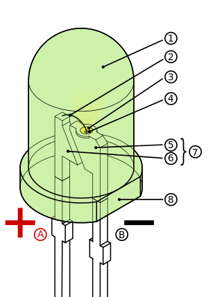

Montaje con placa prototipo

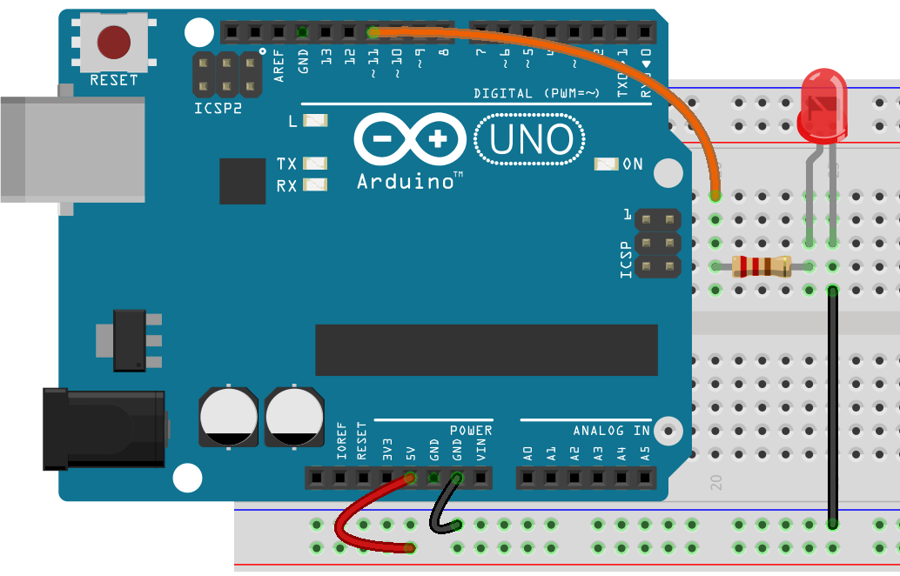

Internamente la placa de prototipo (protoboard) es así:

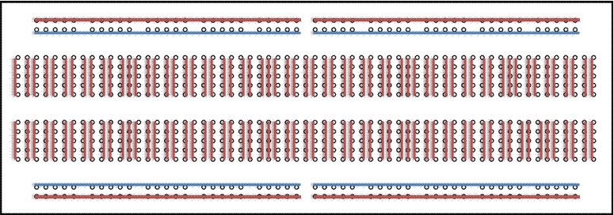

Ejercicio: Cambiar el pin utilizado al pin 7


### Esquema eléctrico


* * *

## Con un relé usaremos ¡¡grandes corrientes eléctricas!!

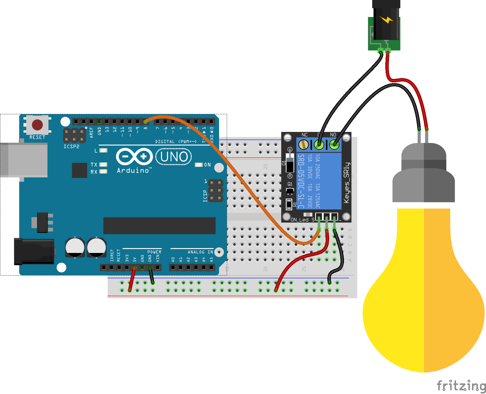


# Envío de datos serie

La comunicación serie se produce via USB entre Arduino y el PC

* Detectamos el puerto
* Configuramos la velocidad
* Necesitamos un programa para ver los datos

## Enviando "On" y "Off" al PC


[Programa](http://www.arduinoblocks.com/web/project/174290)

Ahora deberíamos seguir con semáforos, kit, (cylon) y esas cosas....


#### Usando un sensor DTH11


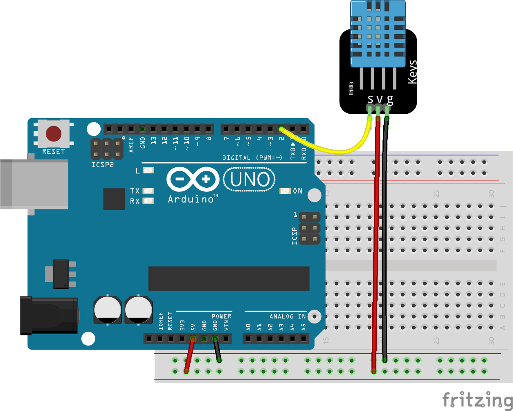


##### Ahora enviamos "Textos" y **Valores**


[Programa](http://www.arduinoblocks.com/web/project/174286)

### Termostato

 En función de la temperatura vamos a decidir si activar el elemento calefactor


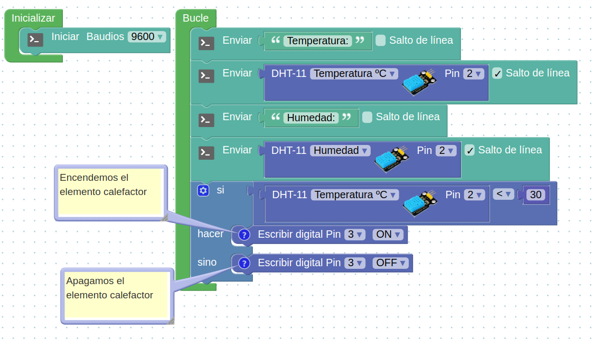

[Programa](http://www.arduinoblocks.com/web/project/174301)


Igual podíamos hacer con un sensor de líquidos y más preciso como es el ds18b20

[Programa](http://www.arduinoblocks.com/web/project/174308)

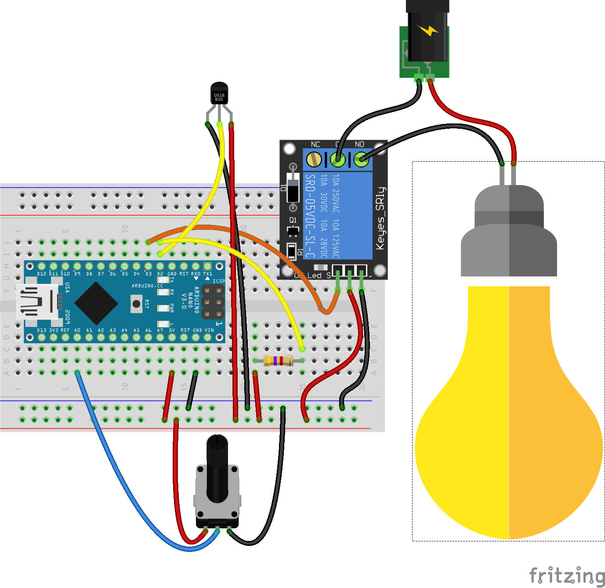


¿Cómo es que podemos usar esos sensores? : Librerías: conjunto de código empaquetado

Ejemplo: [lcd](http://arduino.cc/en/pmwiki.php?n=Reference/LiquidCrystal) o [servo](http://arduino.cc/en/pmwiki.php?n=Reference/Servo)

Para incluir una librería en código hacemos

```C++
#include <Libreria.h>
```

## Lectura de datos analógicos

Potenciómetro: resistencia variable (mando de volumen)

Se leen valores enteros entre 0 y 1023 que equivalen a los valores de 0V y 5V

#### Regulando la velocidad de parpadeo

Regulando el brillo

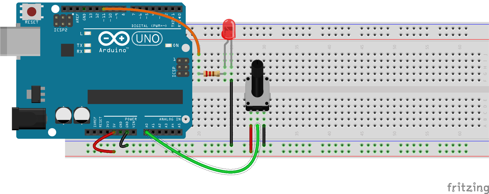

* * *

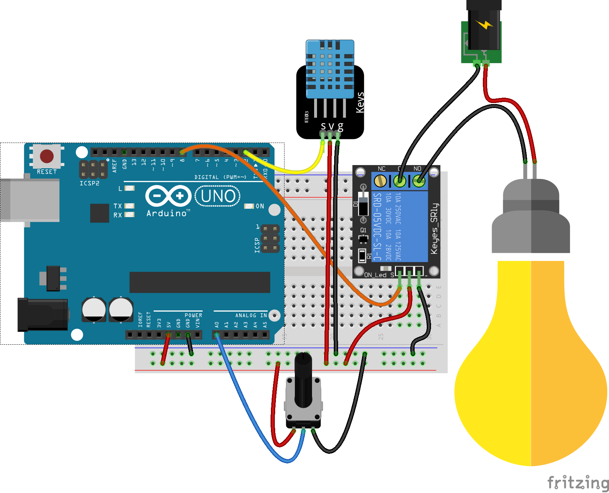


Vamos a utilizar nuestro potenciómetro para seleccionar la temperatura objetivo

En muchas ocasiones necesitamos hacer la transformación al rango que a nosotros nos interesa. Para simplificarlo usamos las funciones matemáticas **map**

Convertiremos (mapearemos) la medida de entre 0 y 100 a una temperatura entre 15 y 30º 


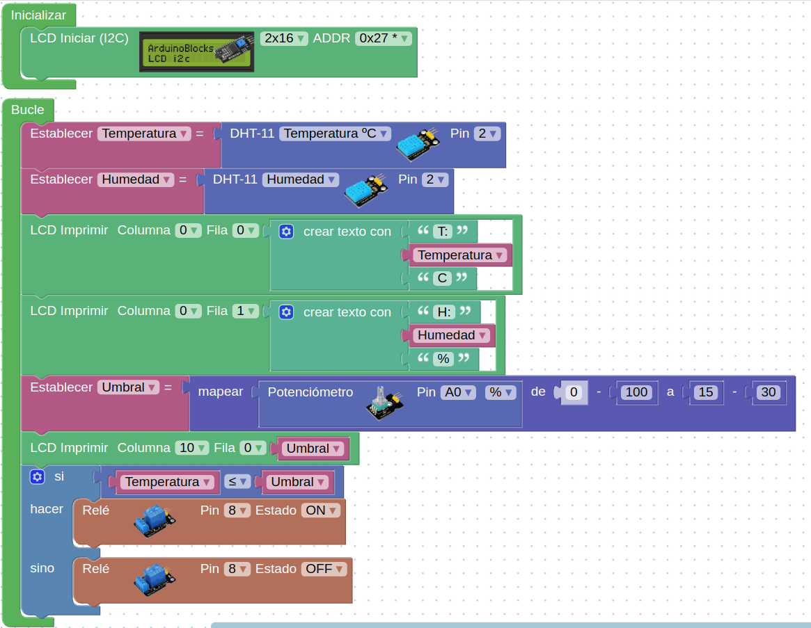

[Programa](http://www.arduinoblocks.com/web/project/174382)
[Programa v2](http://www.arduinoblocks.com/web/project/192734)

* * *
# Números decimales

Usaremos el tipo de variable float

### Ejemplo: Voltímetro
* Leemos el valor de un potenciómetro conectado a una entrada analógica (A0)
* Convertimos el valor (0-1023) a 0 - 5.0v
* Sacamos el valor por la consola serie

* Calibramos viendo los extremos y el valor intermedio 3.3V

```C++
const int analogInPin = A0;  // Entrada analógica
int sensorValue = 0;        // valor leído

void setup() {
    Serial.begin(9600);
}
void loop() {

    sensorValue = analogRead(analogInPin);   // leemos el valor analógico
    float voltios=(5.0*sensorValue) /1023;   // Lo convertimos
    Serial.print("sensor = " );                       
    Serial.print(sensorValue);    
    Serial.print(" = ");
    Serial.print(voltios);
    Serial.println("v");   
    delay(200);                     
}
```


* * *


# Pulsaciones: botones

## Montaje


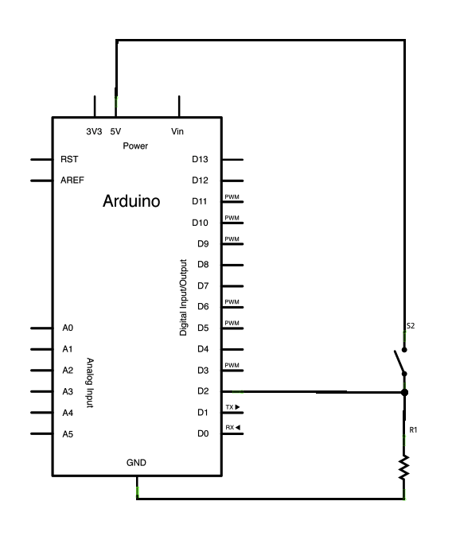


## Programa


### Usamos una sentencia condicional: si se cumple esto...se hace aquello


Código

```C++
void setup()
{
    pinMode(2,INPUT_PULLUP);  // Usamos 2 como entrada
    pinMode(13,OUTPUT);		// Usamos 13 como salida
}


void loop()
{
    if (digitalRead(2) == HIGH)  	// Si el pulsador está pulsado
    {
    digitalWrite(13,HIGH);		//Encendemos el led 13
    }
    else 							// Si NO se cumple
    {		
    digitalWrite(13,LOW);		// Lo apagamos
    }
}
```


# Funciones

Cuando tenemos un conjunto de instrucciones que se repiten a lo largo del código podemos hacer nuestro programa más simple creando una **Función**

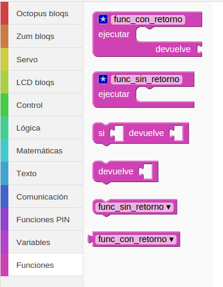

## Función:

Conjunto de instrucciones que empaquetamos en un bloque y que podemos llamar desde cualquier parte de nuestro código.

* Todas las funciones tienen 1 nombre que con el que se definen

* Una función puede devolver un valor a quien la llama o no

* A una función le podemos pasar un argumento, una variable que usará nuestra función para realizar su cometido


Podemos llamar a una función desde cualquier parte de nuestro código.

## Escritura de valores analógicos

Usando técnicas como PWM podemos simular valores intermedios: 0 - 255

Sólo funciona en algunos pines, en los marcados con el símbolo: **~** 

Como vamos a hacer que cambie de valor usaremos una variable

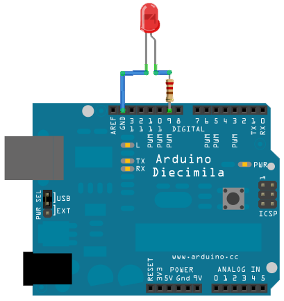


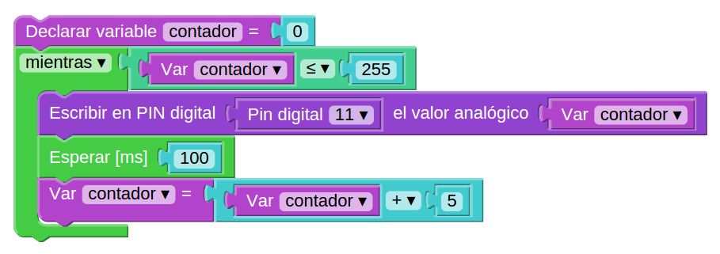

### Si vemos el código

	void setup()						// configuracion
	{
	  pinMode(11,OUTPUT);				// Usaremos la patilla 11 como salida

	}

	void loop()
	{
	  int contador=0;				// la variable valorSalida empieza en 0
	  while (contador <= 255) {		// Haremos el bucle hasta que lleguemos a 256
	    analogWrite(11,contador);		// pasamos el valor a la patilla 11
	    delay(100);						// Esperamos 0,1 segundos
	   }

	}

## Vamos a hacer ahora una subida y luego la bajada

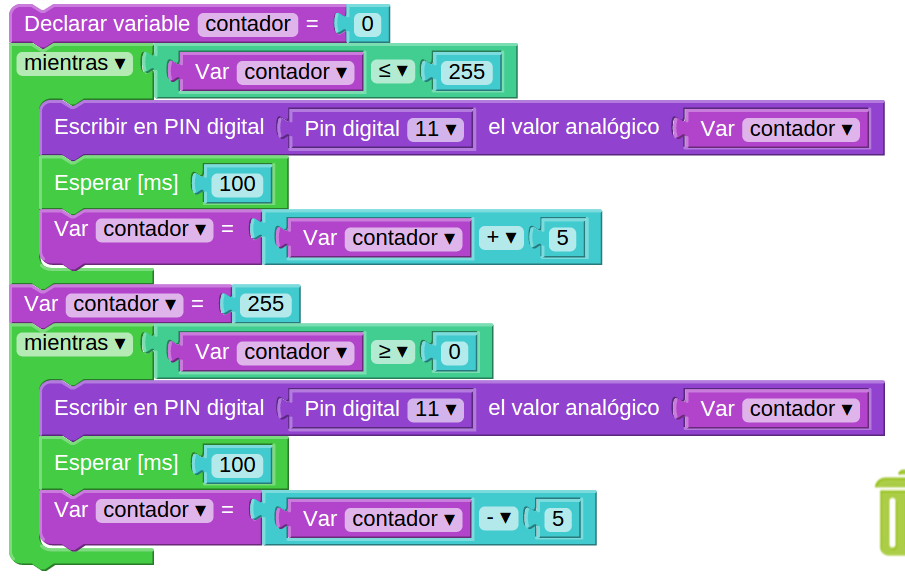

Es importante el dar un valor válido a la variable contador hasta de empezar a bajar

Ejercicio:Añade una línea para que veas el valor desde el PC.

Piensa en qué cambia si lo pones antes o después del incremento de la variable

## Usando leds de colores (RGB)

Internamente son 3 leds (Red,Green,Blue) con una de las patillas común:

* Positivo (Ánodo) Común


* Negativo (Cátodo) Común


## Tiras de leds

Necesitamos más potencia por lo que usaremos un transistor como amplificador.

El montaje es sencillo

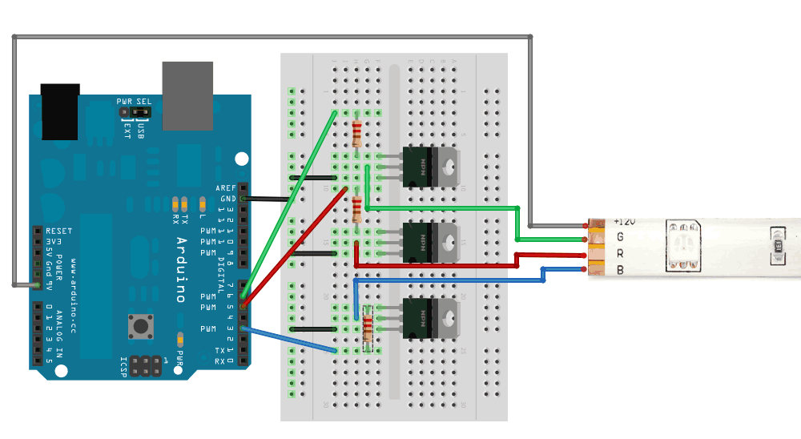

[Introducción a la electrónica](http://www.slideshare.net/javacasm/40-introduccin-a-la-electrnica)

Un simple transistor Mosfet nos permite controlar grandes potencias

#### Ejercicios: Combinando colores

Vamos a hacer combinaciones de colores.
Definiremos funciones con distintos colores y haremos una secuencia de colores. Cada función llamar
Es muy importante que seamos claros con los nombres de las variables para así no equivocarnos

* * *
# Potenciómetro regulando una salida analógica


### El código:

	void setup()
	{
	  pinMode(5,OUTPUT);
	}


	void loop()
	{
	  int valorPotenciometro=analogRead(0);				 	// Leemos el valor
	  int ValorSalida=map(valorPotenciometro,0,1023,0,255);	// Convertimos al rango de salida
	  analogWrite(5,ValorSalida);							// Escribimos el valor en la salida
	}

### Ejercicio: usar 3 potenciómetros para controlar los colores de un led RGB

El montaje sería:


Y el programa

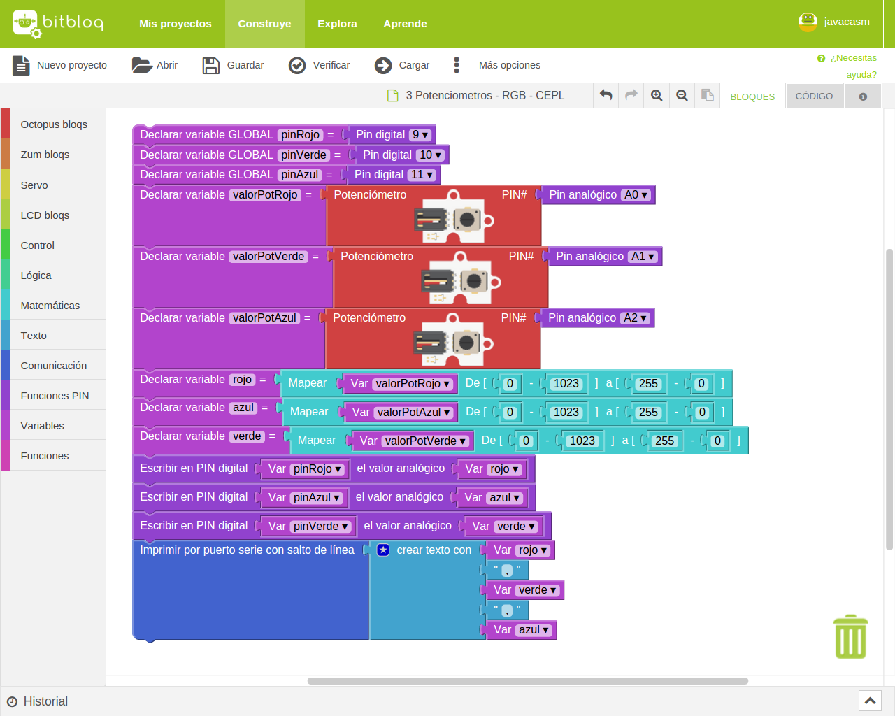

# Motores

Para controlar motores vamos a usar una placa especializada en ello. En concreto usaremos una [placa estándar basada en el chip L298](http://www.dfrobot.com/wiki/index.php?title=Arduino_Motor_Shield_(L298N)_(SKU:DRI0009))

Esta placa es capaz de controlar 2 motores.

Comentar el tema de alimentación y la forma de controlarlo ** Alimentación **

Esta placa, de tipo shield, se conecta encima de arduino y usa unos pines concretos:

|Entrada|pin|Utilidad|
|---|---|---|
|M1|4| Sentido de giro del motor 1|
|E1|5| Velocidad de giro del motor 1|
|E2|6| Velocidad de giro del motor 2|
|M2|7| Sentido de giro del motor 2|

## Programa

Hacemos el siguiente programa bitbloq

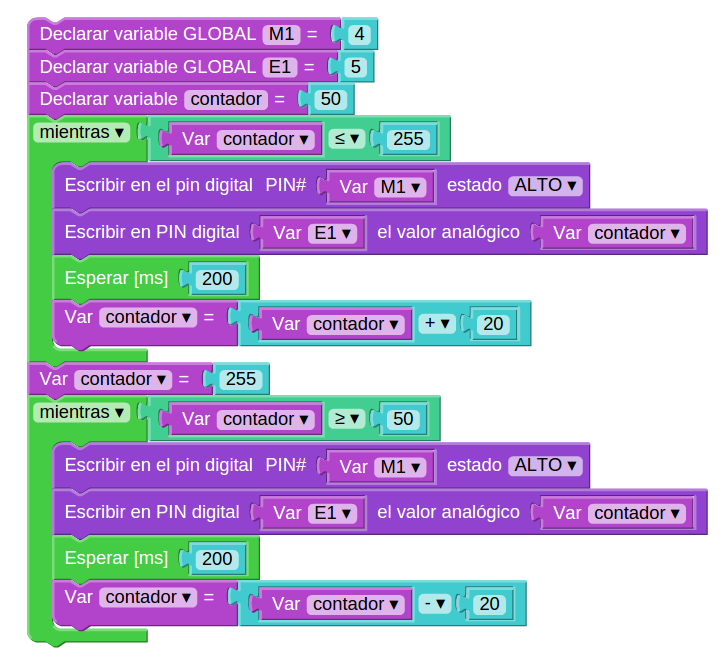

## Código


```C++
	//Arduino PWM Speed Control：
	int E1 = 5;  
	int M1 = 4;
	int E2 = 6;                      
	int M2 = 7;                        

	void setup()
	{
	    pinMode(M1, OUTPUT);   
	    pinMode(M2, OUTPUT);
	}

	void loop()
	{
	  int value;
	  for(value = 0 ; value <= 255; value+=5)
	  {
	    digitalWrite(M1,HIGH);   
	    digitalWrite(M2, HIGH);       
	    analogWrite(E1, value);   //PWM Speed Control
	    analogWrite(E2, value);   //PWM Speed Control
	    delay(30);
	  }  
	}
```

## Control de velocidad del motor

Vamos a controlar la velocidad y el sentido de giro con motores

(En el esquema no se ha puesto la placa L298 y se ha conectado directamente el motor a los pines de control 4 y 5)

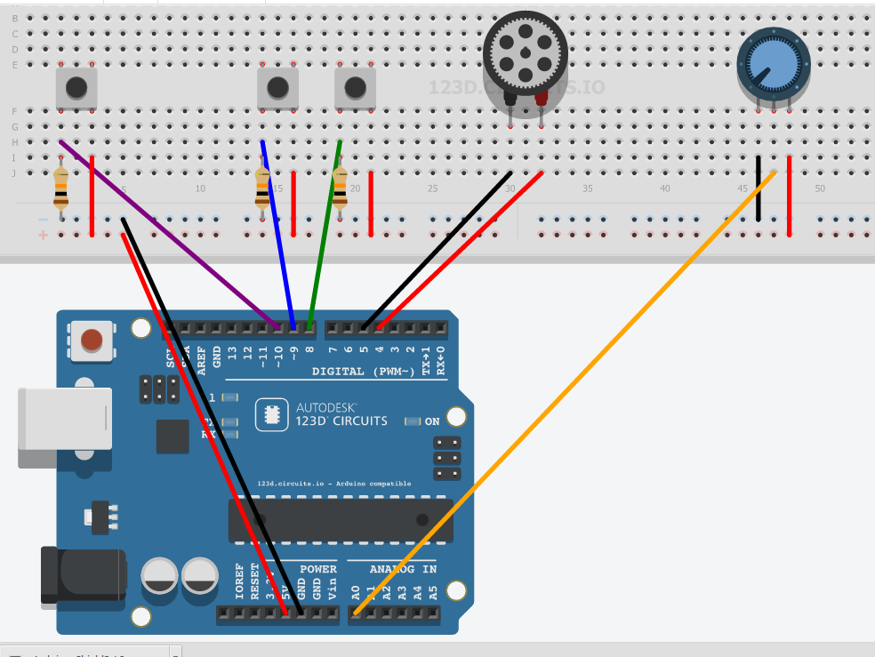

Una versión más complicada donde añadimos unos indicadores de la dirección

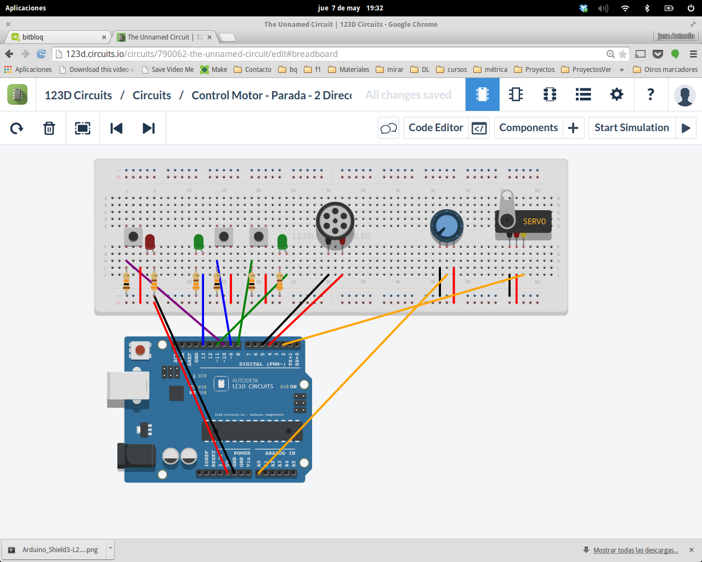

El programa sería

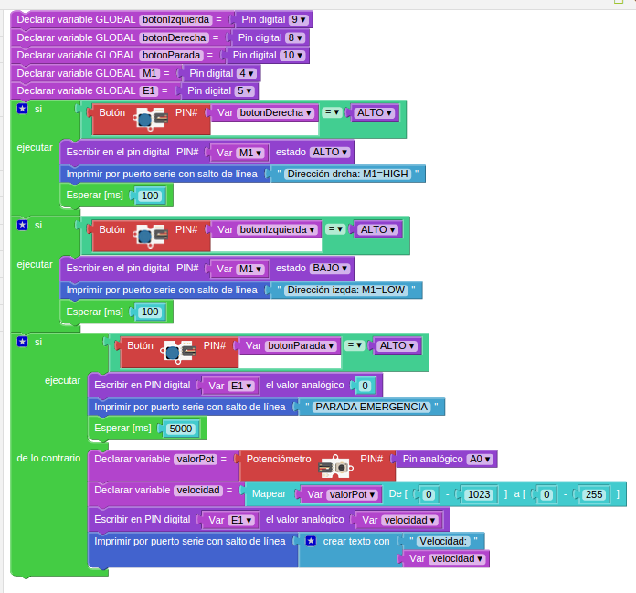


* * *
# Sensores

## Para los sensores tenemos que seguir los pasos

* Haremos la lectura
* Conversiones: traducimos a valores físicos (aritmética/mapeo) según el fabricante
* Calibraciones: establecemos valores de referencia

[Introducción a la electrónica](http://www.slideshare.net/javacasm/40-introduccin-a-la-electrnica)

[Sensores](http://www.slideshare.net/javacasm/46-sensores)


# Medidas con sensores

Podemos pensar en los sensores como un circuito externo que tenemos que alimentar conectando a 5v y GND (divisor de tensión)


Estudiar el comportamiento con la luz


# LDR (célula fotoeléctrica)

Ejemplo: activaremos un led al pasar de determinado nivel de luz


## Activación de led por umbral de luz

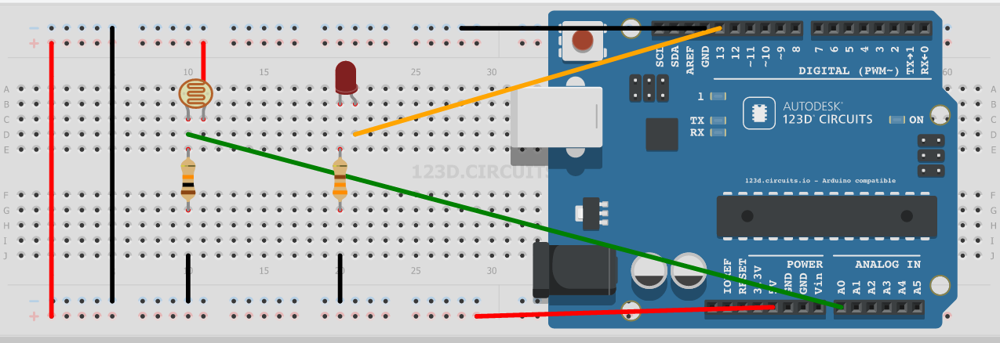

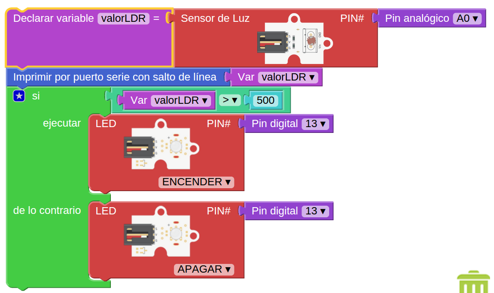

## Regular el nivel con un potenciometro.  Documentarlo.

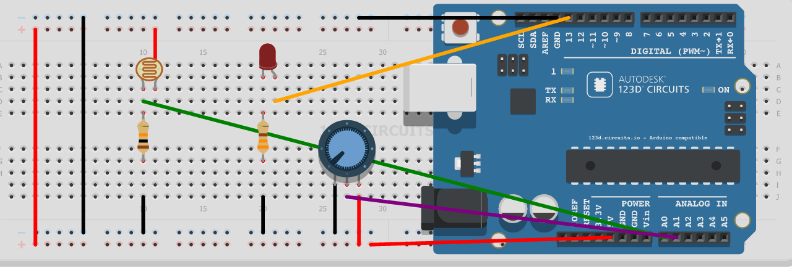

## Seguidor solar

Vamos a añadir ahora un segundo LDR. Esto nos permitirá simular un seguidor solar: compararemos los valores de los dos LDR, moviendo el servo en la dirección del que más luz recibe

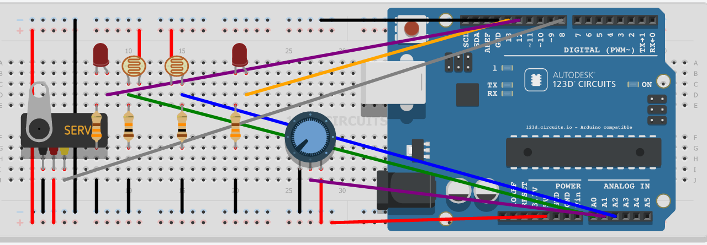

El programa sería este:

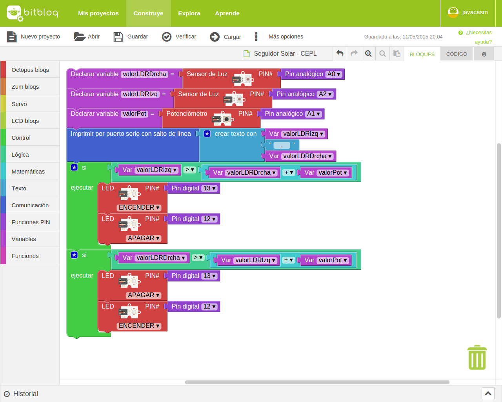

***

<!-- background: #184bc6-->
<!-- color: #fff -->
<!-- font: centurygothic -->
# Termistor (sensor de temperatura)
[Documentación del kit](http://www.seeedstudio.com/wiki/Sidekick_Basic_Kit_for_Arduino_V2#Thermistors)  

[foros](http://www.seeedstudio.com/forum/viewtopic.php?f=16&t=2117&p=14846&hilit=thermistor#p14846)  

[fabricante](http://www.seeedstudio.com/forum/download/file.php?id=1345)

[Ejemplo 1](http://playground.arduino.cc/ComponentLib/Thermistor)

[Ejemplo 2](http://playground.arduino.cc/ComponentLib/Thermistor2)


* * *
# Sensor de temperatura LM35: viene calibrado y linealizado


## Usamos la fórmula del fabricante

	temperatura = valorAnalogico*5*100/1024

[pinout lm35](./images/tmp36pinout.gif)

* * *
## El código quedaría así:

### Enviaremos el dato leído al pc con la función __Serial__

	int sensorPin=A0;

	void setup()
	{
		Serial.begin(9600);  // Configuramos la conexión
	}

	void loop()
	{
		int sensorValue= analogRead(sensorPin);  // Leemos el valor analógico
		float temperatura=(sensorValue*5*100)/1024; // float para tener decimales
		Serial.println(temperatura);			// Enviamos el dato al PC
		delay(1000);
	}


* * *


* * *
# Servo

### Los servos son motores capaces de mantener una posición angular.
### Se les dice él ángulo que deben formar

##### (también hay servos que pueden girar todo lo que quieran)

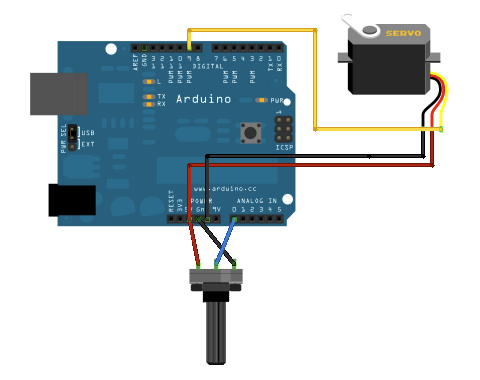

* * *

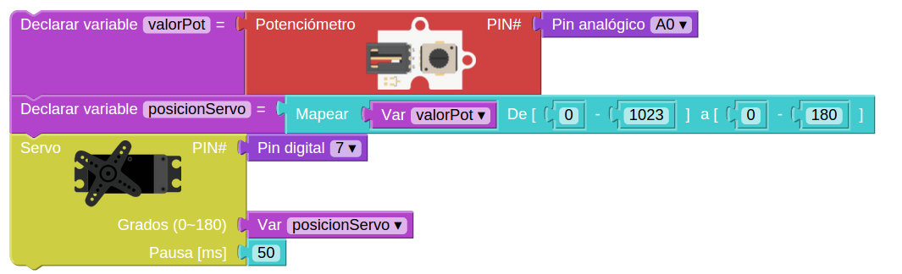

### El código

```C++
#include <Servo.h>  // Incluimos la librería

Servo servo;       // Declaramos que vamos a usar 1 servo

void setup()
{
    servo.attach(7); // Configuramos el servo conectado al pin 7
}


void loop()
{
    int valorPotenciometro=analogRead(A0); 					// Leemos el potenciometro
    int PosicionServo=map(valorPotenciometro,0,1023,0,180);	// Reescalamos el valor
    servo.write(valorPotenciometro);							// Le pedimos que gira hasta ese ángulo
    delay(50);												// Le damos tiempo para que complete el giro

}
```
## Oscilación servo

Podemos utilizar un bucle para hacer que el servo oscile entre las posiciones extremas

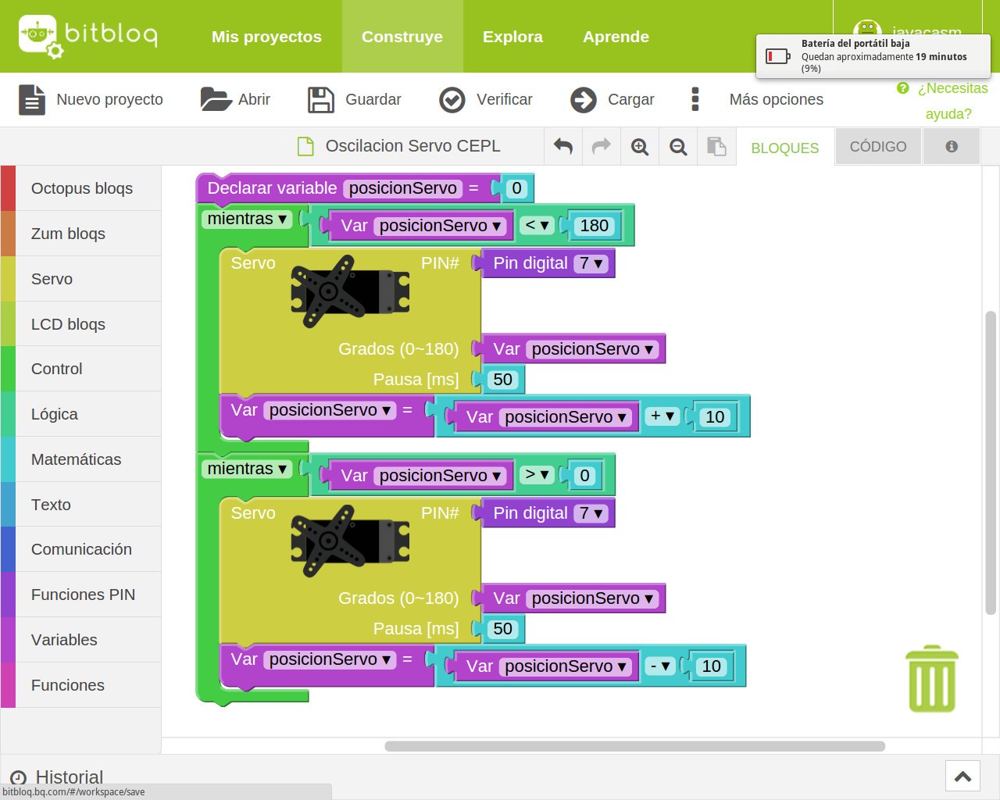

#### [Más sobre servos](http://www.slideshare.net/javacasm/arduino-prctico-servos)

* * *

# LCD


### Existen varias librerías:

* [Librería LCD MF](https://bitbucket.org/fmalpartida/new-liquidcrystal/wiki/Home)
* [Ejemplos lcd](http://arduino-info.wikispaces.com/LCD-Blue-I2C#v3)
* [Ejemplo bq](http://diwo.bq.com/programando-lcd/)

### Usaremos lcd I2C

* Descargamos de su [origen](http://www.4tronix.co.uk/arduino/sketches/LiquidCrystal_V1.2.1.zip)
* Descomprimimos en la carpeta **arduino/libraries**

### Montaje


### Código

	#include <Wire.h>
	#include <LiquidCrystal.h>

	LiquidCrystal lcd(0x27);  // El fabricante nos debe decir la dirección

	void setup()
	{
	  lcd.begin(16, 2);  //Geometria del lcd
	  lcd.clear();

	}


	void loop()
	{
	  lcd.setCursor(0,0);  		// Nos movemos a la posición
	  lcd.print("Hola Mundo");	// Mostramos un texto

	}

* * *
# Proyecto: termostato configurable y que activa un relé

[Proyecto 1](https://arduinolab.wordpress.com/)
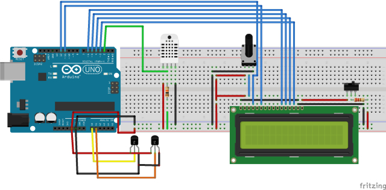

[Proyecto 2](http://www.electroschematics.com/8998/arduino-temperature-controlled-relay/)


## Veamos los componentes:

* Sensor lm35 conectado a A0
* Potenciómetro conectado a A1
* Relé conectado a D7
* LCD conectado a A4 y A5

## Programa

Comparamos el valor leido del potenciómetro con el leído del potenciómetro.
Si este es máyor activamos el relé
Mostramos en el lcd la temperatura actual


