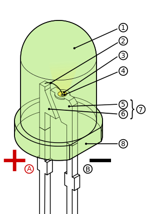
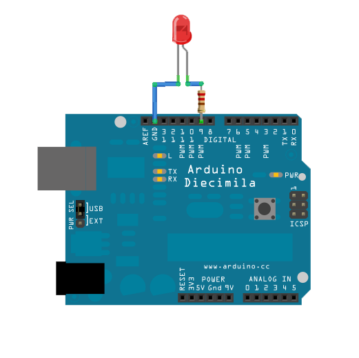
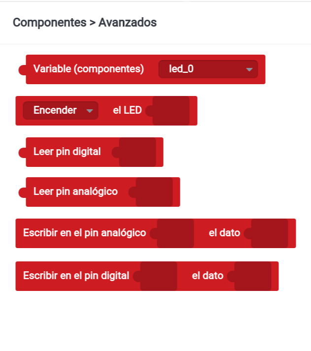

### Introducción a la programación con Bitbloq

Bitbloq es un entorno de programación visual por bloques que nos permite programar nuestra placa Arduino o compatible de forma sencilla, evitando la complejidad de las sentencias C++.

Podemos acceder directamente desde su web <http://BitBloq.bq.com/>

Como verás cuando entres a su página, funciona con Chrome en todos los sistemas operativos, y el se encarga de avisarte si necesitas drivers o cambiar algo en tu sistema.

(Pudiera ocurrir que algunos vídeos se usa la versión anterior, que era la recomendada hasta hace poco ...)


A lo largo de estos vídeos veremos algunas de sus características más importantes. Puedes encontrar más tutoriales en la página [oficial de BitBloq](http://diwo.bq.com/tag/bitbloq/)

Veamos un ejemplo sencillo:


[](https://youtu.be/rOdMRhhQTUs)

[Vídeo de ejemplo básico](https://youtu.be/rOdMRhhQTUs)

Desde el entorno podemos transferir el programa a la placa

[](https://youtu.be/gMe2YDgUUQE)

[Vídeo "Transfiriendo el programa BitBloq a Arduino"](https://youtu.be/gMe2YDgUUQE)

## Con led externo



### Montaje con placa prototipo


### Esquema eléctrico

![led externo]./images/ExampleCircuit_sch.png)


## Con un relé usaremos ¡¡grandes corrientes eléctricas!!

![rele]./images/relee_arduino.jpg)

![Danger]./images/Dangers-of-electric-shock.jpg)

Bitbloq nos permite programar nuestro Arduino sin instalar (prácticamente) nada en nuestro ordenador. Sólo tenemos que pulsar sobre el botón cargar lo que hace que se compile el código, se detecte la placa y se envíe el programa a nuestro Arduino


[](https://youtu.be/cg1YNVSprdo)

[Vídeo "Cómo ver código C++ de un programa BitBloq"](https://youtu.be/cg1YNVSprdo)


Desde BitBloq siempre podemos ver el código Arduino generado. De momento no podemos modificar este código pero si copiarlo y llevarlo al IDE de Arduino

## Sentencias de control

[](https://youtu.be/dakh7MTxpBg)

[Vídeo sobre sentencias de control ](https://youtu.be/dakh7MTxpBg)


Las sentencias de control son aquellas que nos permite modificar el orden o el modo en el que se ejecutan los bloques de nuestro programa.

##### Variables

Para utilizar las sentencias de control necesitaremos el concepto de variables: que no es otra cosa que un lugar donde almacenar un valor que puede se modificar si así lo queremos

[](https://youtu.be/Os-8oHBKsQU)

[Vídeo sobre variables](https://youtu.be/Os-8oHBKsQU)


Con las variables podemos realizar operaciones matemáticas

[](https://youtu.be/nvRUCZERScE)

[Vídeo sobre operaciones con variables](https://youtu.be/nvRUCZERScE)


### Sentencias de control

Vamos a ver las sentencias de control que nos van a permitir decidir cómo se van ejecutando las órdenes de nuestro programa, si se repiten, si se ejecutan en función de una u otra razón

[](http://youtu.be/0Af8VdF6h24)

[Vídeo sobre sentencias de control](http://youtu.be/0Af8VdF6h24)

### Bucle **for**

Empezamos por la sentencias **for** que nos va a permitir decir que una parte de nuestro programa se repita un número determinado de veces.

[](https://youtu.be/mIAgTdc4oC8)

[Vídeo sobre bucle for](https://youtu.be/mIAgTdc4oC8)


Necesitamos declarar una variables que actuará como contador y definir el valor inicial que tendrá la variable y el final, realizándose tantos como pasos como valores enteros haya entre ambas.

### Bucle **while**

También podemos decidir que se repitan unas sentencias en función de una determinada condición usando la sentencia **while**

[](https://youtu.be/RVcaaz1NYjk)

[Vídeo bucle While](https://youtu.be/RVcaaz1NYjk)


Usaremos la sentencia de control **while** para los bucles donde el número de veces que se repite no está definido desde el principio

### Bloque **if** : sentencias condicionales

Una sentencia condicional permite decidir si se ejecutan o no determinadas órdenes

[](http://youtu.be/dXpDCOzsO2U)

[Vídeo sobre sentencias condicionales](http://youtu.be/dXpDCOzsO2U)


[](https://youtu.be/RTtn_77pZY4)

[vídeo sentencias if](https://youtu.be/RTtn_77pZY4)


Las sentencias condicionales permiten ejecutar un código y otro según se cumpla o no una determinada condición. Esta condición será una validación que definiremos con operandos.

Podemos hacer que en caso de que se cumpla se ejecute un código (es el bloque if) y en caso de que no se cumpla la condición se ejecute otro (bloque else). Veamos un ejemplo

[](https://youtu.be/-f_htl5TQN8)

[vídeo: condicionales](https://youtu.be/-f_htl5TQN8)


### Condicionales-complejas

[](http://youtu.be/en_Y-_wVyO0)

[vídeo: condiciones complejas](http://youtu.be/en_Y-_wVyO0)


La condición que determina si se ejecuta un bloque u otro o si salimos de un bloque while puede contener varias comprobaciones.

Entre estas condiciones utilizaremos operadores lógicos que pueden ser AND o OR.

- Estas condiciones se tendrán que cumplir todas en el caso del operador AND.

- Con que se cumpla una de ellas se dará por válida toda la condición.

### Envío de datos al pc

En el siguiente Vídeo vamos a ver cómo enviar información entre Arduino y el PC usando Bitbloq

[](http://youtu.be/uAy_reYl8_Y )

[Vídeo: comunicacion serie](http://youtu.be/uAy_reYl8_Y )

[](https://youtu.be/hy9t76RLeBU)

[Vídeo enviando datos al PC](https://youtu.be/hy9t76RLeBU)


Podemos enviar contenidos entre nuestra placa y el PC usando las sentencias de comunicaciones. Usaremos print para enviar algo (puede ser el valor de una variable o un texto) al PC o println para enviar y pasar a la siguiente línea.

### Variables locales vs variables globales

En el siguiente vídeo hablamos sobre los diferentes tipos de variables dentro de un programa

[](https://youtu.be/U3ulo7rAE58)

[Vídeo: tipos de variables](https://youtu.be/U3ulo7rAE58)


Podemos definir variables locales o globales. Una variable global estará definida y por tanto mantendrá su valor en todo el programa, mientras que una variable local solo se definirá donde se haya declarado.

Las variables globales mantienen su valor entre las distintas iteraciones que se realizan del programa.

#### Creando bucles sin sentencias de control

Podemos usar la forma cíclica (y unas variables globales) en la que se ejecutan los programas en Arduino para hacer un bucle sin más estructuras de control que una simple variable global


## Leer valores analógicos

Cuando añadimos un sensor analógico podemos leer su valor con un nuevo componente


Podremos utilizar ese valor que estará entre 0 y 1023

Su código:

	int led10 = 10;
	int potenciometro = A0;

	void setup() {
	    pinMode(led10, OUTPUT);
	    Serial.begin(9600);
	}

	void loop() {
	    digitalWrite(led10, HIGH);
	    Serial.println("Encendido");
	    delay(analogRead(potenciometro));
	    digitalWrite(led10, LOW);
	    Serial.println("Apagado");
	    delay(analogRead(potenciometro));
	}


## Escritura de valores analógicos

Usando técnicas como PWM podemos simular valores intermedios: 0 - 255

Sólo funciona en algunos pines, en los marcados con el símbolo: **~** 

Como vamos a hacer que cambie de valor usaremos una variable





### Si vemos el código

```C++
	void setup()						// configuracion
	{
	  pinMode(9,OUTPUT);				// Usaremos la patilla 5 como salida
	  Serial.begin(9600);				// Configuramos la conexión con el PC
	}

	void loop()
	{
	  int valorSalida=0;				// la variable valorSalida empieza en 0
	  while (valorSalida < 256) {		// Haremos el bucle hasta que llegemos a 256
	    analogWrite(9,valorSalida);		// pasamos el valor a la patilla 5
	    Serial.println(valorSalida);	// Enviamos al pc la variable
	    delay(100);						// Esperamos 0,1 segundos
	   }

	}
```


## Usando leds de colores (RGB)

Internamente son 3 leds (Red,Green,Blue) con una de las patillas común:

* Positivo (Ánodo) Común


* Negativo (Cátodo) Común


## Tiras de leds

Necesitamos más potencia por lo que usaremos un transistor como amplificador.

El montaje es sencillo


[](https://youtu.be/hy9t76RLeBU)

[Vídeo: Envío de datos al PC](https://youtu.be/hy9t76RLeBU)


Podemos enviar contenidos entre nuestra placa y el PC usando las sentencias de comunicaciones. Usaremos print para enviar algo (puede ser el valor de una variable o un texto) al pc o println para enviar y pasar a la siguiente línea.

[](https://youtu.be/nChCA1Qc0uo)

[Vídeo: Entradas analógicas](https://youtu.be/nChCA1Qc0uo)


[](https://youtu.be/U3ulo7rAE58 )

[Vídeo: Variables locales vs Variables globales](https://youtu.be/U3ulo7rAE58 )


Podemos definir variables locales o globales. Una variable global estará definida y por tanto mantendrá su valor en todo el programa, mientras que una variable local solo se definirá donde se haya declarado.

Las variables globales mantienen su valor entre las distintas iteraciones que se realizan del programa.

## Ejemplo de bucle sin sentencias de control ???


Podemos usar la forma cíclica (y unas variables globales) en la que se ejecutan los programas en Arduino para hacer un bucle sin más estructuras de control que una simple variable global

### Sonido

En bitbloq existen 2 formas de generar sonidos

* Reproducir notas musicales: podemos escoger la nota que vamos a reproducir y su duración


* Si pulsamos en la opción de "Avanzados" veremos que podemos usar bloques donde seleccionar la frecuencia exacta que queremos reproducir y su duración.

 


## Entradas y salidas digitales

Veamos como podemos usar las entradas y salidas digitales

[](https://youtu.be/GmvUamkeG4Y)

[Vídeo: entradas y salidas digitales](https://youtu.be/GmvUamkeG4Y)


Veamos ahora como activar un led al pulsar un botón. Para ello añadiremos un botón y un led en el apartado del hardware


[](https://youtu.be/nChCA1Qc0uo)

[Vídeo: Lectura de entradas analógicas](https://youtu.be/nChCA1Qc0uo)


## Servos

Para usar la librería Servo con bitbloq podemos usar los bloques Servo. Existen 2 tipos de servos: los de rotación continua y los normales.


Puedes encontrar más tutoriales en la página [oficial de bitbloq](http://diwo.bq.com/tag/bitbloq-2/)
