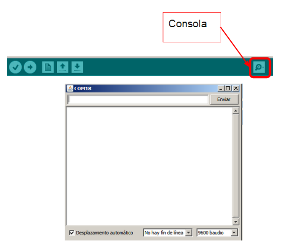
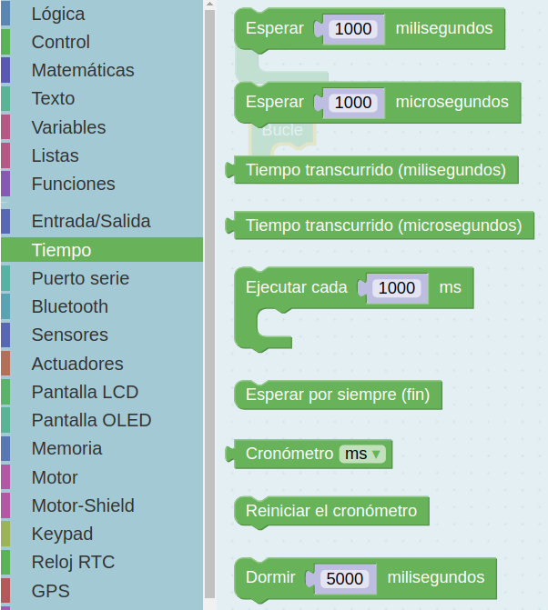
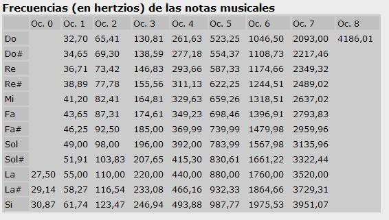
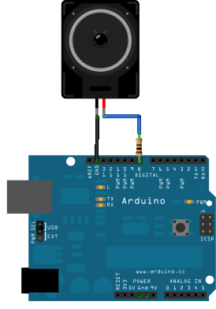
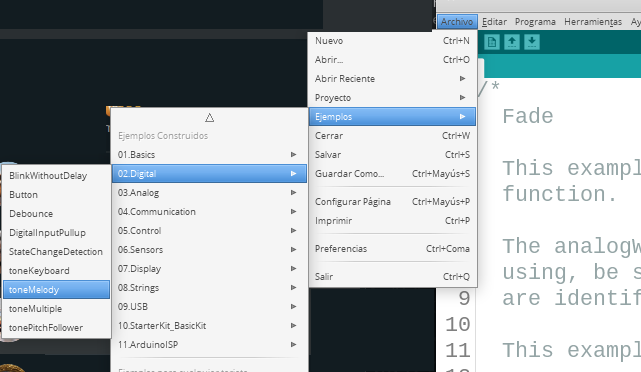
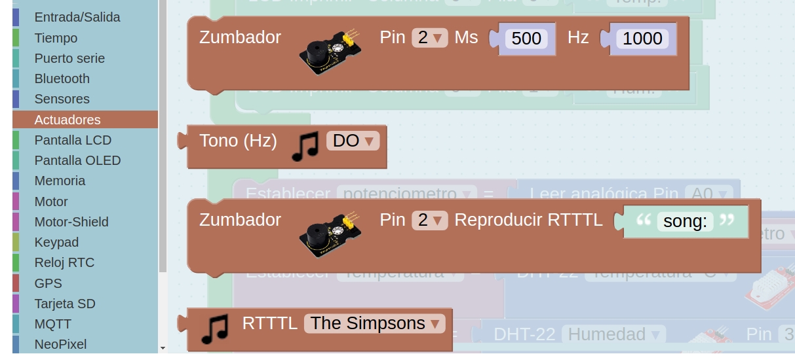
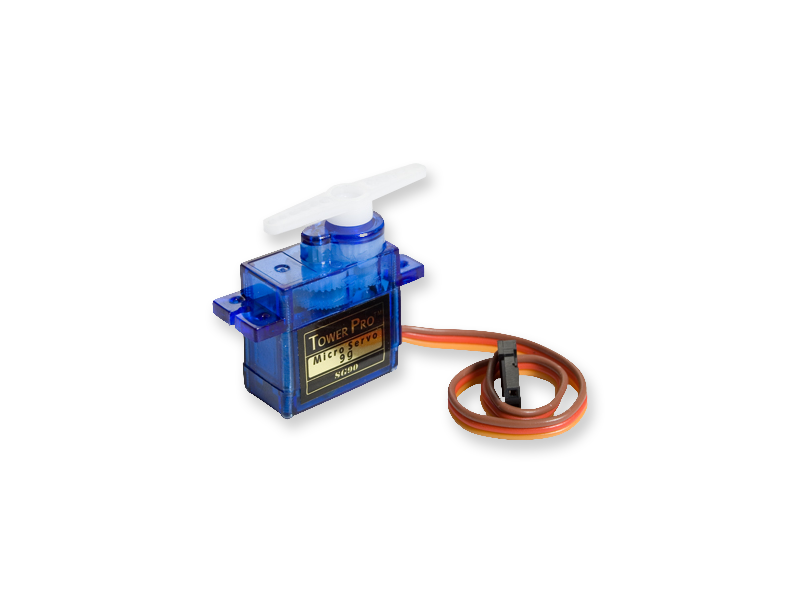
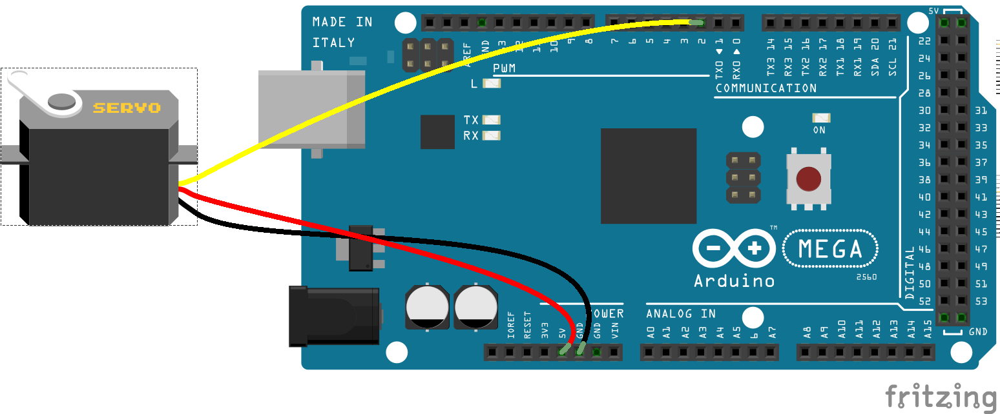
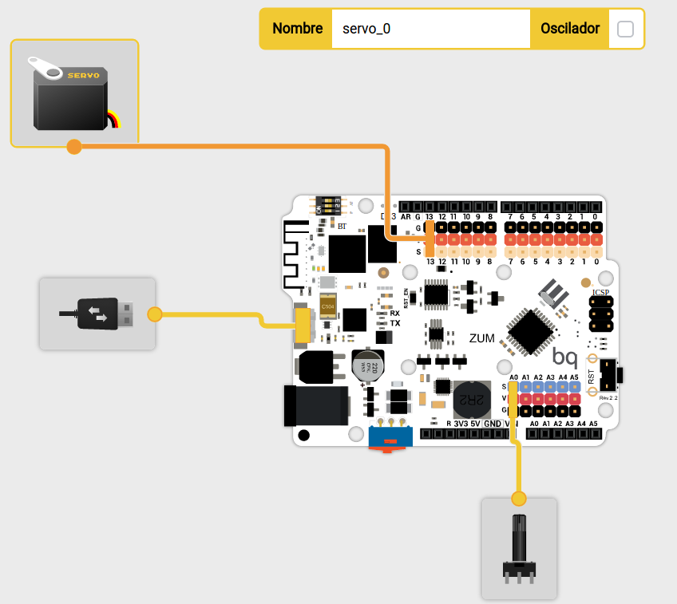
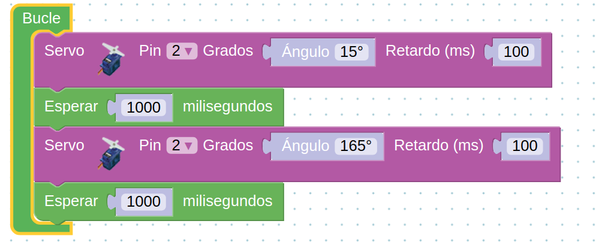

### Usando el IDE de Arduino

 

El Entorno de Programación Integrado (IDE) de Arduino es sencillo y a la vez potente, incluyendo casi todas las funcionalidades que uno espera de un IDE actual.

Es un IDE multiplataforma, estando disponible para descargar directamente para Windows, Linux y MaxOS. Al ser una herramienta de código libre podemos descargar también el código fuente para compilarlo.

Está desarrollado en Java y deriva del IDE de Processing y de Wiring.

Ha sido diseñado teniendo en mente que sus usuarios no son expertos desarrolladores y que lo esencial es que los recién llegados sean capaces de familiarizarse con él.

Incluye un editor de código que resalta la sintaxis, indicando cuando es correcta, indicando si las llaves están bien emparejadas y organizando el código de forma clara.

Además el entorno incluye todo lo necesario para compilar y descargar las aplicaciones al microcontrolador, sin necesidad de que el usuario conozca la complejidad de este proceso.

El entorno viene con una librería llamada Wiring (procedente de dicho proyecto) que facilita el programar pensando en las entradas y las salidas.

El código que se desarrolla es C/C++, aunque el usuario solo incluye las funciones **setup** y **loop**

Usaremos las versión 1.8.12 (o superior si se actualizara)

#### Instalación del entorno

[Descarga del tutorial de instalación](https://drive.google.com/file/d/1yIsnzA4-WWONr2s-3fD58h0HnHzaARYt/view?usp=sharing)

#### Descargando el programar a Arduino

Vamos a comenzar viendo paso a paso una descarga de un programa a Arduino.

Intentaremos hacer una lista paso a paso para poder detectar errores en el caso de que se produzcan

[Enlace para descarga: Primeras pruebas con Arduino](https://drive.google.com/file/d/15zHSVEUj-ouiWezT7ULY0VgD4JQOQ4Fz/view?usp=sharing)

En el siguiente vídeo podemos ver el paso a paso de la descarga de un programa a una placa Arduino

### Comenzando a programar con Arduino

#### Comenzando a programar

Como hemos visto podemos encontrar multitud de ejemplos en el propio IDE de Arduino, de ellos podemos aprender la sintaxis y las posibilidades que el entorno tiene.

Vamos a hacer unos ejemplos nosotros que sin entrar en detalles técnicos nos van a permitir ir haciéndonos con el entorno.

### Programa con contador

Introducimos el siguiente programa en el entorno. En el se irá incrementando la variable _i_ y se enviará su valor al pc por el puerto de comunicaciones.

    void setup(){
      Serial.begin(9600);
    }

    int i=0;
    void loop() {
      Serial.print("hola ");
      Serial.println(i);
      i=i+1;
    }

Vamos a analizar el programa:

-   Todos los métodos que empiezan con Serial, se refieren a comunicaciones con el pc, en la línea **Serial.begin(9600)** estamos diciendo que vamos a iniciar (**begin**) las comunicaciones a una     velocidad de **9600bps** (baudios o bits por segundo). **Serial.print** lo que lleva a continuación al PC. Si utilizamos **println** le estamos indicando de  después de imprimir salte a la siguiente línea.
-   Sabemos el método **setup** se ejecuta sólo al principio una vez para configurar todo. El método **loop** en cambio se ejecuta de forma repetitiva, con lo que el resultado será que nuestra variable **i** se va incrementando a cada paso en una unidad (podíamos haber abreviado el programa sustituyendo la linea **i=i+1;** por **i++** que significa lo mismo pero es más corta de escribir (los programadores de C tienen la tendencia hacer su código cuanto más corto mejor, no siempre atendiendo a la claridad...)

Descargamos el programa

después de haber comprobado que tenemos bien seleccionado nuestro modelo de placa y el puerto donde está conectada. Una vez descargada, abrimos la consola serie para ver el resultado

Cuidando de que la velocidad seleccionada será la misma que hemos indicado en el programa

Veremos como se producen una sucesión de línea con el texto "hola 1...."

En BitBloq hacemos el siguiente programa

## Tiempos

Podemos ver las líneas se suceden a toda velocidad en el programa anterior. Ahora mismo el micro está funcionando todo lo rápido que puede (la única limitación es la velocidad a la que se envían datos al pc)

Para introducir una pausa podemos usar las funciones **delay** y **delayMicroseconds**. Veamos su uso

-   **delay(milisegundos)**: espera el número de milisegundos indicado
-   **delayMicroseconds(microsegundos)**: espera los microsegundos     indicados El número máximo que soporta es 16383 microsegundos

Así con solo introducir la siguiente línea detrás del incremento de la
variable i, conseguiremos que el programa se retrase

    delay(1000);

Ya que estamos hablando de tiempo veamos que otras funciones tiene
Arduino relacionadas con el mismo:

- **long millis()** : devuelve el número de milisegundos desde que se  encendió la placa. Se vuelve a poner a cero cada 50 días aproximadamente.
- **long micros()** : devuelve el número de microsegundos desde que se  encendió la placa. Se vuelve a poner a cero cada 70 minutos aproximadamente. **Tiene una resolución de 4 microsegundos.**

Con todo esto vamos a hacer un programa que envíe cada segundo el número de milisegundos que han pasado desde la ultima iteración. Intenta hacer el programa por ti mismo

Quedaría algo así:

    void setup(){
      Serial.begin(9600);
    }

    long mAnteriores; // Lo usaremos para almacenar el valor anterior

    void loop() {
      long mActuales=millis(); // leemos el valor actual de millis

      Serial.println(mActuales-mAnteriores);
      // restamos el anterior del actual y esos son los que han pasado

      mAnteriores=mActuales;
      // guardamos el dato actual para la siguiente iteración

      delay(1000);
    }

ArduinoBlocks dispone de una categoría entera para **Tiempo**

Me parece especialmente interesante su bloque **Ejecuar cada ...** que nos permite hacer de forma sencilla que algo se ejecute periódicamente (por ejemplo podíamos hacer que un led parpadeo cada 3 segundos mientras leemos los valores de un sensor) o el que ponga a nuestro Arduino a dormir (consiguiendo un bajo consumo) durante un tiempo.

### Sonido

Arduino puede reproducir sonido sin más que conectar un altavoz (mejor
un altavoz piezoelectrico de los que tienen los
pcs)

Uno de los terminales del altavoz a la salida digital que usaremos y el otro a GND. Dependiendo de las características del altavoz pudiera ser conveniente usar una resistencia entre el altavoz y la salida digital.

Podemos hacer sonidos con las siguientes funciones:

    tone(pin, frecuencia)
    tone(pin, frequencia, duracion)

-   Genera una señal cuadrada de la frecuencia y duración definidas.

Para afinar las frecuencias a las notas podemos consultar tablas como esta:

-   Interfiere con algunas funciones de los pines el 3 y 11 (el pwm que veremos más adelante)

        noTone(pin)

-   detiene la ejecución del tone actual
-   se utiliza para usar varios pines generando sonido

Podemos ver cómo se usan estas funciones en el ejemplo incluido en Arduino sobre el tema. Accederemos a él según la imagen siguiente

En BitBloq existen 2 formas de generar sonidos

-   Reproducir notas musicales: podemos escoger la nota que vamos a  reproducir y su duración
-   Seleccionar la frecuencia exacta que queremos reproducir y su duración

Se propone como ejercicio voluntario realizar alguna canción conocida, preferiblemente algo friki con Arduino. Comparte en los foros tu composición/interpretación.

Si quieres trabajar con el sonido en ArduinoBlocks, puedes encontrar los bloques en **Actuadores**

### Librerías

Una librería no es más que un conjunto de código empaquetado y al que podemos llamar desde nuestro programa

Facilita la tarea de desarrollar pues aprovechamos un código ya existente y nos abstrae y encapsula la dificultad de la tarea.

Para usarlas solo tenemos que importarlas desde nuestro código con un #include <...>

Si queremos instalarlas sólo hay que descargarlas y copiarlas en la carpeta libraries del directorio donde se guardan nuestros sketches de Arduino. Creamos un directorio con el nombre de la librería.

En el caso de Bitbloq, ahora mismo no se pueden usar librerías, de forma manual.

Aquí es donde ArduinoBlocks gana por goleada a BitBloq: de entrada ya incluye multitud de librerías. De hecho cuando seleccionamos un bloque de un sensor ya estamos utilizando su librería

### Uso de un sensor DHT11

Veamos un ejemplo sencillo de como ArduinoBlocks gestiona los sensores y sus correspondientes librerías.

Este es el montaje de un sensor DHT11 que mide la temperatura y la humedad ambiental (no te preocupes que más adelante lo veremos en detalle)

Si buscas entre los bloques de sensores de ArduinoBlocks lo encontrarás y verás que un programa sencillo que muestra los valores de humedad y temperatura sería

Si ahora pulsas para ver el código verás que ha añadido una sentencia **include** que es la hace referencia a la librería que se necesita para leer los datos del sensor

No te preocupes si el montaje te parece complejo, en el siguiente tema lo veremos en detalle

#### Librerías básicas en el IDE de Arduino

Veamos algunas de las librerías básicas que incluye el IDE de Arduino

-   EEPROM - permite leer y escribir en almacenamiento duradero
-   Ethernet - para conectar a internet
-   Firmata - comunicaciones usando un protocolo concreto
-   LiquidCrystal - manipulación de LCD
-   SD - lectura y escritura en tarjetas SD
-   Servo - control de Servos
-   SPI - comunicaciones con dispositivos usando SPI
-   SoftwareSerial - permite comunicaciones serie por otros pines
-   Stepper - control de motores paso a paso
-   Wire - comunicaciones I2C

#### Otras Librerías

Es sencillo añadir más librerías. Para ello el IDE de Arduino incluye un gestor de librerías. Puedes abrirlo desde el menu **Programa**->**Incluir librería**->**Gestor de librerías**

En [este vídeo](https://youtu.be/0X7pUANVNck) puedes ver cómo hacerlo.

##### Communication (networking and protocols):

-   [Messenger](http://www.arduino.cc/playground/Code/Messenger) - para procesar mensajes de texto provenientes del PC
-   [NewSoftSerial](http://sundial.org/arduino/index.php/newsoftserial/) - una versión mejorada de SoftwareSerial
-   [OneWire](http://www.arduino.cc/playground/Learning/OneWire) - permite la comunicación con dispositivos de Dallas (fabricante de dispositivos electrónicos) que usan este protocolo. Veremos un ejemplo en el módulo de comunicaciones.
-   [PS2Keyboard](http://www.arduino.cc/playground/Main/PS2Keyboard) - Lee caracteres desde un teclado PS2.
-   [Simple Message    System](http://www.arduino.cc/playground/Code/SimpleMessageSystem) - facilita la tarea de enviar mensajes entre Arduino y el PC
-   [SSerial2Mobile](http://code.google.com/p/sserial2mobile/) - envía mensajes de texto y email desde el movil (via comandos AT)
-   [Webduino](http://code.google.com/p/webduino/) - servidor web para usar con Arduino ethernet
-   [X10](http://arduino.cc/en/Tutorial/X10) - Envia señales del protocolo X10**usando los cables electricos domésticos
-   [XBee](http://code.google.com/p/xbee-arduino/) - Comunicaciones XBees en modo API**
-   [SerialControl](http://www.arduino.cc/playground/Code/SerialControl) - Control remoto de otros Arduinos por medio de comunicaciones serie

##### Sensing:

-   [Capacitive Sensing](http://www.arduino.cc/playground/Main/CapSense) - permite usar dos entradas como sensors capacitivos
-   [Debounce](http://www.arduino.cc/playground/Code/Debounce) - para hacer debounce en entradas

##### Pantallas y LEDs:

-   [Improved LCD
    library](http://web.alfredstate.edu/weimandn/arduino/LiquidCrystal_library/LiquidCrystal_index.html) mejora la libreria LCD library
-   [GLCD](http://www.arduino.cc/playground/Code/GLCDks0108) - permite manejar LCDs graficas basadas en el chip KS0108 o equivalente.
-   [LedControl](http://www.arduino.cc/playground/Main/LedControl) - maneja matrices de led con chips MAX7221 o MAX7219.
-   [LedControl](http://www.wayoda.org/arduino/ledcontrol/index.html) - librería alternativa para los chips anteriores.
-   [LedDisplay](http://www.arduino.cc/playground/Main/LedDisplay) - controla pantallas basadas en     [HCMS-29xx](http://sigma.octopart.com/23295/datasheet/Avago-HCMS-2973.pdf) con scroll.

Por estar basado en lenguajes estándar podemos portar (migrar) fácilmente librerías disponibles para otros sistemas

Estas librerías son compatibles con Wiring, los enlaces apuntan a la documentación.
-   [Matrix](http://wiring.org.co/reference/libraries/Matrix/index.html) - facilita el trabajo con Matrices de Leds
-   [Sprite](http://wiring.org.co/reference/libraries/Sprite/index.html) - Permite usar image básicas (sprite) en matrices leds

##### Frequency Generation and Audio:

-   [Tone](https://code.google.com/archive/p/rogue-code/wikis/ToneLibraryDocumentation.wiki) - genera sonidos de la frecuencia dada

##### Motores  y PWM:

-   [TLC5940](http://www.arduino.cc/playground/Learning/TLC5940) - facilita el usar el chip TLC594016 canales con PWM de 12 bit PWM.

##### Manejo del tiempo:

-   [DateTime](http://www.arduino.cc/playground/Code/DateTime) - facilita el trabajar con fechas y horas.
-   [Metro](http://www.arduino.cc/playground/Code/Metro) - ayuda a medir intervalos temporales fijos
-   [MsTimer2](http://www.arduino.cc/playground/Main/MsTimer2) - permite ejecutar tareas cada N milisegundos (usa 2 temporizadores).

##### Utilidades:

-   [PString](http://arduiniana.org/libraries/PString/) - clase ligera para imprimir
-   [Streaming](http://arduiniana.org/libraries/streaming/) - simplifica la manera de imprimir caracteres

#### Escribiendo nuestra propia librería

-   Para crear nuestra librería tenemos que generar nuestro código en C++
-   Crearemos una clase con nuestro código
-   Usaremos un fichero "nuestralibreria.h" donde declararemos nuestro interface (obligatorio que exista el constructor)
-   Un fichero "nuestralibreria.cpp" con nuestro código
-   Incluiremos todos los ficheros en una carpeta "nuestralibreria" en la carpeta libraries del directorio de usuario
-   Cerramos y abrimos el entorno Arduino para que la recompile y ya está disponible.

#### Ejemplo: Librería Servo

Un servo es un tipo de motor que permite hacer movimiento controlando el  ángulo de movimiento. Generalmente sólo pueden moverse 180º

(Más adelante veremos más detalles sobre éste y otro tipo de motores)

Si lo hacemos en el IDE de Arduino usaremos la librería **Servo** que nos permite controlar hasta 12 servos en un Arduino UNO y 48 en un Arduino Mega

Tiene las siguientes funciones

-   [attach(pin) : conecta el objeto servo con el pin     dado](http://arduino.cc/en/Reference/ServoAttach)
-   [write(angul**0**) : establece la posición del     servo](http://arduino.cc/en/Reference/ServoWrite)
-   [read() : devuelve la posición del    servo](http://arduino.cc/en/Reference/ServoRead)
-   [attached()](http://arduino.cc/en/Reference/ServoAttached) : comprueba si está conectado
-   [detach()](http://arduino.cc/en/Reference/ServoDetach)[: desconecta el pin del servo](http://arduino.cc/en/Reference/ServoAttached)

La gran mayoría de los servos tienen el mismo esquema de conexión (a veces cambia el color negro por marrón y el blanco por amarillo/naranja)

Veamos un ejemplo que podemos cargar desde el IDE de Arduino pulsando **Archivo**->**Ejemplos**->**Servo**->**Sweep** (que me he permitido traducir y modificar para usar el pin 2)

    #include <Servo.h>  // Incluimos la libreria Servo

    Servo myservo;  // creamos un objeto servo

    int pos = 0;    // guardamos la posicion del servo
    int potpin = 2; // pin donde está conectado el potenciómetro

    void setup() {
      myservo.attach(potpin);  // asignamos el pin 2 a nuestro servo
    }

    void loop() {
      for (pos = 0; pos <= 180; pos += 1) { // se mueve de 0 a 180
        // in steps of 1 degree
        myservo.write(pos);              // le dice al servo que vaya a esa posicion
        delay(15);                       // le damos al servo tiempo a reaccionar
      }
      for (pos = 180; pos >= 0; pos -= 1) { // ahora de 180 a 0
        myservo.write(pos);              // le dice al servo que vaya a esa posicion
        delay(15);                       // le damos al servo tiempo a reaccionar
      }
    }

Para usar la librería Servo con BitBloq podemos usar los bloques Servo. Existen 2 tipos de servos: los de rotación continua y los normales.

Veamos este ejemplo:

En ArduinoBlocks puedes encontrar las órdenes para el servo en la categoría de **Motores**. Vamos a hacer un proyecto sencillo con el montaje inicial

[Programa para Arduino Mega](http://www.arduinoblocks.com/web/project/283739) [Vídeo explicándolo](https://youtu.be/saAvPRxuEV4)

#### Ejemplo: Librería EEPROM

Guarda datos en la memoria no volátil EEPROM:

-   EEPROM.write(address, value) escribe el valor value en address.
-   EEPROM.read(address): devuelve el valor de la posición address.

En el tema de almacenamiento veremos ejemplos de acceso a EEPROM
