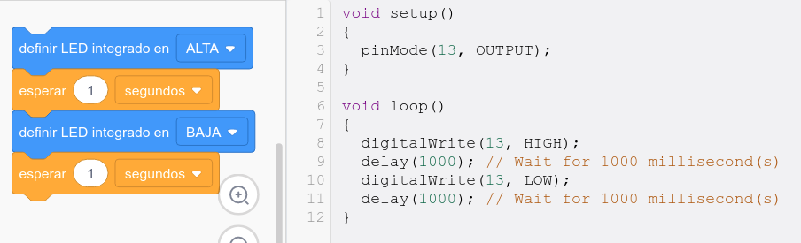
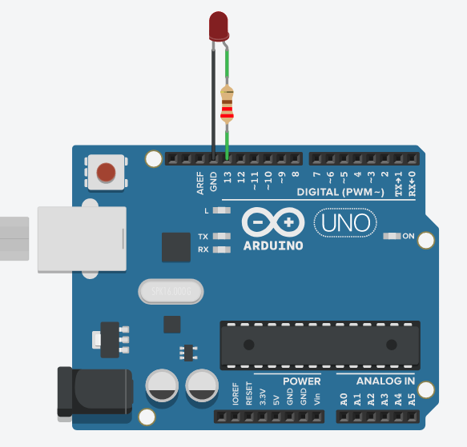
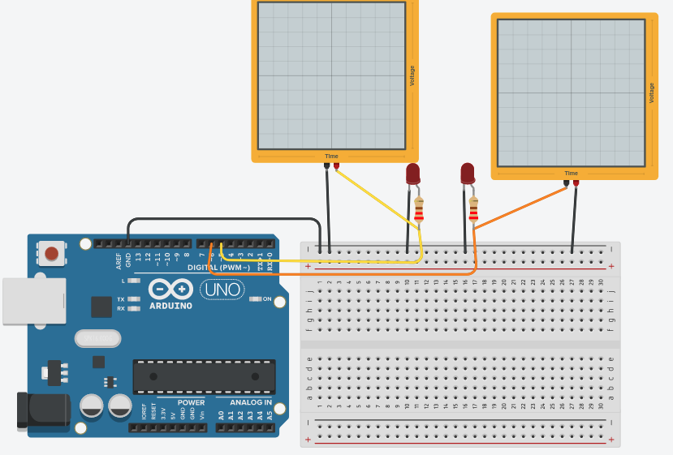
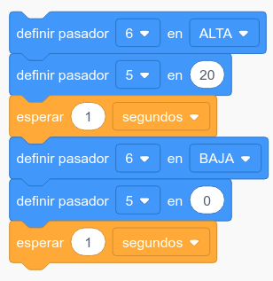
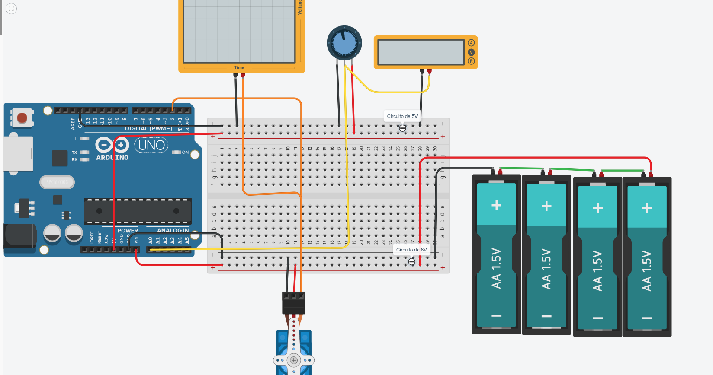
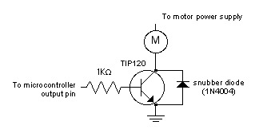
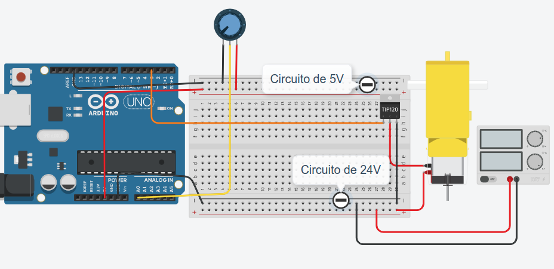

## Manejando potencia con Arduino

Ya hemos visto que nuestra placa Arduino no transmite mucha potencia por sus pines. De hemos sólamente puede transferir los 20-25mA que necesita un pequeño LED. Si queremos controlar algo que requiera de más potencia necesitaremos incorporar algún componente o placa electrónica que sea capaz de entregar esas potencias.

También hemos visto que las patillas digitales, en principio, solamente pueden tener valores digiatles: 0 o 1 es decir 0 o 5 voltios. En términos de potencia eso sería como un control Todo/Nada, a tope de potencia o totalmente parado.

Veremos que utilizando una técnica conocida como **PWM** vamos a poder producir una señal que permite un control de potencia más fino,.
Empezaremos viendo cómo podemos controlar el brillo de un LED utilizando está técnica de PVM

En este caso vamos a utilizar el simulador de Tinkercar que nos va a permitir utilizar herramientas muy útiles en electrónica cómo son los voltimetros y el osciloscopio.

### Control digital de un LED

Ya hemos visto como controlar un led digitalmente




Usamos la función **digitalWrite** para establecer el valor digital del pin 13.

[Proyecto](https://www.tinkercad.com/things/e9w0igqpdC7)


### Control "analógico" PWM de un LED

Así se ve una señal **PWM**:


Cuanto más % del tiempo total está la señal el alto (5V) mayor transferencia de potencia se produce.

Vamos a usar ahora **PWM** para controlar la brillo del led y lo compararemos con un led encendido digitalmente:





Hemos incluído dos osciloscopios en el simulador para ver la señal.

Usamos la función **analogWrite** para establecer el valor PWM del pin 5 y **digitalWrite** para el valor digital del pin 6.

```C++
void setup()
{
  pinMode(6, OUTPUT);
  pinMode(5, OUTPUT);
}

void loop()
{
  digitalWrite(6, HIGH);
  analogWrite(5, 20);
  delay(1000); // Wait for 1000 millisecond(s)
  digitalWrite(6, LOW);
  analogWrite(5, 0);
  delay(1000); // Wait for 1000 millisecond(s)
}

```

[Proyecto](https://www.tinkercad.com/things/4erPtVIB8tf)

### Control de servo con potenciómetro

Vamos a conectar ahora un **servomotor**, para ello incluiremos una alimentación externa a nuestra placa Arduino, para garantizar una potencia suficiente. 

Alimentaremos el Arduino a través del pin Vin.

Vamos a conectar un potenciómetro a entrada analógica A0 y haremos que el servo gire un ángulo proporcional a la posición del potenciómetro, usando la función **map** que nos convierte la medida analógica del potenciómetro (0 a 1023) a los 0-180 grados del servo:




Controlaremos la señal con el potenciómetro:

```C++
#include <Servo.h>

Servo servo_2;

void setup()
{
  pinMode(A0, INPUT);
  servo_2.attach(2, 500, 2500);

}

void loop()
{
  servo_2.write(map(analogRead(A0), 0, 1023, 0, 180));
  delay(100); // Wait for 100 millisecond(s)
}


```

[Proyecto](https://www.tinkercad.com/things/69AXZa6BPOF)


### Control de motor con Transistor 

Vamos a controlar ahora la velocidad de giro de un motor usando **PWM**, y un transistor que va a actuar como un "amplificador" de la señal PWM y permitiéndonos controlar el giro del motor:



Amplificaremos la señal PWM producida por Arduino conectándola a la patilla de la **base** de un transistor TIP120 (que podemos alimentar con hasta 24V) haciendo que al motor le llegue la alimentación a través de las otras patillas del transitor:




```C++
void setup()
{
  pinMode(A0, INPUT);
  pinMode(3, OUTPUT);
}

void loop()
{
  analogWrite(3, map(analogRead(A0), 0, 1023, 0, 255));
  delay(100); // Wait for 100 millisecond(s)
}
```

[Proyecto](https://www.tinkercad.com/things/0XtFmjvHMgF)