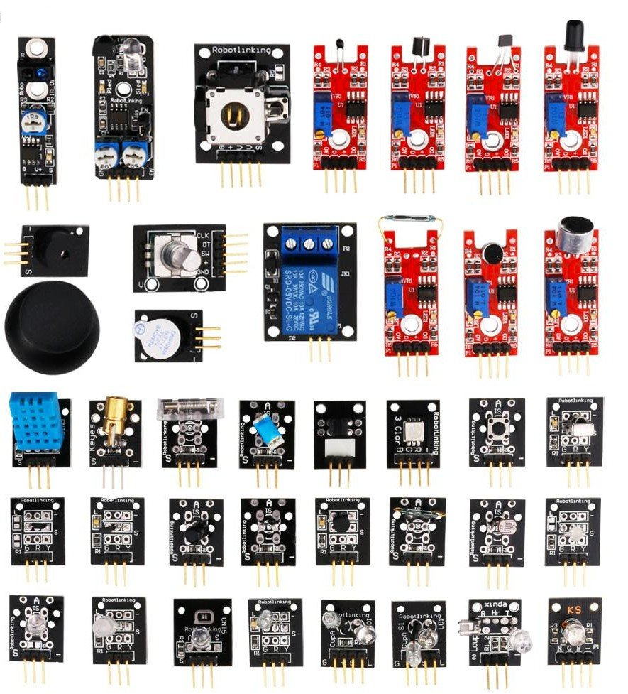

### Sobre algunos sensores

Existen multitud de sensores, casi tantos como magnitudes a medir. En este módulo vamos a hacer un repaso por algunos de ellos.

Verás como la mayoría de estos sensores están disponibles en ArduinoBlocks, sin más que buscar el bloque con la imagen del sensor.

En este [vídeo](https://youtu.be/QUG5j96RKMY) vamos a hablar sobre los diferentes formatos en los que podemos encontrar algunos sensores, cómo podemos usarlos y qué formato es más sencillo de usar.

[Vídeo: componentes o módulos](https://youtu.be/QUG5j96RKMY)

Mmuchos de estos sensores miden magnitudes semejantes. Por ejemplo para medir la inclinación podemos usar un simple Tilt Sensor (una bolita que al inclinar el encapsulado hace contacto entre 2 terminales) hasta un avanzado  acelerómetro. Dentro de este último tipo podemos ver varios modelos distintos, cada uno con distinta forma de acceder a sus datos:

* Uno de los más utilizados es el ADXL, podemos ver en el Playground de Arduino, [cómo  usarlo](http://arduino.cc/en/Tutorial/ADXL3xx)
* Otro muy famoso (y de los primeros en integrarse en un único chip) es el memsic. que se usa midiendo la longitud de los pulsos de sus señales en cada salida. En este [enlace](http://arduino.cc/en/Tutorial/Memsic2125) se puede ver un ejemplo de código.
* Otro sistema para medir la inclinación podría ser un mando de consola, como por ejemplo el de la Wii al que podemos conectarnos por I2C.

Podemos ver otro ejemplo de esta variedad sin más que ver que para un mismo sensor podemos encontrar diferentes librerías, con similares características. Por ejemplo para medir distancias con un sensor de ultrasonidos podemos usar la librería [Ping](http://arduino.cc/en/Tutorial/Ping?from=Tutorial.UltrasoundSensor) y la [New  Ping](http://playground.arduino.cc/Code/NewPing), ambas operativas pero con mejoras la segunda con respecto a la primera.

También podemos encontrar gran diferencia entre la complejidad tecnológica de algunos sensores, frente a la simplicidad manifiesta de otros montajes. Para muestra un botón: [un sensor de presión](http://wiki.lvl1.org/Pressure_sensor_with_antistatic_foam) realizado con la espuma protectora de los embalajes

Veamos en estos vídeos una descripción de algunos de los sensores y cómo acceder a ellos:

[Vídeo: tipos de sensores](http://www.youtube.com/embed/2foKpM7foXY )

[Video: sensores y su conexión](http://www.youtube.com/embed/jJxwQ3Zlpyo)

[Vídeo: sensor de temperatura DS18x20](http://www.youtube.com/embed/8zr2NwaT5AM)

Para entener bien el funcionamiento de los sensores te recomiendo esta [introducción a la electrónica](./presentaciones/Introducción%20a%20la%20electrónica.pdf))

