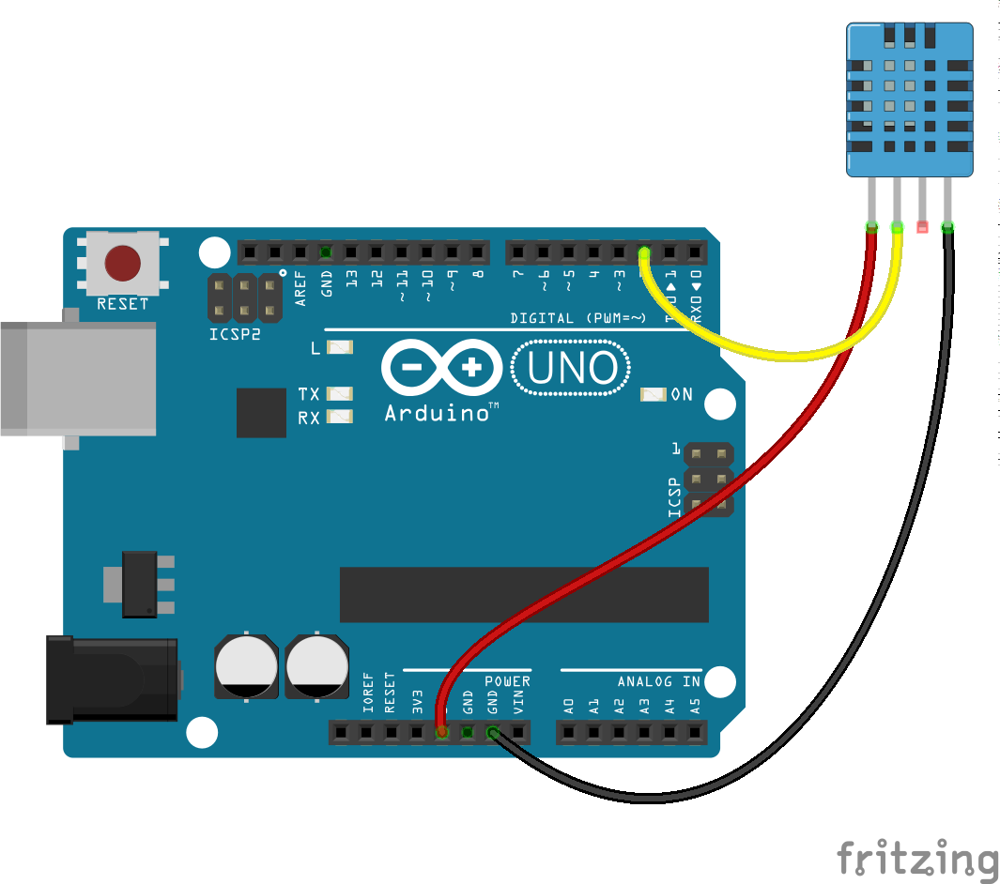
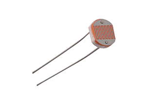
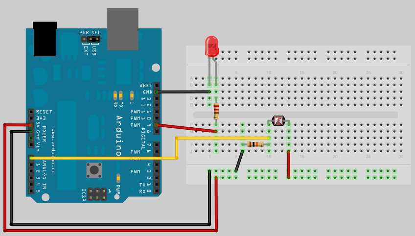
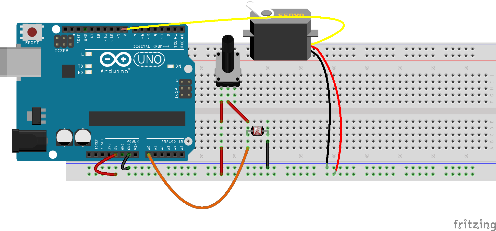
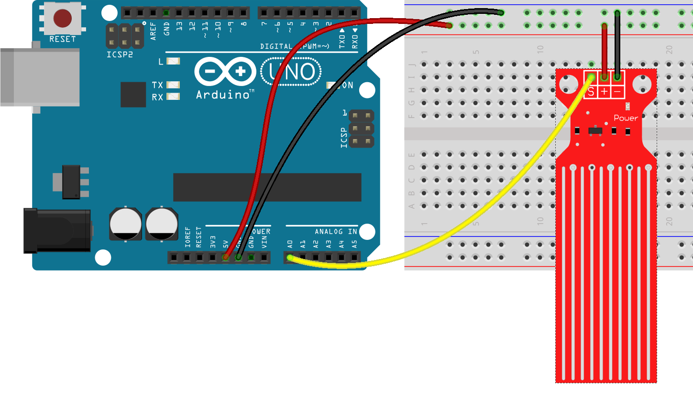
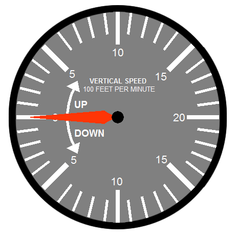
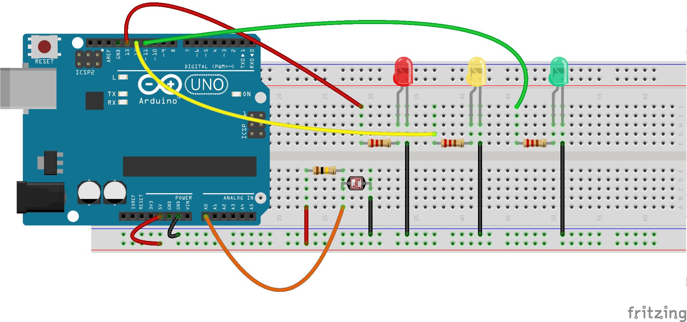

## Proyectos sencillos

Ahora que ya hemos visto como utilizar los bloque de control, leer señales y trabajar con algunos sensores vamos a comenzar a hacer proyectos sencillo.

Algunos los detallaremos completos y otros se dejan para que se completen como ejercicio.

Para hacer cualquiera de ellos puedes usar el entorno que más te guste, y recuerda en que la mayoría de los sensores los tienes en ArduinoBlocks, sólo tienes que buscarlos por su imagen 🤭.

## Medida de temperatura y humedad con DHT11

Vamos a medir la temperatura y la humedad ambiental con un sensor DHT11. El montaje es sencillo



Con este programa sencillo enviaremos los datos al PC y podremos verlo abriendo el monitor serie


Puedes hacerlo usando el IDE de Arduino sin más que instalar la librería SimpleDHT y usando el ejemplo DHT11Default

### Termostato

Un termostato no es más que un sistema que activa o desactiva un dispositivo  cuando la temperatura llega a un umbral

Podemos añadir un sencilla comprobación sobre el valor de temperatura que hemos medido y a partir de un valor determinado que establezcamos activar un led simulando que sea un elemento calefactor (en el siguiente tema veremos que podemos activar de la misma forma un elemento calefactor real, como una estufa, por medio de un componente llamado **Relé**)


Si quieres, puedes hacer que la temperatura umbral se configure con un potenciómetro. En el siguiente tema lo haremos usando también una pantalla para visualizar tanto la medida como el umbral.

### Interruptor crepuscular

Detrás de este nombre tan sofisticado se encuentra el típico sistema de iluminación que se activa cuando tenemos poca luz ambiental.

Para ello usaremos una resistencia luminosa (LDR)



que conectaremos en el típico montaje del divisor de tensión con una resistencia de 100kOhmios



El programa para BitBloq sería 


(Adáptalo para ArduinoBlocks y no dejes de compartirlo en los foros)

### Interruptor crepuscular con umbral configurable

¿Y si ahora añadimos un potenciómetro a la entrada analógica A1 y lo usamos para configura el umbral?


Puedes hacer que la activación del led no sea digital, sino proporcional a la oscuridad....


### Interruptor crepuscular ajustable con ajuste de de persianas

Existe otra manera de ajustar el umbral de luz usando el potenciómetro en lugar de la resistencia fija. De esta manera Arduino no tiene que leer el valor del potenciómetro sino que estamos haciendo un ajuste a nivel electrónico.




Ahora podemos hacer que en función del valor que leamos abramos o cerremos las persianas con un servo (Imagina una persiana de lamas veneciana)

### Control de la velocidad de movimiento de los led tipo Kitt

Ya vimos como hacer que varios leds se encendieran y apagaran en sucesión, ahora te proponemos que utilices un componente/sensor analógico para controlar

### 2 Pulsadores para controlar el brillo de un led

A partir del típico montaje de un led y un pulsador, y añadiendo un pulsador, podemos controlar el nivel de brillo del led con los pulsadores: un pulsador lo incrementa y otro lo decrementa.


### Controlar los colores de un led RGB con 3 potenciómetros

Vamos a hacer un montaje con 3 potenciómetros, cada uno de los cuales controla la intensidad de un color.


Por si no tiene 3 potenciómetros  (aunque seguro que puedes usar 1 potenciómetros y los dos que tiene el joystick) puedes aprovechar para usar el simulador de Tinkercad.com (en [este vídeo](https://www.youtube.com/watch?v=VoWSmP5UpmI&t=332s) puedes ver cómo usarlo)


## Termostato con sensor LM35

Modifica el programa del termostato con el sensor LM35 y este montaje


Recuerda que el fabricante nos dice que la **temperatura** viene dada por la siguiente fórmula a partir del valor analógico leído

    temperatura = valorAnalogico * 5 * 100 / 1024

(Recuerda que en ArduinoBlocks tienes casi todos los sensores... el LM35 también 😉 )


## Sistema de riego con indicador luminoso o servo 

Los sensores de humedad nos permiten determinar la conductividad del agua, o la del suelo si los podemos en contacto con él.



Utilizando es sensor podemos decidir si es necesario regar o no (el valor umbral depende de muchos factores pero podemos utilizar un valor arbitrario de 500)

Haz que cuando se alcance ese valor umbral se active un led.

En la siguiente unidad añadiremos componentes para hacer un sistema de riego más realista


## Indicador retro&analógico con un servo

Usa un servo mover una flecha imitando un indicador retro&analógico (como el velocímetro de un coche) que indique la temperatura o la humedad



## Voltímetro
* Leemos el valor de un potenciómetro conectado a una entrada analógica (A0)
* Convertimos el valor (0-1023) a 0 - 5.0v
* Sacamos el valor por la consola serie

* Calibramos viendo los extremos y el valor intermedio 3.3V

```C++
const int analogInPin = A0;  // Entrada analógica
int sensorValue = 0;        // valor leído

void setup() {
    Serial.begin(9600);
}
void loop() {

    sensorValue = analogRead(analogInPin);   // leemos el valor analógico
    float voltios=(5.0*sensorValue) /1023;   // Lo convertimos
    Serial.print("sensor = " );                       
    Serial.print(sensorValue);    
    Serial.print(" = ");
    Serial.print(voltios);
    Serial.println("v");   
    delay(200);                     
}
```

¿Cómo sería en ArduinoBlocks?

## Proyectos propuestos

* Usando un sensor de ultrasonidos, haz un sistema que mida la distancia y simule el que tienen los coches para evitar chocarse cuando aparcas
* Alarma con PIR y/o sensor de incendio: Al detectar valores altos con estos sensores activa un sonido en el zumbador
* Semáforo de ruido: mide el nivel sonoro con el pin A0 del sensor de sonido y en función del valor activa un led Rojo cuando éste sea alto, sólo tienes que cambiar el sensor de este sensor luminoso

* Theremin: Utiliza el sensor de ultrasonidos para emitir sonidos de distinta frecuencia en función de la distancia. También puedes combinar los valores con un sensor de luz (LDR)
* Monta a la vez el LM35 y el DHT11  y comparas sus medidas de temperatura

