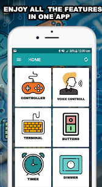

## Comunicaciones bluetooth

Una vez podemos comunicarnos vía puerto serie, el pasar a comunicaciones inalámbricas es sencillo con Bluetooth. De esta manera podremos conectar nuestros proyectos con móviles y tablets.

Existen unos módulos Bluetooth capaces de enviar al dispositivo con el que están emparejados los datos que ellos reciben por sus pines.

En esta imagen podemos ver uno de ellos. Bajo este aspecto existen diferentes tipos de dispositivos. 

Para hacer lo que pretendemos basta la versión más básica, que será un bluetooth de tipo esclavo. Los master pueden costar hasta 4 veces más y sólo se necesitan si queremos que sea nuestro Arduino el que tome la iniciativa en las comunicaciones. Normalmente este papel lo hace el móvil.

La conexión con Arduino es muy sencilla. Sólo hay que tener en cuenta que hay que conectar con los cables cruzados: TX-RX y RX-TX. Para recordar esto podemos pensar que cuando hablamos (Tx) el que nos escucha lo hace con la orejas (Rx)...


El código para controlar un rele via bluetooth es muy sencillo:


```C++
const int rele=9;

void setup() {
  Serial.begin(9600);
  pinMode(rele,OUTPUT);
}

void loop() {
  while(Serial.available()>0) // Hay datos pendientes de leer
  {
    int iChar=Serial.read();  // Leemos un caracter
    Serial.println((char)iChar);
    if(iChar=='1')   // Un caracer '1' lo enciende y cualquier otro lo apaga
      digitalWrite(rele,HIGH);
    else
      digitalWrite(rele,LOW);
  }
}
```

Añadiendo más casos para cuando recibamos distintos caracteres podemos hacer más complejo nuestro proyecto.

```C++
void setup(){
    Serial.begin(9600);
    // pinMode adecuado para nuestros motores
}

void Adelante(){
  // Codigo para controlar nuestro motor
}

void Atras(){
  // Codigo para controlar nuestro motor
}

void Parar(){
  // Codigo para controlar nuestro motor
}

void Derecha(){
  // Codigo para controlar nuestro motor
}

void Izquierda(){
  // Codigo para controlar nuestro motor
}

void Velocidad(int velocidad){
  // Codigo para controlar nuestro motor
}

void loop()
{
  char inDat;   
  //Serial.println("No data");
  while(Serial.available()>0)
  {   
    int iChar=Serial.read();  // Leemos un caracter
    delay(1000);
    Serial.println((char)iChar);
    switch(iChar){  // Segun el caracter ejecutamos una accion
      case 'L':   //- Izquierda
        Izquierda();
        break;
      case 'R':   //- Derecha
        Derecha();
        break;
      case 'F':   //- Derecha
        Adelante();
        break;          
      case '0':   //- Parada del motor
        Parar();
        break;
      case '1':   //- Velocidad lenta
        Velocidad(100);
        break;
      case '9':
        Velocidad(100); //- Velocidad rápida
      // ..... Demas casos
      break;
      default:
      break;
      }
  }
}

```

### Apps para el dispositivo móvil

Para controlar desde el móvil, debemos emparejar el Bluetooth con nuestro móvil y utilizando alguna aplicación que nos permita enviar datos entre nuestro Arduino y el móvil o el tablet. Existen mucha aplicaciones que nos permiten controlar muchas funciones, basta con [buscar "arduino bluetooth" en google play](https://play.google.com/store/search?q=arduino%20bluetooth%20controller&c=apps)


* [Blueterm](https://play.google.com/store/apps/details?id=de.jentsch.blueterm) que se comporta como el Monitor Serie de Arduino.

* [Arduino Bluetooth RC Car](https://play.google.com/store/apps/details?id=braulio.calle.bluetoothRCcontroller) Está pensada para controlar remotamente un robot de tipo coche. Permite configurar los caracteres que se envían con cada botón.


* [Arduino Bluetooth Controller - All in One](https://play.google.com/store/apps/details?id=com.appsvalley.bluetooth.arduinocontroller) que dispone de diferentes tipos de controles, incluso permite controlar dispositivos Bluetooth usando la voz.




También podemos crear nuestra aplicación para un dispositivo Android usando la plataforma [App Inventor](http://ai2.appinventor.mit.edu/) que nos permite hacerlo mediante bloques. 

Puedes probar [esta sencilla aplicación para manejar relés](http://ai2.appinventor.mit.edu/?galleryId=5486377139044352&locale=es_ES).

En el siguiente vídeo vemos cómo utilizarlos y configurarlos:

[](https://youtu.be/N04DzxnTXqA)

[Vídeo: configurando dispositivo Bluetooth](https://youtu.be/N04DzxnTXqA)

En el siguiente vídeo vamos a usar un dispositivo bluetooth para activar un relé remotamente desde un móvil.

[](https://youtu.be/j5j-pfIGdoM)

[Vídeo: controlando relé desde el móvil](https://youtu.be/j5j-pfIGdoM)

