## Comunicaciones Wifi con  ESP8266

El ESP8266 es una pequeña placa diseñada por [Espressif](https://www.espressif.com) para proporcionar conectividad Wifi a microcontroladores. En nuestro caso se controla vía serie usando comandos AT (como los Modem, y lo teléfonos GPRS y GSM). También se puede programar directamente con el IDE de Arduino y se puede utilizar como un microcontrolador como veremos un poco más adelante.

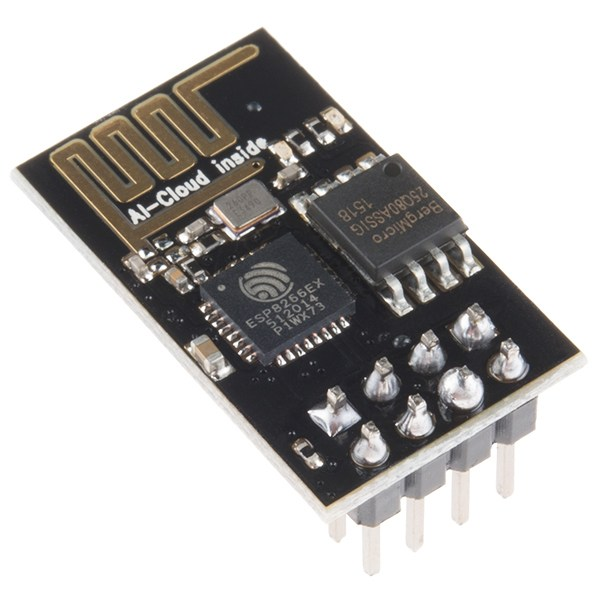

La placa dispone sólo de 8 patillas:

* GND
* Vcc que debe ser de 3.3V.
* TX  para comunicaciones.
* RX para comunicaciones.
* EXT_RSTB reset.
* CH_EN Enabled.
* GPIO01 Disponible para programación.
* GPIO02 Disponible para programación.

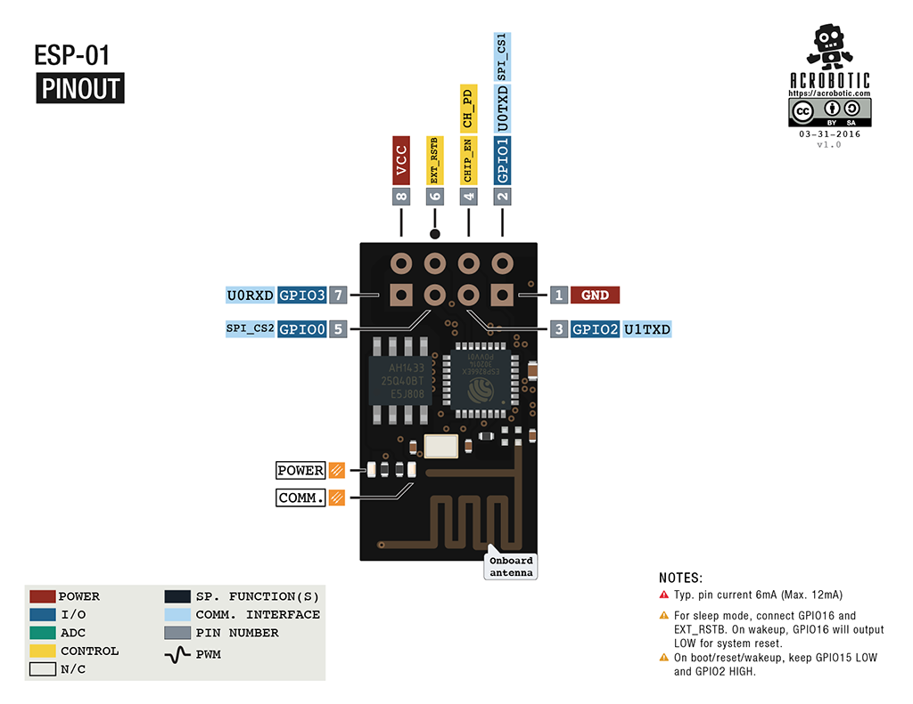

Como vemos la placa funciona a 3.3V pero parece ser tolerante a 5V (al menos no se daña directamente con conectar a las patillas de Arduino). En cualquier caso es mejor usar un adaptador de voltajes o un divisor de tensión para evitar forzar las entradas.

Las patillas no están pensadas para usar en protoboard, nosotros usaremos cables M-H para conectarlo. Pero si necesitamos conectarlo a una protoboard podemos usar un adaptador como estos que existen o construirlo nosotros mismos con 2 grupos de 4 pines hembra de patilla larga:

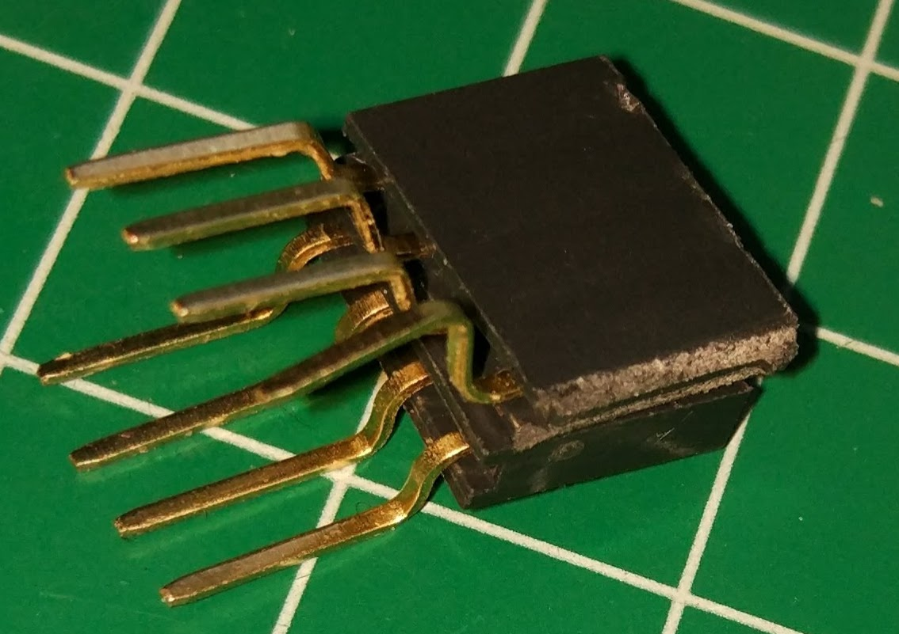

O comprando un adaptador como este otro:

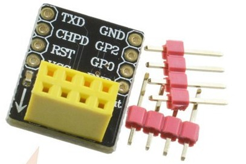

Hemos hecho este montaje:

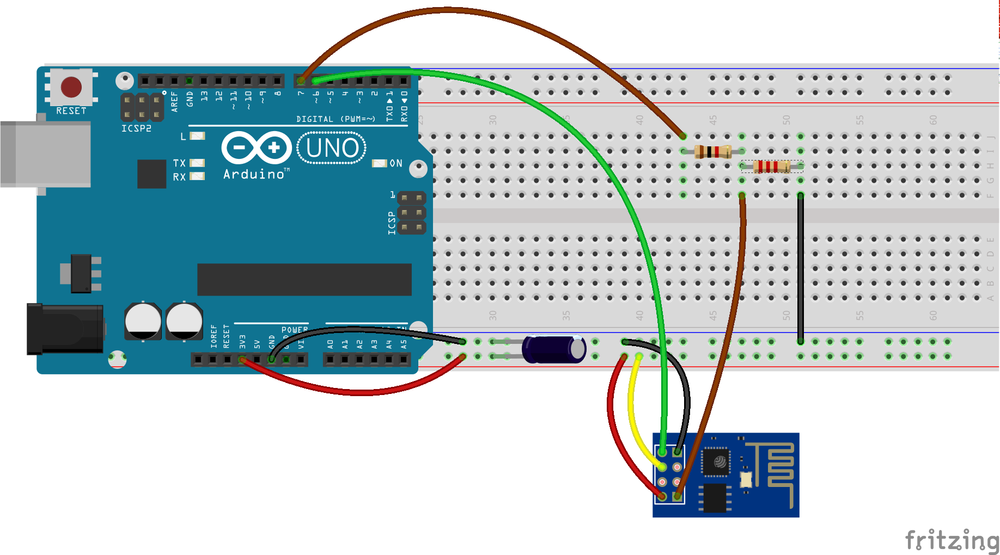

Utilizando un divisor de tensión para el pin RX del ESP8266 utilizando una resistencia de 1KΩ y otra de 2.2KΩ de manera que el voltaje que reciba el ESP sea aproximadamente de 3.3V (Si no tenéis resistencias de 2.2KΩ podéis usar 2 de 1KΩ en serie).

Lo hemos alimentado del pin 3.3V de Arduino y funciona bien, pero podríamos tener problemas si usamos el wifi de manera intensiva pues esta salida da poca intensidad. En caso de necesitarlo habría que usar una alimentación externa de 3.3V conectando su GND con el de Arduino.

Para evitar estos problemas de alimentación hemos incluido un condensador de 100microFaradios que contribuye a estabilizar la alimentación.

Si lo vamos a conectar a un Arduino Mega podemos aprovechar que esta placa tiene varios puertos series y conectarlo al Serial1 (Pines 18 y 19). Quedaría algo así:

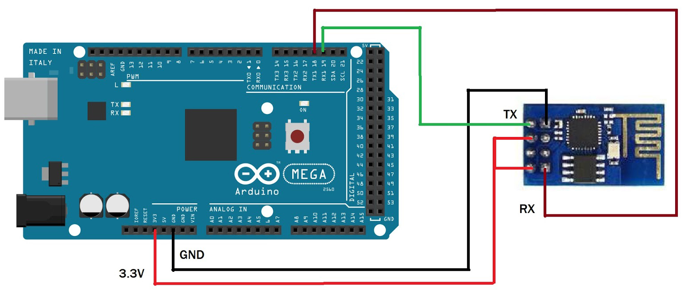

### Programación

Como hemos dicho tendríamos que usar comandos AT para comunicarnos con el ESP8266 que enviamos por su puerto serie para configurarlo, aquí tenéis el [listado de todos ellos](https://www.espressif.com/sites/default/files/documentation/4a-esp8266_at_instruction_set_en.pdf).

Una forma más sencilla de hacerlos es usando una librería que haga el trabajo dificil por nosotros.

Instalaremos la librería WifiESP que podemos instalar desde el gestor de librerías o desde su repositorio https://github.com/JiriBilek/WiFiEsp (Descargamos el fichero Zip y lo incorporamos en el entorno desde la opción "Añadir librería desde ZIP" en el menú Programa -> Incluir librería).

Una vez importada tendremos sus ejemplos y los usaremos para poner a punto nuestro ESP y la comunicación con Arduino.

Abrimos primero "test -> ESPDebug" que nos permitirá enviar directamente comandos manualmente para ver que todo va ok. 

La librería espera que nuestro ESP8266 trabaje a 9600, pero las hoy en día el ESP8266 suele venir configurado a 115220.

Para ello cambiaremos el código de la función setup del ejemplo para que quede así:

```C++

void setup()
{
  Serial.begin(115200); // serial port used for debugging
  Serial1.begin(115200);  // your ESP's baud rate might be different
}

```

En el ejemplo se usa una características del lenguaje de programación C que se llama compilación condicional:

```C++
// Emulate Serial1 on pins 7/6 if not present
#ifndef HAVE_HWSERIAL1
#include "SoftwareSerial.h"
SoftwareSerial Serial1(6, 7); // RX, TX
#endif
```

Para placas que tenga un puerto Serial1 no se usa ese código y conectaremos nuestro ESP a los pines TX1 y RX1.

Si no tiene Serial1 se crea un puerto virtual SoftwareSerial en los pines 6 y 7.

Lo subimos a nuestro Arduino y abrimos el monitor serie. Comprobamos que tenemos la opción de velocidad a 115200 y la opción de enviar NL + CR (esto quiere decir que cuando enviamos cualquier carácter, se añade un código fin de línea NL y otro de retorno de carro CR ).


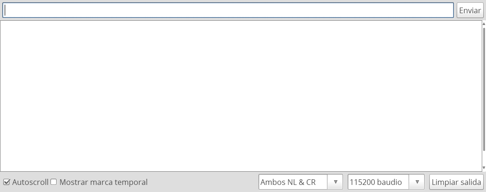

Escribimos "AT" y pulsamos Enter y recibimos "OK".

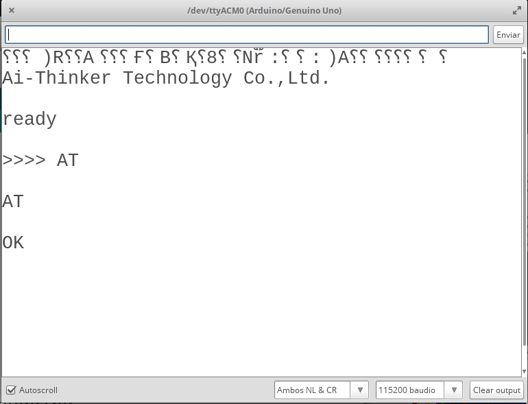

Ya lo tenemos listo para usarlo.

### Posibles errores

Si no recibimos respuesta puede ser que tengamos mal conectado el ESP. 

Si recibimos un galimatías puede ser que nuestro EPS esté configurado a 9600, lo más sencillo es cambiar la velocidad en el Setup del ejemplo a 9800

Si recibimos OK de respuesta, ESP8266 está configurado a 9600 baudios y podemos pasar a usar los siguientes ejemplos.

Si recibimos unos caracteres extraños:

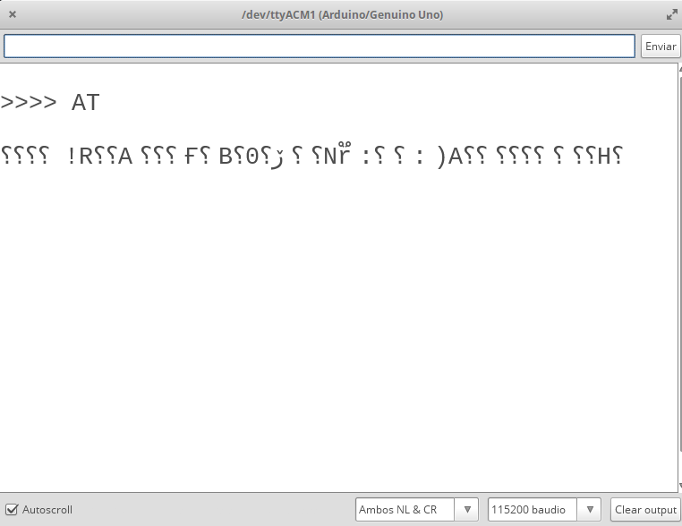

Para configurarlo a la velocidad correcta enviamos lo siguiente:

    AT+UART_DEF=9600,8,1,0,0

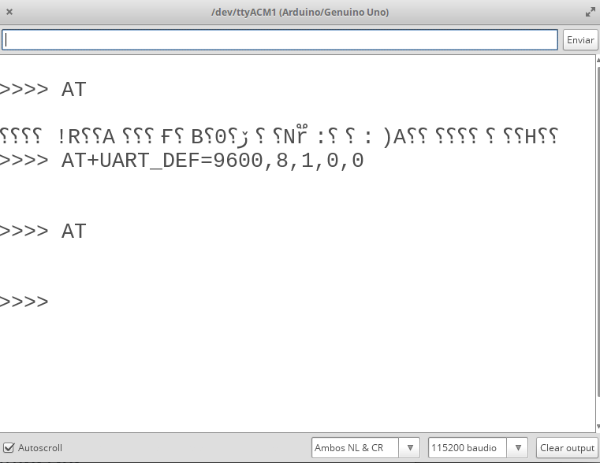

y reseteamos todo, apagando y encendiendo.

Otra opción es resetear el esp8266 a su configuración de fábrica haciendo **AT+RESTORE**


### Comandos AT

Podemos comunicarnos con nuestro ESP usando comandos AT (Todos empiezan por AT ....)

* **AT+GMR** Nos la versión del firmware del ESP.

```
>>>> AT+GMR

AT+GMR

AT version:1.3.0.0(Jul 14 2016 18:54:01)
SDK version:2.0.0(656edbf)
compile time:Jul 19 2016 18:44:44
OK

```

* **AT+CWLAP** Escanea las redes wifis y nos da un listado con la intensidad, el canal ,...

```
>>>> AT+CWLAP

AT+CWLAP

+CWLAP:(3,"MiFibra-6538-",-76,"0c:8e:29:9e:e1:f1",1,32767,0)
+CWLAP:(3,"vodafone9558",-87,"78:94:b4:a1:95:59",2,35,0)
+CWLAP:(4,"wifi_bajo2,4g",-90,"b8:69:f4:22:83:eb",1,61,0)
+CWLAP:(3,"MiFibra-8310",-91,"0c:8e:29:40:dc:bc",1,46,0)
+CWLAP:(3,"jazzBajo",-26,"ec:f4:51:69:44:7b",6,36,0)
+CWLAP:(4,"jazzBajo_plus",-57,"34:ce:00:1b:12:b7",6,58,0)
+CWLAP:(3,"Invitado-4479",-27,"62:f4:51:69:44:78",6,35,0)
+CWLAP:(3,"MOVISTAR_DFB1",-77,"e4:ab:89:38:df:b2",6,48,0)
+CWLAP:(3,"devolo-bcf2afb14e3e",-90,"bc:f2:af:b1:4e:3e",6,45,0)
+CWLAP:(4,"JAZZTEL_jGyf",-93,"08:3f:bc:df:6d:f6",6,46,0)
+CWLAP:(3,"DIRECT-c8-HP M130f LaserJet",-87,"fa:da:0c:1a:67:c8",6,32767,0)
+CWLAP:(4,"OpenWrt",-77,"f8:8e:85:53:2f:cb",9,48,0)
+CWLAP:(3,"PPARAMO",-80,"48:8d:36:d0:b7:74",11,45,0)
+CWLAP:(4,"MIWIFI_U3UQ",-82,"8c:68:c8:d3:36:42",11,60,0)
+CWLAP:(4,"TP-LINK_3F73E2",-92,"84:16:f9:3f:73:e2",11,35,0)
+CWLAP:(4,"MiFibra-B972",-81,"70:4f:57:9f:95:01",11,38,0)
+CWLAP:(3,"vodafoneBA1821",-89,"74:9d:79:6d:21:00",11,60,0)

OK
```

* **AT+CWJAP=you "ssid","password"** Nos conecta a una de estas redes. Es necesario usar las comillas y escribir exactamente las mayúsculas minúsculas en el SSID y el password de la red.

* **AT+CWSAP="ssid","password",3,0** También podemos crear una red wifi propia.

* **AT+CWLIF** nos muestra los dispositivos conectados a nuestra red.

### Webserver

Empezaremos con el ejemplo **WebServer**, al que cambiaremos el SSID y el password por los de nuestro wifi y la velocidad del Serial1 si así lo necesitamos. En el monitor serie veremos la dirección IP que tiene nuestro ESP y podremos conectarnos con un navegador.

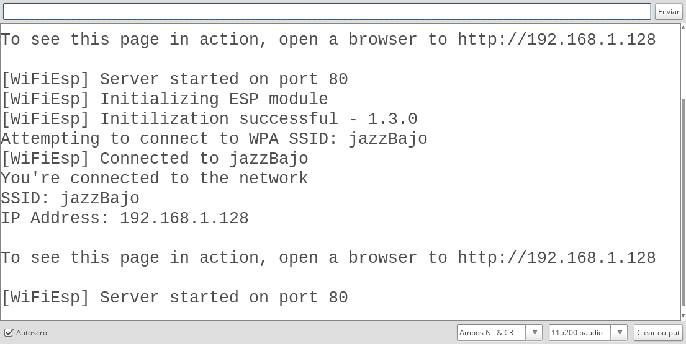

Nos conectamos y vemos la web.

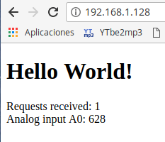

Si analizamos el código vemos que lo que hace es enviar el HTML de la página mediante llamadas client.print("...") y en medio incluye el valor de la lectura analógica.

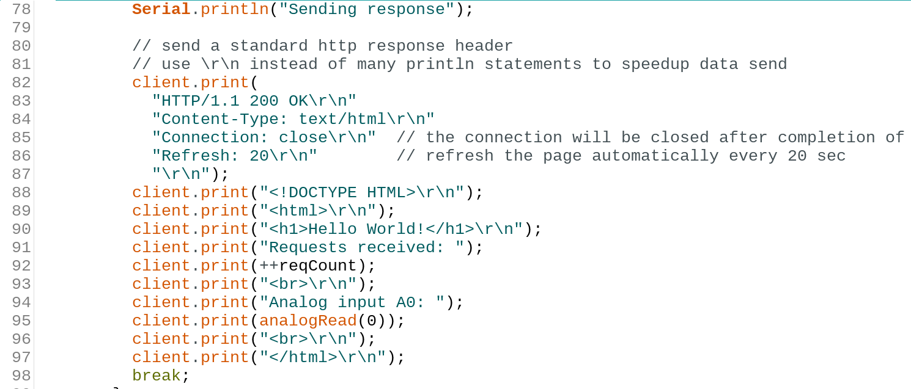

Sin saber HTML, podemos cambiar la línea donde estamos enviando el valor de analogRead por el valor de cualquier sensor.

**Ejercicio**: Conecta un sensor DHT11 y muestra el valor de la temperatura y humedad.

Vamos a usar ahora el ejemplo **WebServerLed** que nos permite controlar el estado de un led vía web. Cambiaremos los datos del wifi y la velocidad del Serial1 como en los otros ejemplos

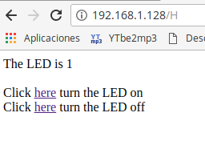

Donde vemos que según pulsemos un enlace u otro se activa o desactiva el led del pin 13. El "truco" ahora es generar unos enlaces para apagar o encender.

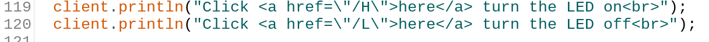

Y al recibir una petición se comprueba si viene de "H" o  de "L":

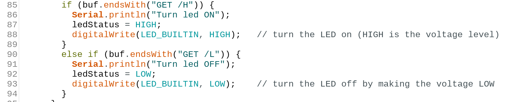

Ejercicio: conecta y configura un relé conectado a un pin y cambia el código para se encienda/apague.

En [este vídeo](https://youtu.be/jYqKn6dhgJo) vemos todo el proceso de configuración el uso de los ejemplos pero tened en cuenta que se usa un ESP de 9600 baudios.

### ¿Qué más podemos hacer con un ESP8266?

Internamente este pequeño ESP8266 tiene un micropocesador de 32 bits (necesario para implementar WPA) funcionando a 80MHz (y que puede hacerlo a 160MHz) y con 32 Kb de memoria de instrucciones y 80KB  de datos de usuario ([Especificiaciones](https://en.wikipedia.org/wiki/ESP8266)).

Con estas características es una pena usarlo sólo para comunicaciones....

Si en lugar de usar esta pequeña placa donde la mayoría de los pines no están conectados al exterior lo usamos en un formato mayor como es el ESP12 en una placa NodeMCU tiene sentido eliminar Arduino y hacer todo el trabajo en esta placa


Pero eso será tema para otro curso...


### Referencias

Os recomiendo esta [estupenda entrada sobre la conexión con ESP8266 de Luis Llamas](https://www.luisllamas.es/arduino-wifi-esp8266-esp01/)
