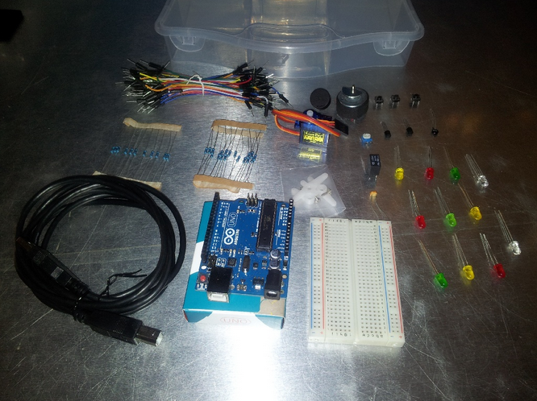

Dónde comprar
-------------

No dejes de escribir tus opiniones en el foro

### Comprar en España

* [Inven](http://inven.es/): Tienen un enorme catálogo de productos para Arduino y Raspberry. Nos han dado unos código de descuento para los siguientes kits:

  ARDUINO:

  [Starter Kit completo](http://inven.es/nuestros-kits/555-starter-kit-basico-con-arduino-uno-r3-incluido.html)

  [Starter Kit completo]( http://inven.es/nuestros-kits/556-starter-kit-completo-con-arduino-uno-r3-incluido.html)

  Código de descuento: KITARDUINO2017

  Raspberry Pi:

  [Raspberry](http://inven.es/raspberry-pi/557-kit-raspberry-pi-3-tarjeta-16gb-transformador-corriente.html)                      
  [Raspberry básico](http://inven.es/raspberry-pi/368-inven-pi3-kit-raspberry-pi-3-basico.html)

  [Raspberry completo](http://inven.es/raspberry-pi/369-inven-pi3-kit-raspberry-pi-3-completo.html)

  [Raspberry + electrónica](http://inven.es/raspberry-pi/370-inven-pi3-kit-raspberry-pi-3-electronica.html)

  CODIGO: KITRASPI2017

* [Electan](http://www.electan.com/): Tienen stock de muchos productos y varios kits interesantes sobre arduino. Responden rápido.
* [Bricogeek](http://www.bricogeek.com/shop/): Uno de los sitios más confiables para comprar. Tiene gran variedad y tienes tu envío en casa
al día siguiente.
* [Cooking Hack](http://www.cooking-hacks.com/):Es la tienda online de [libelium](http://www.libelium.com/), la startup de la Universidad de
Zaragoza, conocida mundialmente por sus soluciones inalámbricas basadas en arduino.
* [Leantec](http://www.leantec.com): tienen todos los componentes imprescindibles y muy bien documentados.

### Fuera de España

* [Arduino](http://store.arduino.cc/eu/index.php):Son los fabricantes y avisan de stock y de fecha de entrega.
* [Sparkfun](http://www.sparkfun.com/): En esta tienda podemos encontrar practicamente de todo. Además ellos son diseñadores de la mayoría de los kit que podemos encontrar en otros sitios.
* [Adafruit](http://adafruit.com/): Uno de los grandes impulsores deHardware libre

### Internacionales baratas

Son fabricantes (no se limitan a copiar) y así consiguen una alta calidad a buenos precios

* http://www.elecfreaks.com/
* http://www.electrodragon.com/

También puedes encontrar productos arduino en grandes portales online de venta de productos electrónicos como [dealextreme](http://dx.com/),  [Ebay](http://www.ebay.es/) o [aliexpress](http://aliexpress.com).

Habitualmente estos productos tienen un menor precio, pero a costa de un menor control de calidad. Mi experiencia en estos sitios es que uno de cada tres productos tiene algún defecto. Decidid vosotros mismos si os vale la pena el riesgo frente al ahorro. Además no suelen traer documentación con lo que te puedes encontrar en no sabes cómo conectar tus componentes.

Qué comprar
-----------

 Un buen kit básico ha de tener al menos:

-   resistencias variadas,
-   led de diferentes colores,
-   ldr (células fotoeléctricas),
-   ntc (sensores de temperatura)
-   transistores,
-   condensadores,
-   un par de servos,
-   algún motor pequeño
-   una breadboard,
-   cables de colores con conectores machos y hembras
-   arduino Uno o Mega

Recomendamos usar Arduino UNO o Arduino Mega (con preferencia por la
primera) **por ser los más estándares.**

Puedes encontrar una revisión de kits [que hicimos hace tiempo en elcacharreo.com](http://blog.elcacharreo.com/2011/06/02/kit-de-iniciacion-de-arduino-i/)
