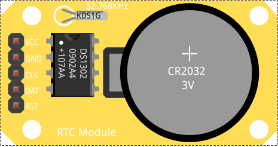
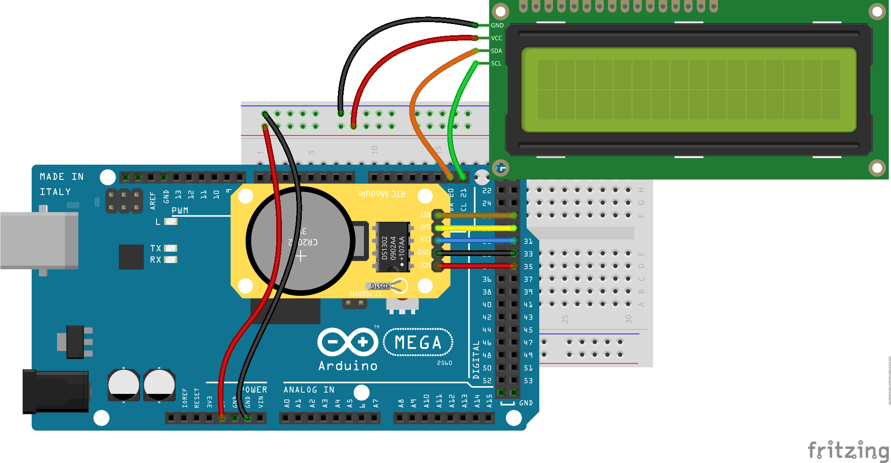
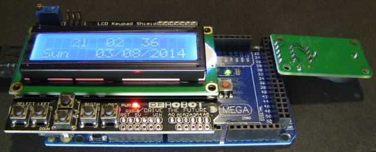

# Relojes de tiempo Real (RTC)

## Módulo con RTC 1302

Un RTC es un Reloj de Tiempo Real, es decir un reloj capaz de medir el paso del tiempo, normalmente dotado de una pila para que no se pierda la fecha y que se puede comunicar con Arduino.

Si intentamos medir tiempos largos (del orden de horas) con Arduino veremos que tiene muy poca precisión, además si reseteamos nuestro Arduino perderemos la referencia de tiempo y tendremos que "ponerlo en hora".



Podemos usar la [librería DS1302](http://playground.arduino.cc/uploads/Main/DS1302RTC.zip) :

El DS1302 usa un interface de 3 hilos. No es I2C, ni OneWire, ni SPI. 

## Montaje

Dado el bajo consumo del RTC es habitual usar un montaje así, donde el reloj se alimenta de un pin de Arduino. De esta manera si queremos podemos "apagar" el dispositivo poniendo el pin Vcc en estado Low.

El apagar los periféricos es algo que se hace frecuentemente para ahorrar consumo elécrico.






## Código

Antes de usarlo debemos ponerlo en hora. Podemos hacerlo con el ejemplo "SetSerial" de la librería, que nos dirá si ya tienen una hora válida o tenemos que dársela. Se le da vía serie en el formato "yy,m,d,h,m,s"

El siguiente es un ejemplo sencillo de reloj que usa un lcd I2C


``` C++
// Basado en  Timur Maksiomv 2014
//
// A quick demo of how to use DS1302-library to make a quick
// clock using a DS1302 and a 16x2 LCD.
//
// I assume you know how to connect the DS1302 and LCD.
// DS1302:  CE pin    -> Arduino Digital 27
//          I/O pin   -> Arduino Digital 29
//          SCLK pin  -> Arduino Digital 31
//          VCC pin   -> Arduino Digital 33
//          GND pin   -> Arduino Digital 35
//
// LCD I2C: 
//          SDA       -> Arduino Digital 20
//          SCL       -> Arduino Digital 21
//          GND       -> ND
//          Vcc       -> 5V

// Includes del LCD
#include <Wire.h> 
#include <LiquidCrystal_I2C.h>

#include <DS1302RTC.h>
#include <Time.h>

// Init the DS1302
// Set pins:  CE, IO,CLK
DS1302RTC RTC(27, 29, 31);

// Optional connection for RTC module
#define DS1302_GND_PIN 33
#define DS1302_VCC_PIN 35

// Init the LCD
LiquidCrystal_I2C lcd(0x27,16,2); 

void showMessage(String texto){
	Serial.print(texto);
	lcd.setCursor(0,0);
	lcd.print(texto);
}


void setup()
{
	lcd.init(); 
	lcd.backlight();

	// Activate RTC module
	digitalWrite(DS1302_GND_PIN, LOW);
	pinMode(DS1302_GND_PIN, OUTPUT);

	digitalWrite(DS1302_VCC_PIN, HIGH);
	pinMode(DS1302_VCC_PIN, OUTPUT);

	showMessage("RTC activated");

	delay(500);

	// Check clock oscillation  
	lcd.clear();
	if (RTC.haltRTC())
	   showMessage("Clock stopped!");
	else
	   showMessage("Clock working.");

	// Check write-protection
	if (RTC.writeEN())
		showMessage("Write allowed.");
	else
		showMessage("Write protected.");

	delay ( 2000 );

	// Setup Time library  
	showMessage("RTC Sync");
	setSyncProvider(RTC.get); // the function to get the time from the RTC
	if(timeStatus() == timeSet)
		showMessage(" Ok!");
	else
		showMessage(" FAIL!");

	delay ( 2000 );

	lcd.clear();
}

void loop()
{

	// Display time centered on the upper line
	lcd.setCursor(3, 0);
	print2digits(hour());
	lcd.print("  ");
	print2digits(minute());
	lcd.print("  ");
	print2digits(second());

	// Display abbreviated Day-of-Week in the lower left corner
	lcd.setCursor(0, 1);
	lcd.print(dayShortStr(weekday()));

	// Display date in the lower right corner
	lcd.setCursor(5, 1);
	lcd.print(" ");
	print2digits(day());
	lcd.print("/");
	print2digits(month());
	lcd.print("/");
	lcd.print(year());

	// Warning!
	if(timeStatus() != timeSet) {
	lcd.setCursor(0, 1);
	lcd.print(F("RTC ERROR: SYNC!"));
	}

	delay ( 1000 ); // Wait approx 1 sec
}

void print2digits(int number) {
	// Output leading zero
	if (number >= 0 && number < 10) {
	lcd.write('0');
	}
	lcd.print(number);
}
```

Uniendo los ejemplos de RTC, keypad y lcd podemos hacer un reloj despertador co alarma como el de este proyecto

[Reloj despertador con alarma](https://www.hackster.io/SurtrTech/simple-alarm-clock-with-ds1302-rtc-a92d7b)


[Más detalles](http://playground.arduino.cc/Main/DS1302RTC)

[Otro tutorial](http://www.instructables.com/id/Real-Time-Clock-DS1302/)

