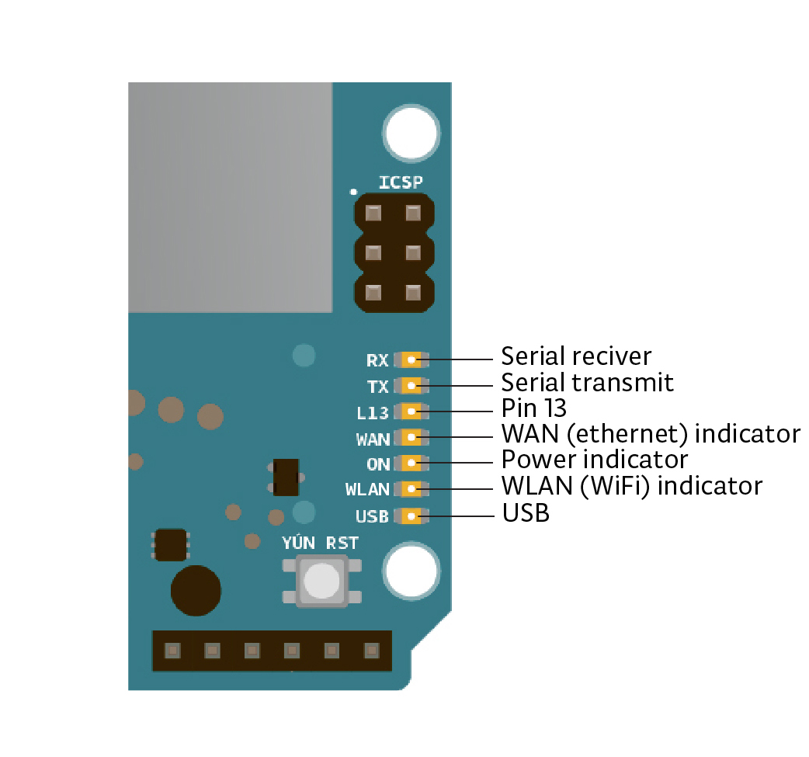
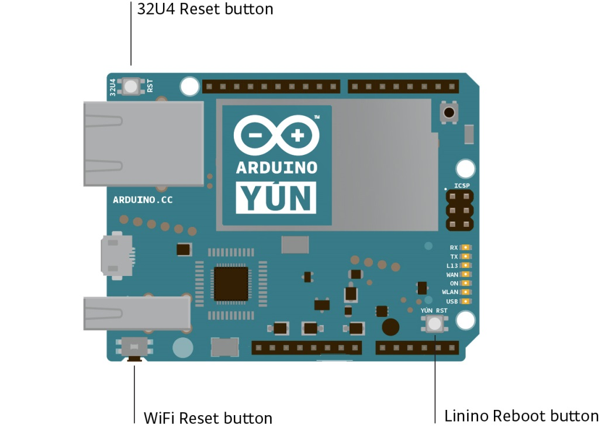
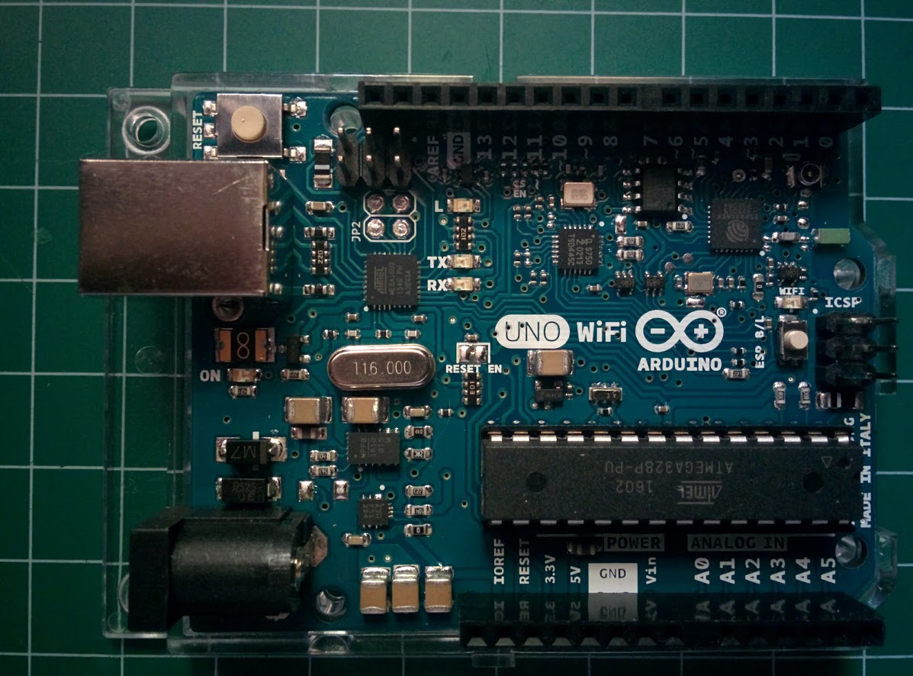
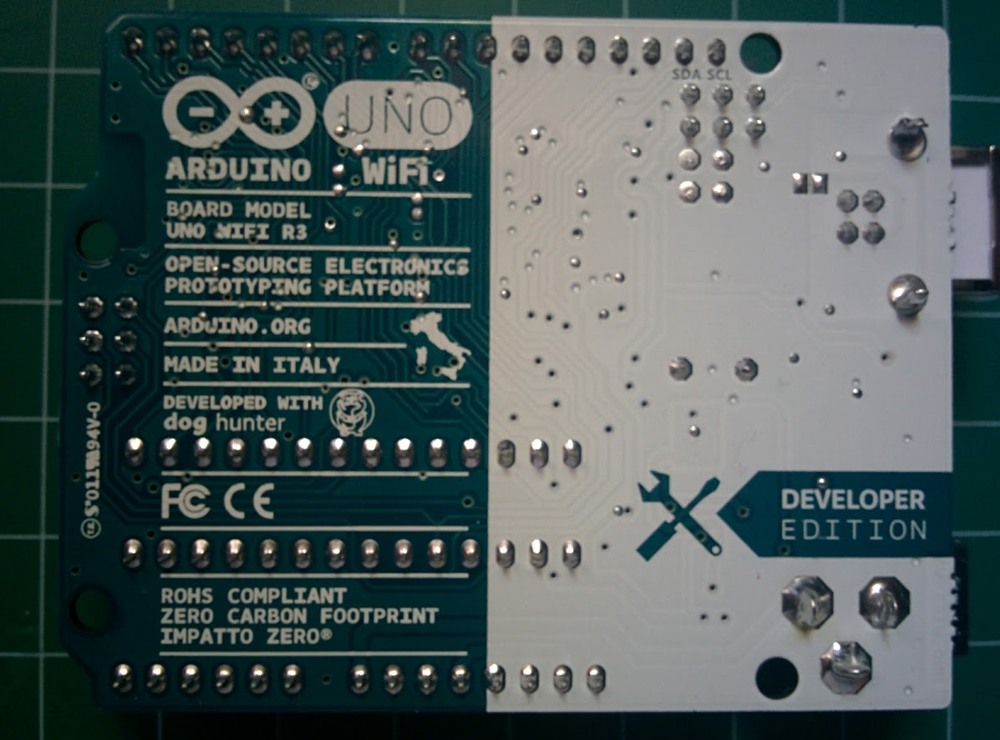

## Wifi

Existen diversas formas de dar funcionalidad Wifi a una placa Arduino:

* Podemos usar placas Arduino que lo incorporan, como son la Arduino Uno Wifi, la Arduino Yún o MKR.
* Usar un shield Wifi.
* Conectar un dispositivo Wifi que nos proporcione esa funcionalidad con el ESP8266.

## Arduino Yún

Yún significa nube y precisamente esa es la vocación de esta placa, conectar con servicios en la nube de una forma sencilla para el usuario.

Este dispositivo fue el primero de varios  dispositivos Arduino que incluían en una misma placa un Arduino tradicional (normalmente Leonardo) con los habituales conectores y un equipo más potente capaz de ejecutar un sistema operativo potente como Linux. El sistema Línux incluye una distribución llamada Linino basada en Open-WRT.

De esta forma podemos usar todo lo desarrollado previamente, tanto en software como en hardware y añadir nuevas funcionalidades avanzadas, sobre todo en el aspecto de conectividad.

Estos dos dispositivos están conectados por un interface llamado Bridge, tanto a nivel hardware como software (la librería bridge):


Veamos las características del Arduino  Yún:

    Módulo Arduino
    Microcontroller:ATmega32u4
    Operating Voltage:5V
    Input Voltage:5V
    Digital I/O Pins:20
    PWM Channels:7
    Analog Input Channels:12
    DC Current per I/O Pin:40 mA
    DC Current for 3.3V Pin:50 mA
    Flash Memory:32 KB (of which 4 KB used by bootloader)
    SRAM:2.5 KB
    EEPROM:1 KB
    Clock Speed:16 MHz

    Módulo Linux 
    Processor:Atheros AR9331
    Architecture:MIPS @400MHz
    Operating Voltage:3.3V
    Ethernet:IEEE 802.3 10/100Mbit/s
    WiFi:IEEE 802.11b/g/n
    USB Type-A:2.0 Host/Device
    Card Reader:Micro-SD only
    RAM:64 MB DDR2
    Flash Memory:16 MB
    PoE: compatible 802.3af card support

 
Yún dispone de un interface Ethernet y Wifi y USB Host, lo que le proporciona una conectividad extraordinaria. En breve seguro que se publican aplicaciones donde se conecta una cámara al USB pudiendo acceder a ella por Wifi.

Dada la complejidad del equipo dispone de muchos LEDs indicadores:



Y de 3 pulsadores Reset:

• Uno para el equipo Arduino.
• Otro para el equipo Linux.
• Otro para el wifi.

Si realizamos una pulsación suficientemente larga sobre ellos se devuelve al sistema hasta su configuración y estado por defecto (borrando los cambios que hayamos hecho):



Una de las novedades de Arduino Yún es que permite ser programado inalámbricamente, via Wifi, lo que se conoce como OTA (igual que los móviles). Al conectarse a nuestro wifi aparecerá un puerto más que representa esta conexión wifi.

Vamos a incluir el pinout completo de la placa


A continuación un par de vídeos sobre Yún

A continuación un par de vídeos sobre Yún

* [Primeras impresiones Arduino Yún I](https://youtu.be/i5Pzz_ENyag)
* [Primeras impresiones Arduino Yún II](https://youtu.be/UeSwu1LSrac)

## Arduino Uno Wifi

Vamos a ver ahora otra placa que incorpora wifi la  [Arduino UNO Wifi](https://store.arduino.cc/arduino-uno-wifi-rev2).


La placa [Arduino UNO Wifi](https://store.arduino.cc/arduino-uno-wifi-rev2) no es otra cosa que una placa Arduino UNO con un [ESP8266](http://www.esp8266.com/) integrado que le proporciona la conectividad Wifi y que están conectados entre si por medio I2C con lo que tenemos disponible todos  los pines.

     



### Wifi

Como hemos dicho la placa incluye un ESP8266 que nos permite tanto crear una red Wifi como conectarnos a una dada. [¿Cómo configurar el wifi?](https://www.arduino.cc/en/Guide/ArduinoUnoWiFiRev2).

### Características

      Microcontrolador: ATMega328 @ 16 MHz
      Módulo Wifi ESP8266EX @ 80 MHz 802.11 b/g/n 2.4 GHz
      Voltaje de funcionamiento (pines I/O): 5V
      Alimentación: 7 a 12 V
      Memoria Flash: 32 Kb
      SRAM: 2Kb
      Pines I/O: 20
      Salidas PWM: 6
      Consumo: 93 mA
      Pines analógicos: 6
      EEPROM: 1Kb


### Uso

Para usarla tenemos que tener una versión moderna del IDE (Posterior a la 1.6.x)

A partir de aquí podemos programar la placa de la forma estándard.

En [este vídeo veremos como usarlo](https://youtu.be/Mp81ekoXV4Y).


## Código

Como siempre tenemos disponibles ejemplos al seleccionar la placa. Veamos algunos a continuación.

### Webserver

Se trata de poder ver el valor de las entradas analógica desde un navegador web conectándolos a la ip del Arduino UNO Wifi.

```C++
#include <Wire.h>
#include <ArduinoWiFi.h>

// Nos conectamos a la IP de la placa arduino (192.168.240.1 por defecto)    
// Para ello nos conectamos a una red wifi que crea con nombre Arduinoxxxxx

void setup() {
    Wifi.begin();
    Wifi.println("WebServer Server arrancado");
}

void loop() {

    while(Wifi.available()){
      process(Wifi);
    }
  delay(50);
}

void process(WifiData client) {
  // Leemos el comando (petición)
  String command = client.readStringUntil('/');

  if (command == "webserver") {
    WebServer(client);
  }
}

void WebServer(WifiData client) {
  client.println("HTTP/1.1 200 OK");
  client.println("Content-Type: text/html");
  client.println("Connection: close");  
  client.println("Refresh: 20");  // refresh the page automatically every  sec
  client.println();      
  client.println("<html>");
  client.println("<head> <title>UNO WIFI Example</title> </head>");
  client.print("<body>");

  for (int analogChannel = 0; analogChannel < 4; analogChannel++) {
    int sensorReading = analogRead(analogChannel);
    client.print("analog input ");
    client.print(analogChannel);
    client.print(" is ");
    client.print(sensorReading);
    client.print("<br/>");
  }

  client.print("</body>");
  client.println("</html>");
  client.print(DELIMITER); // very important to end the communication !!!   
}
```

### Webserver con capacidad de controlar pines

En este ejemplo podemos encender/apagar el pin 13 del arduino Wifi remotamente:

```C++
#include <Wire.h>
#include <ArduinoWiFi.h>

// Nos conectamos a  http://<IP>/arduino/webserver/

void setup() {
    pinMode(13,OUTPUT);
    Wifi.begin();
    Wifi.println("WebServer Server is up");
}
void loop() {

    while(Wifi.available()){
      process(Wifi);
    }
  delay(50);
}

void process(WifiData client) {
  // read the command
  String command = client.readStringUntil('/');

  // is "digital" command?
  if (command == "webserver") {
    WebServer(client);
  }

  if (command == "digital") {
    digitalCommand(client);
  }
}

void WebServer(WifiData client) {

  client.println("HTTP/1.1 200 OK");
  client.println("Content-Type: text/html");
  client.println();
  client.println("<html>");

  client.println("<head> </head>");
  client.print("<body>");

  client.print("Click<input type=button onClick=\"var w=window.open('/arduino/digital/13/1','_parent');w.close();\"value='ON'>pin13 ON<br>");
  client.print("Click<input type=button onClick=\"var w=window.open('/arduino/digital/13/0','_parent');w.close();\"value='OFF'>pin13 OFF<br>");

  client.print("</body>");
  client.println("</html>");
  client.print(DELIMITER); // very important to end the communication !!!

}

void digitalCommand(WifiData client) {
  int pin, value;

  // Read pin number
  pin = client.parseInt();

  // If the next character is a '/' it means we have an URL
  // with a value like: "/digital/13/1"
  if (client.read() == '/') {
    value = client.parseInt();
    digitalWrite(pin, value);
  }

  // Send feedback to client
  client.print(F("Pin D"));
  client.print(pin);
  client.print(F(" set to "));
  client.print(value);
  client.print(EOL);

}
```


## Shield Wifi

Hasta hace poco las placas wifi para Arduino eran caras (entre los 60€ y 70€), consumían mucho y no funcionaban demasiado bien. Tengo en casa varias y ninguna de ellas es realmente operativa.

Una de las mas usadas ha sido el [Arduino Wifi Shield](https://www.arduino.cc/en/Guide/ArduinoWiFiShield).

.

Que tiene la ventana de incluir un lector de tarjetas SD.

La Arduino UNO Wifi me ha parecido una placa muy interesante, con buenas prestaciones, un precio muy ajustado y que facilita totalmente acceso wifi, no obstante vamos a ver otra forma de proporcionar conectividad wifi más sencilla y barata.
