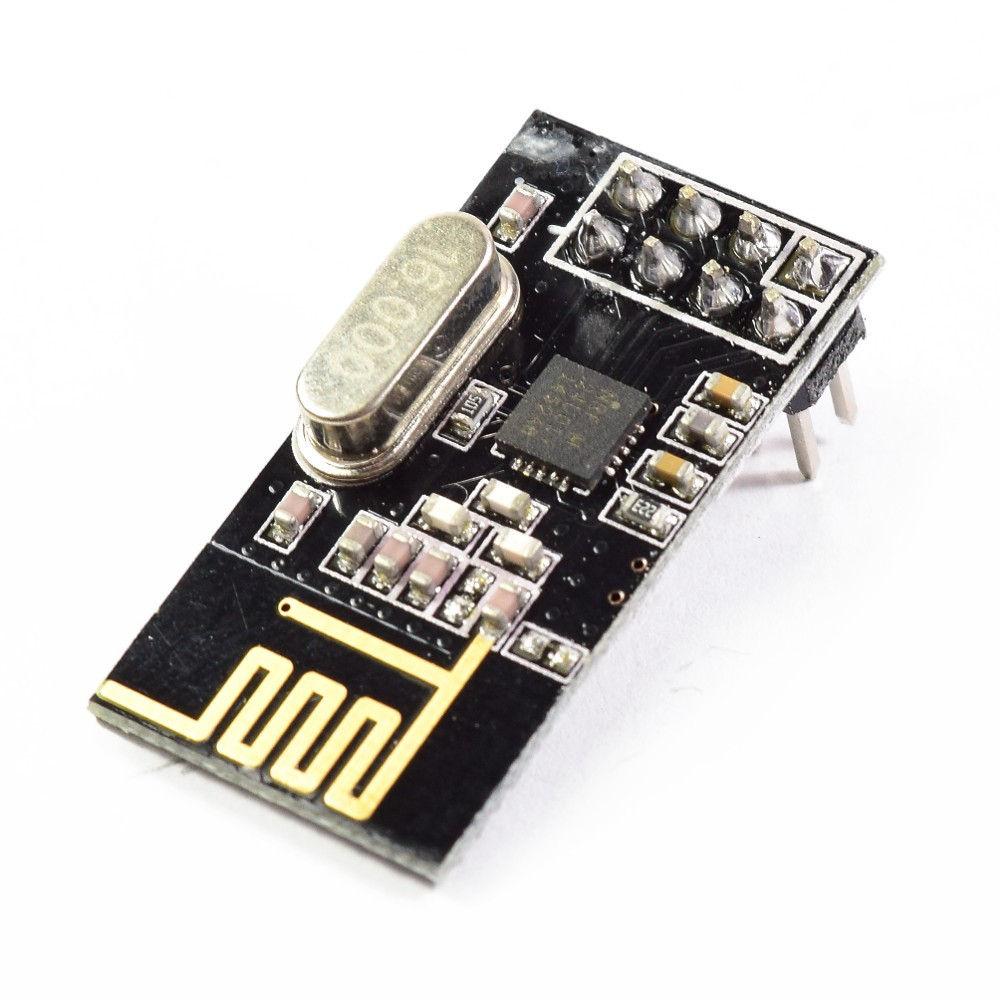

## Comunicaciones por Radio

Algo que cada vez se requiere en más proyectos es la comunicación inalámbrica entre diferentes componentes del mismo. El realizar proyectos distribuidos y el añadir capacidad de procesamiento lleva a utilizar cada vez más sistemas semi-inteligentes.

Existen diferentes tecnologías para conseguir esta comunicación por radio. Unas usan tecnología digital, otras analógica, los primeros consiguen mayor calidad, frente al menor precio de los segundos. Algunos dispositivos digitales son capaces de garantizar la entrega de los paquetes y permiten que el microcontrolador no tenga que realizar tareas de este tipo.

Cuando vayamos a utilizarlos en algún proyecto debemos estudiar la capacidad de comunicación que necesita nuestro proyecto, tanto en ancho de banda como la calidad del mismo.

Normalmente tendremos que desarrollar un protocolo propio para enviar nuestra información, protocolo que se basará en el propio protocolo de transporte del dispositivo usado.

En [este vídeo](https://www.youtube.com/embed/_uRbiYx_nPQ) vamos a ver algunas de las distintas formas de utilizar comunicaciones radio con Arduino.

Veamos ahora cómo usarlos, con librerías y conexiones en [este vídeo](https://www.youtube.com/embed/QKExgg_kUtM).

### Nordic NRF24L01

Existen otras librerías con mayor funcionalidad, capaces de controlar los dispositivos Nordic. Las vemos en [este vídeo](https://www.youtube.com/embed/3lMUoepgeQg).

Si tuviéramos que elegir un sistema de comunicaciones inalámbricas sería sin duda el NRF: es un todo-terreno que podría sustituir a cualquier 485. Además nos evita el cableado que es un infierno en obra ya terminada.

La conexión es la típica de un dispositivo SPI:

Existen 2 librerías muy usadas Mirf y la RF24. La primera creo que es más usada por motivos históricos, pero la RF24 es más avanzada y además se puede usar en la serie ATTiny lo que te permite montar un nodo de la red en un espacio completamente enano.

Sobre el tema de la interferencias, cobertura,  y alcance no hay que preocuparse, porque si bien los modelos más baratos tienen un alcance algo limitado en interiores existen otros equipos con conector SMA a los que les puedes poner antenas de alta ganancia alcanzando hasta Km sin problema. Otro ventaja en este tema es que puedes regular la potencia de transmisión con lo que puedes ahorrar energía.

Las interferencias es algo que te evitas al usar un protocolo con ACK  (confirmación de llegada) y reintento automático. Si no necesitas enviar muchos datos por segundo sólo tendrías que ampliar el timeout para garantizar que siempre se entrega. Un sencillo contador de paquetes perdidos puede permitirte llevar una estadísticas y en caso de detectar pérdidas, ampliar la potencia de envío.

En estos 2 vídeos podemos ver un sencillo proyecto donde se comunican 3 nrf24l01 [Proyecto radio - Software](https://www.youtube.com/watch?v=3YhfpnyclbM) y [Proyecto radio - Hardware](https://www.youtube.com/watch?v=O1iA9qXBZMQ).

#### Referencias

[Comunicación inalámbrica con Arduino Y nrf24l01 por Luis Llamas](https://www.luisllamas.es/comunicacion-inalambrica-a-2-4ghz-con-arduino-y-nrf24l01/)

[Comunicaciones con nrf24l01 por Prometec](https://www.prometec.net/duplex-nrf2401/)

[Vídeo: Getting Started with the nRF24L01 Transceiver](https://www.youtube.com/watch?v=BjId_6tlYvE)

[Librerías para nRF24L01+](https://playground.arduino.cc/InterfacingWithHardware/Nrf24L01/)
