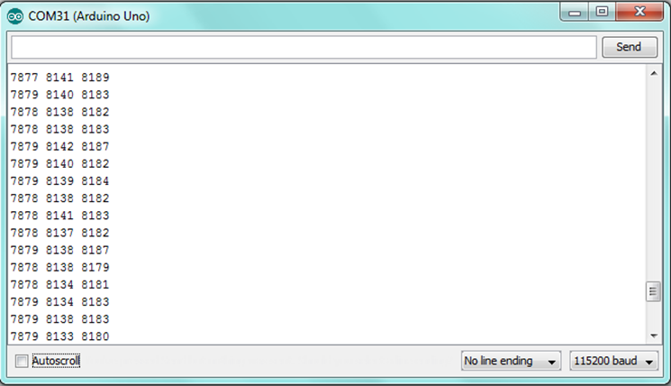
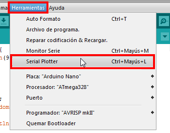
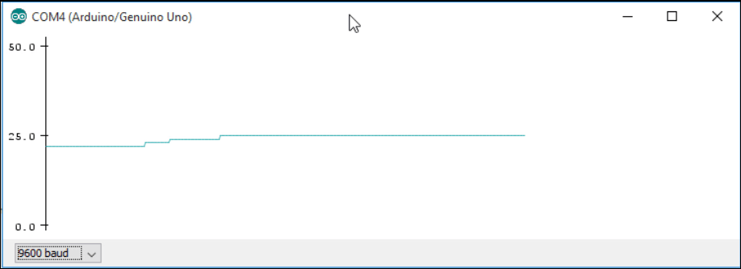
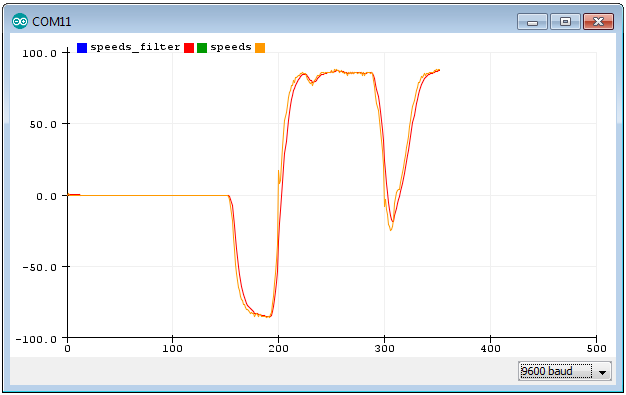
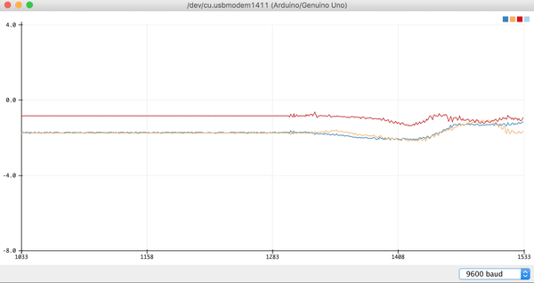

## Monitor Serie y serial Plotter

Ya hemos visto que desde el **Monitor Serie** del entorno de Arduino podemos ver los datos que genera nuestro proyecto.



Viendo los datos podemos tener una idea de su evolución. 
Desde esta ventana podemos copiar los valores y llevarlos a nuestro editor favorito. Más adelante veremos como podemos hacer que un sencillo programa nos permite guardarlos en un fichero.

### Serial Plotter

En el mismo IDE de Arduino también se incluye una herramienta que nos va a permitir ver los datos de una manera gráfica. Para ellos sólo tenemos que enviar los datos en formato concreto y abrir la herramienta **Serial Plotter**



Si enviamos sólo un dato, por ejemplo la temperatura:

```C++
// Example testing sketch for various DHT humidity/temperature sensors
// Written by ladyada
// Libreria DHT-sensor-library
#include "DHT.h"

#define DHTPIN 2     // what pin we're connected to
#define DHTTYPE DHT11   // DHT 11 

DHT dht(DHTPIN, DHTTYPE);

void setup() {
  Serial.begin(9600); 
  dht.begin();  
}

void loop() {
  float t = dht.readTemperature();

  if (isnan(t)) {  // comprobamos si es un numero valido
    return;
  } 
  Serial.println(t);
  delay(10);
}
```


Al abrir el **Serial Plotter** veremos algo así:





Si ahora queremos ver varios valores, sólo tenemos que enviar los valores en una misma línea (usando **print** en lugar de **println**) y separándolos por una ",". El programa quedará así:

```C++
// Example testing sketch for various DHT humidity/temperature sensors
// Written by ladyada
// Libreria DHT-sensor-library
#include "DHT.h"

#define DHTPIN 2     // what pin we're connected to
#define DHTTYPE DHT11   // DHT 11 

DHT dht(DHTPIN, DHTTYPE);

void setup() {
  Serial.begin(9600); 
  dht.begin();  
}

void loop() {
  float t = dht.readTemperature();

  float h = dht.readHumidity();

  if (isnan(h) ||isnan(t)) {  // comprobamos si son numeros validos
    return;
  }

  Serial.print(h);
  Serial.print(", ");  // Fundamenta usar el separador
  Serial.println(t);
  delay(10);
}
```


Del mismo modo podemos hacer que aparezcan más gráficos añadiendo más valores



En las últimos versiones se permite etiquetar los valores con el siguiente código en cada valor

```C++
  Serial.print("speeds_filter:");
  Serial.print(speeds_filter);
  Serial.print(", ");
  Serial.print("speeds:");
  Serial.println(speeds);
```