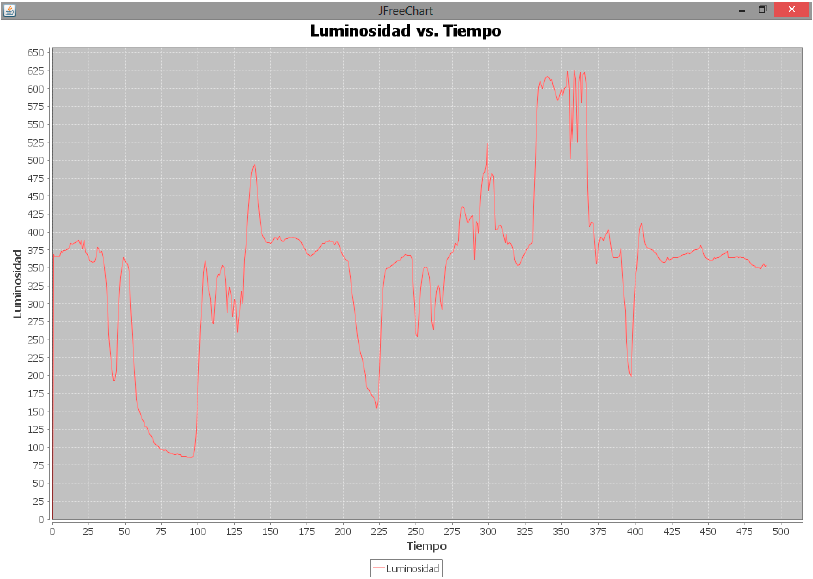

## Java


Para conectar con Arduino desde Java es necesario que tengamos la librería rxtxSerial.dl y el jar RXTXcomm.jar accesibles desde nuestro proyecto. Por defecto vienen en la instalación de Arduino en la carpeta lib.

Podemos añadir estos ficheros al classpath o bien incluirlos en nuestro proyecto. 

Una vez incluidas las librerías sólo tenemos que abrir el stream del puerto serie y con un InputStream y un OutpuStream leer (read) y escribir (write) datos. Veamos un ejemplo

```Java
static InputStream input;
static OutputStream output;
static CommPortIdentifier portId;
static SerialPort port;

public static void main(String[] args) {


    Preferences.init(); // Recuperamos la preferencias
    portId = CommPortIdentifier.getPortIdentifier(Preferences.get("serial.port"));

    port = (SerialPort)portId.open("", 4500);
    input = port.getInputStream(); //obtenemos stream de entrada
    output = port.getOutputStream(); //obtenemos stream de salida
    port.setSerialPortParams(Preferences.getInteger("serial.debug_rate"),
    SerialPort.DATABITS_8,
    SerialPort.STOPBITS_1,
    SerialPort.PARITY_NONE);

    try{
      while(true){
        while(input.available() > 0) {
        System.out.print((char)(input.read())); //Enviamos a la consola los datos que leemos
        }
      }
    }
    catch(gnu.io.NoSuchPortException nsp) {
      System.err.println("ERROR: " + nsp.getMessage());
    }
    catch(gnu.io.UnsupportedCommOperationException usp) {
      System.err.println("ERROR: " + usp.getMessage());
    }
    catch(gnu.io.PortInUseException pie) {
      System.err.println("ERROR: Port " + port + " is already in use\nCLose the port and restart.");
    }
    catch(java.io.IOException ioe) {
      System.err.println("IO ERROR: " + ioe.getMessage() );
    }
    catch(Exception exe) {
      System.err.println("ERROR: Unexpected error occured \n" + exe.getMessage() );
    }
}

}
```

### Gráficos en tiempo real

Siguiendo las indicaciones de este enlace http://panamahitek.com/graficas-de-sensores-en-tiempo-real-con-arduino-java-y-jfreechart/



Para realizar los gráficos se usa la conocida librería abierta JFreeChart http://www.jfree.org/jfreechart/

Para utilizarla en nuestro proyecto descargamos JFreeCharts y jCommons http://www.jfree.org/jcommon/ e importamos en nuestro proyecto
