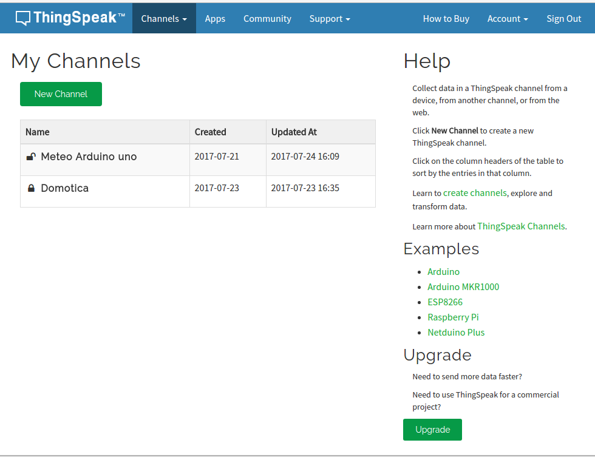

## Acceso a servicios externos

Una vez tenemos operativo nuestro hardware y somos capaces de descargar una página web desde nuestro Arduino, es el momento de pasar al siguiente nivel.

Y este no es otro que acceder a servicios online. Estos servicios online, o en la nube como ahora se suele decir, exponen una serie de reglas para acceder a ellos.

Es lo que se conoce de forma genérica como un API (Application Programming Interface). 

Existen multitud de estos servicios, algunos nos permite publicar contenidos en redes sociales (como Twitter y Facebook) otros nos facilitan el almacenar nuestros datos y mostrarlos como gráficas. Además estos servicios  dan una dimensión social a nuestros datos pudiendo compartirlos con otros usuarios.


### Plataformas de publicación de datos

La mayoría de estas plataformas nos permiten subir nuestros datos y obtener gráficas con ellos


Casi todas tienen una versión limitada (limitación en la frecuencia de envío de los datos o en el volumen de estos) gratuita y otra profesional de pago.

Además algunas nos permiten establecer disparadores (trigger) para vigilar que algún dato tome cierto valor, en cuyo caso envían un aviso a nuestro sistema.

* Adafruit IO https://io.adafruit.com/
* Blynk  https://blynk.io/
* Cayenne https://mydevices.com/ 
* Grafana https://grafana.com/
* Connect2me https://www.c2m.net
* All Things Talk https://www.allthingstalk.com/
* Thingspeak https://thingspeak.com/
* Xively https://www.xively.com/


## Plataforma Xively

Uno de los más conocidos servicios que nos permiten gestionar y visualizar nuestros datos es el antes gratuito y conocido como Pachube, luego llamado Cosm y de momento [Xively](https://xively.com/).

Veamos cómo acceder a este servicio:

* Accedemos a la página de desarrolladores https://www.developerxively.com
* Buscamos los detalles para nuestro hardware, por ejemplo para el esp8266 https://www.developerxively.com/docs/esp8266. Vemos que en el listado no aparece ninguna de las placas Arduino, eso se debe a que Google, el actual dueño de Xively considera que ninguna de las placas Arduino puede garantizar comunicaciones seguras.

Aquí nos indica como configurar nuestra placa y descargar un ejemplo en el que cambiaremos nuestro API Key (código que obtenemos al registrarnos).

Podemos aprender a usar REST y HTTP viendo los ejemplos de la librería HTTPClient https://github.com/interactive-matter/HTTPClient.

En este otro ejemplo http://jotschi.de/2012/04/21/arduino-ethernet-shield-simple-rest-api-example/ podemos ver cómo puede actuar Arduino como servidor soportando peticiones REST.

Podemos encontrar alternativas a este servicio en http://forum.arduino.cc/index.php?topic=124577.15 , como por ejemplo el servicio  Opensource http://emoncms.org/ o https://parse.com/.

# Publicación en ThingSpeak

ThingSpeak es una servicio web que nos permite publicar datos de las medidas de nuestros dispositivos IOT (o de cualquier otro).


Es gratuito para cierto número de datos y nos permite de manera muy sencilla subir datos.

## Creación del canal (Channel)

* Nos hacemos una cuenta en ThingSpeak, recibiremos un email y lo verificamos.

* Entramos en Channels->My Channels y pulsamos en "New Channel".



* Configuraremos el canal, indicando los datos que se van a enviar. Podemos añadir una descripción y datos como la web, canal de youtube, etc...


* Para poder enviar datos al canal necesitamos el API KEY que lo identifica que incluiremos en nuestro código.


* Para que cualquiera pueda ver los datos, podemos hacer que el canal sea público, desde la pestaña Sharing.


* Una vez creado el canal podemos configurar los detalles de cada gráfico, para lo que pulsaremos sobre el icono "lápiz" de cada uno.

* En cualquier momento podemos importar/exportar los datos de un gráfico dado.


## Código Arduino

Para subir datos usaremos en este ejmplo la librería "ciao" de Arduino UNO Wifi y haremos una petición a su web construyendo una URL con nuestra API Key (que hemos obtenido al Canal) y los datos.

Un código básico sería algo así:


```C++
    #include <Wire.h>
    #include <UnoWiFiDevEd.h>

    #define CONNECTOR     "rest"
    #define SERVER_ADDR   "api.thingspeak.com"
    #define intervalo     30000

    #define APIKEY_THINGSPEAK  "UC3QL166QDZW9Q30" //Insert your API Key

    #define SERIAL_BAUD     9600

    #define MSG_WRITE_ERROR    T("Write Error")

    long lIntervaloMedida=2000;  // Para un sistema real sería no menos de un minuto
    long lUltimaMedida=0;
   
    void setup_Serial(){
      Serial.begin(SERIAL_BAUD);
    }

    void setup_nube(){
      Ciao.begin(); // CIAO INIT
    }

    void setup() {
      setup_Serial();
      setup_nube();
    }
    /* ==== END Setup ==== */

    /* ==== Loop - Codigo que se repite==== */

    void publica_datos(){
      String uri = "/update?api_key=";
      uri += APIKEY_THINGSPEAK;
      uri += "&field1=";
      uri += String(hum);
      uri += "&field2=";
      uri += String(temp);
      uri += "&field3=";
      uri += String(pres);
      Ciao.println(T("Send data on ThingSpeak Channel"));
      Ciao.println(uri);
      CiaoData data = Ciao.write(CONNECTOR, SERVER_ADDR, uri);

      Serial.print(uri);
      if (!data.isEmpty()){
        Ciao.println( "State: " + String (data.get(1)) );
        Ciao.println( "Response: " + String (data.get(2)) );
        Serial.println(data.get(1));
        Serial.println(data.get(2));
      }
      else{
        Ciao.println(MSG_WRITE_ERROR);
        Serial.println(MSG_WRITE_ERROR)
      }

    }

    void loop() {
      if(millis()-lUltimaMedida>lIntervaloMedida){ // Toca Medir
        lUltimaMedida=millis();

        delay(lIntervaloMedida);
      }
    }
```


Desde la Consola Wifi podemos ver la actividad de red


#### Tutoriales

La mayoría de las plataformas tienen tutoriales detallados, y muchas de ellas como por ejemplo Blynk incluso generan el código necesario para utilizarlas, con lo que nosotros sólo tenemos que personalizarlo con nuestro sensores y preferencias.

[Blynk](https://blynk.io/en/getting-started)

[Cayenne](https://www.instructables.com/id/Platform-IoT-Cayenne-Mydevices-ESP8266-12E-NodeMCU/) ([Librería mqtt](https://github.com/myDevicesIoT/Cayenne-MQTT-ESP))

[Grafana](https://www.spainlabs.com/foros/tema-SpainLabsIoT2018-Grafana-Dashboard-Open-Source)

[Plataformas publicas por Jose Enrique Crespo](https://aprendiendoarduino.wordpress.com/2018/11/23/plataformas-cloud-publicas/)

[Thingspeak](https://aprendiendoarduino.wordpress.com/2018/11/23/thingspeak/)

## Otras formas de publicar

[Telegram](https://arduinocentermx.blogspot.com.es/2017/07/nodemcu-bot-telegram.html)

[Googlesheet](https://www.youtube.com/watch?v=fS0GeaOkNRw&feature=youtu.be&utm_content=bufferc2e1d&utm_medium=social&utm_source=twitter.com&utm_campaign=buffer)

[Publicación con el ESP](https://www.youtube.com/watch?v=lH6Qiyb10v8&feature=youtu.be&utm_content=buffer9d6ae&utm_medium=social&utm_source=twitter.com&utm_campaign=buffer)

