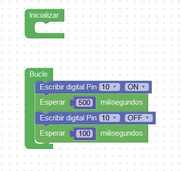
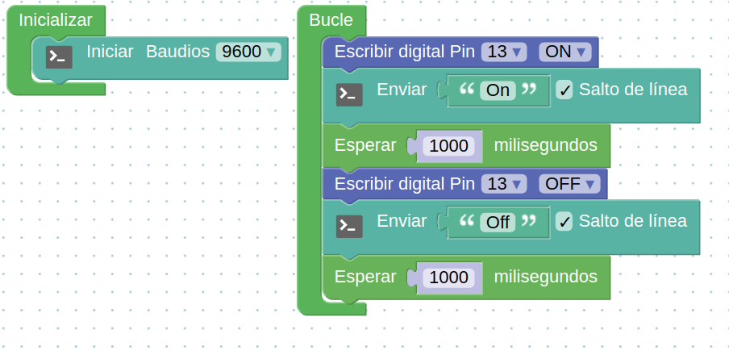

### Introducción a [ArduinoBlocks.com](http://www.arduinoblocks.com)

Para aprovechar todas las ventajas de ArduinoBlocks debes registrarte, pero si no quieres hacerlo puedes trabajar también en el modo de prueba. Las ventajas de estar registrado es que tus programas se guardan automáticamente en la nube, puedes compartirlos y además puedes usar más placas además de Arduino UNO

### Parpadeando el led interno

Vamos a empezar haciendo parpadear el led interno de la placa Arduino

ArduinoBlocks es un entorno de programación visual por bloques que nos permite programar nuestra placa Arduino o compatible de forma sencilla, evitando la complejidad de las sentencias C++

Además nos permite programar nuestro Arduino sin instalar (prácticamente) nada en nuestro ordenador

Empezaremos seleccionando el tipo de placa Arduino que vamos a usar (normalmente Arduino UNO) y añadimos los siguientes bloques para que produzca el parpadeo.

En este [vídeo](https://youtu.be/S5Bf6cmcDs8) vemos cómo subir el [programa](http://www.arduinoblocks.com/web/project/283245) a nuestra placa Arduino UNO.

Puedes utilizar el programa que he compartido haciendo clic en el siguiente enlace al [programa](http://www.arduinoblocks.com/web/project/174285)

##### Ejercicio: Cambiar la velocidad de parpadeo

#### Envío de datos al PC

La comunicación serie se produce vía USB entre Arduino y el PC, vamos a hacer un ejemplo en el enviamos información entre nuestra placa Arduino y el PC

Vamos a enviar "On" y "Off" al PC

En este [vídeo](https://youtu.be/zv9esePKoAo) vamos a ver cómo funciona y como ver los datos que intercambia PC y Arduino usando este [programa](http://www.arduinoblocks.com/web/project/283322)

Ahora abrimos la consola y vemos los mensajes

* Detectamos el puerto
* Configuramos la velocidad
* Necesitamos un programa para ver los datos

En todo momento podemos ver el código (pero no editarlo) desplegando la opción Bloques y pulsando **Ver Código**

Ahora vamos a ver como hacer estos ejemplos en otro entorno como es BitBloq y publicaremos la diferencias entre los dos

