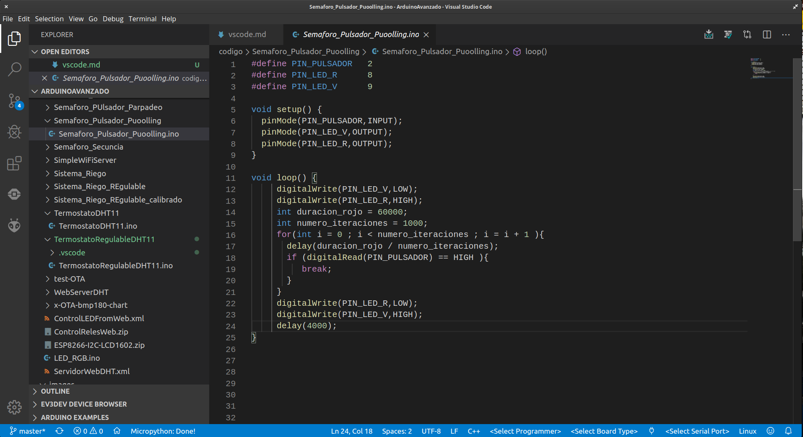
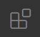
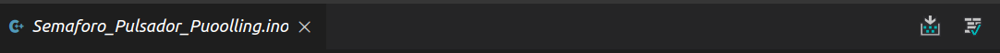

## Visual Studio Code

Visual Studio Code o vsCode es el entorno de programación OpenSource de Microsoft (es opensource al 95%...)

Permite programar con diferente lenguajes: Python, C, C++, Java, arduino, ... incluso usando diferentes plataformas, por ejemplo Arduino con Plataform IO o herramientas de programación para Lego. Además integra herramientas de gestión de código como git y de depuración.

Para usar diferentes lenguajes y/o plataformas usaremos extensiones

Está disponible para los sistemas operativos más frecuentes

## Instalación

[Descarga](https://code.visualstudio.com/download)

Lo instalamos y procedemos a buscar las extensiones.

Pulsamos el icono de las extensiones 

Y buscamos la extensión de **Arduino**. Yo uso la primera opción que es una extensión creada por Microsoft

## Uso

En lugar de utilizar muchas barras de iconos, para acceder a las diferentes funcionalidades Pulsamos **F1** o **ctrl + shift + P** y buscamos la opción que queremos usar, poniendo en primer lugar la extensión. 

### Uso con Arduino

La extensión correspondiente se activa cuando abrimos un fichero del tipo Arduino ***.ino**

Podemos verificar el código o subirlo a la placa con los iconos que aparecen arriba a la derecha

Podemos seleccionar las opciones en la barra de abajo de la ventana

* Modelo de Placa
* Abrir/Cerrar el Monitor Serie
* Seleccionar el puerto Serie

#### Ejemplos

F1 -> Arduino Examples

### Configuración

Para que detecte y verifique correctamente el código cambiaremos la configuración **"C_Cpp:Intelli Sense Engine"** a **"Tag Parser"** para ello entramos en la configuración de la extensión de C++. 

Necesitamos tener instalado un entorno de Arduino y cambiar la configuración en **File -> Preference -> Settings** Seleccionamos **Extensiones** y ahí la de Arduino

Modificamos:

* **Open PDEFiletype** para poder abrir los ficheros del formato antiguo pde 
* **Path** seleccionamos la carpeta donde tenemos instalado el entorno arduino
* "arduino.additionalUrls": "https://dl.espressif.com/dl/package_esp32_index.json"