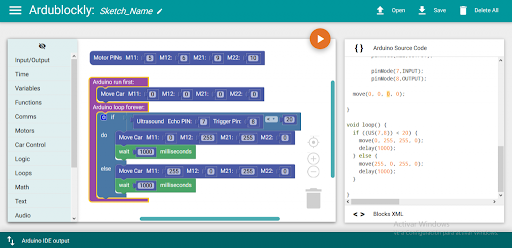
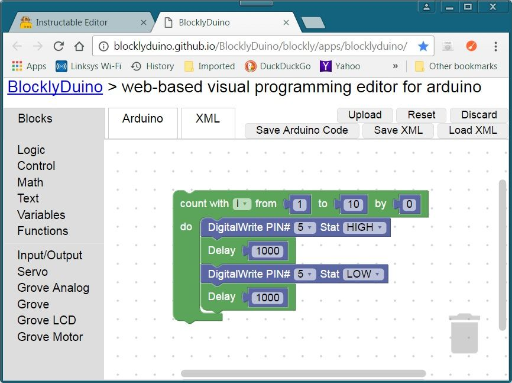
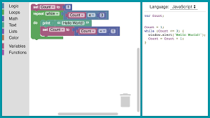

## Otros entornos de bloques

Todos estos derivan de [Blockly](https://developers.google.com/blockly) de google y son por tanto totalmente opensource y podemos 

Unos tienen algunos bloques más que otros, pero sí que tienen la gran ventaja de que podemo

### ArduBlockly

[ArduBlockly](https://ardublockly.embeddedlog.com/)

Entorno de bloques basados en Blockly

### Bloclyduino

[BlocklyDuino](https://blocklyduino.github.io/BlocklyDuino/blockly/apps/blocklyduino/)

### Visualino

[Visualino](http://visualino.net/)

Basado en una versión antigua de Bibloq (que también deriva de blockly)

