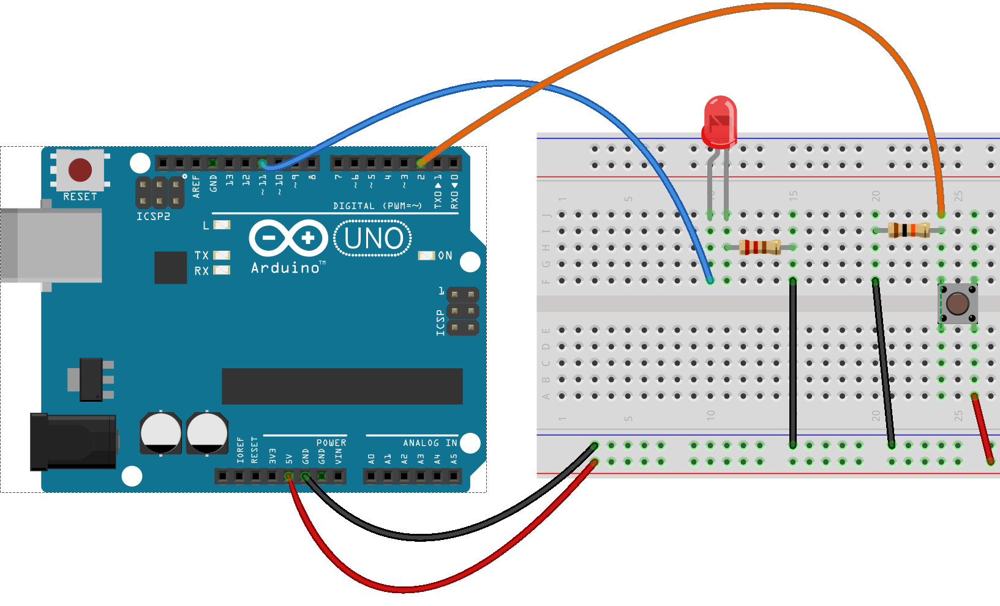

## Controlando el mundo físico con Arduino

### Conectando con el mundo físico

Está claro que si para algo necesitamos a nuestro Arduino es para que interaccione con el exterior, de ahí el concepto de Computación Física del que hablábamos.

Nuestro objetivo en la mayoría de los proyectos será leer y cuantificar ciertas magnitudes y si es necesario actuar sobre el entorno.

Esta lectura del exterior puede ser por ejemplo determinar las magnitudes meteorológicas o bien detectar la interacción de algún elemento exterior.

Nuestras actuaciones pueden ser accionamiento de motores, servos o cualquier otro sistema.

En este módulo veremos como hacerlo.

## Introducción a la electrónica

En la siguiente presentación puedes ver una introducción a la electrónica:

<iframe width="960" height="749" frameborder="0" webkitallowfullscreen="true" mozallowfullscreen="true" allowfullscreen="true" src="https://docs.google.com/presentation/embed?id=1mlXV-Wxtx7rHHfaTzzLYdnhHpBFAmaWu-jC891pyYyE&amp;start=false&amp;loop=false&amp;delayms=60000"></iframe>

[Presentación: introducción a la electrónica](https://docs.google.com/presentation/embed?id=1mlXV-Wxtx7rHHfaTzzLYdnhHpBFAmaWu-jC891pyYyE&amp;start=false&amp;loop=false&amp;delayms=60000)

[Enlace para descarga](https://www.dropbox.com/s/heovmlqccxoc9ta/4.0%20-%20Introducci%C3%B3n%20a%20la%20electr%C3%B3nica.pdf?dl=0)

## Mundo digital

En el mundo digital sólo existen dos estados, 0 y 1. Eléctricamente estos estados corresponden con 0 voltios y 5 voltios. En sistemas de bajo consumo, el estado 1 puede bajar a 3.3 voltios.

En sistemas reales las señales no son realmente como esperamos sino que están mezcladas con ruido. Cómo vemos en la imagen, este ruido complica el reconocer los estados. Para evitar esto se definen un nivel por encima de los cual se toma un valor 1 (la línea roja) y otro por debajo del cual se considera el nivel 0 (la línea azul)

Vamos a usar el IDE de arduino para estos ejemplos sencillos. Todas las órdenes están disponibles en los bloques de **Entrada/Salida** en ArduinoBlocks

### Salidas digitales

Al activar una patilla como salida, pedimos al micro que intente mantenerla en ese estado, pero dentro de sus posibilidades. Cada patilla puede entregar 40mA (200mW), si el equipo conectado necesita más, Arduino no podrá mantener ese estado y la patilla caerá por debajo de los 5v. Si nos pedimos demasiada potencia, estamos forzando la electrónica interna del micro, provocaremos sobrecalentamientos y de hacer continuadamente podemos dañar el micro.

En caso de necesitar más potencia tendremos que usar electrónica suplementaria para poder entregar esa potencia.

Para que nos hagamos una idea, un led necesita unos 25mA.Todas las patillas pueden ser salidas, también las analógicas.

Antes de usar una patilla como salida hemos de decírselo al micro. Lo haremos con la función

    pinMode(pin,OUTPUT);

Para establecer el estado usaremos la función

    digitalWrite(pin,estado);

donde estado puede ser **HIGH** o **LOW**

Siempre que conectemos un LED hemos de usar una resistencia para evitar que le llegue a este demasiado voltaje (un resistencia de 100 o 200 ohmios está bien)

Ahora que ya sabemos manejar las salidas digitales y también sabemos añadir temporizaciones podemos construir un semáforo. Para ello solo habrá que conectar 3 LEDS de distintos colores (cada uno con su resistencia) en 3 pines diferentes.

Como ayuda vamos a ver el caso de un Led conectado al pin 13 que parpadea cada segundo (el parpadeo debe de sincronizarse con el led de la placa)

El montaje en una placa Arduino sería el siguiente, utilizando la salida digital 9

Podemos hacer más ejemplos conectando más leds a diferentes pines. Cómo sabemos usar esperas y retardos podremos hacer un semáforo!! Comparte tu montaje en los foros.

(Pista: basta alternar las instrucciones en las que se enciende un led concreto con una espera y el apagado del anterior)

## Entradas y salidas analógicas

En electrónica, algo analógico significa algo que puede variar entre dos niveles de manera continua. En nuestro caso esos niveles serán normalmente 0v y 5v (aunque como veremos en el apéndice de sensores eso se puede cambiar)

### Entradas analógicas

Arduino proporciona varias (6 en Arduino UNO) patillas con capacidad para leer valores analógicos. Cuando leamos un valor tenemos una resolución de 10bits, lo que quiere decir que podremos obtener valores entre 0 y 1023.

Leeremos estos valores con la función **analogRead**:

    int valor=analogRead(pin);

Hagamos un ejemplo:

Veremos como al girar el potenciómetro, cambia la frecuencia de parpadeo del led, ya que estamos usando el valor medido del potenciómetro (entre 0 y 1023) como argumento para la espera (esperamos entre 0 y 1023 milisegundos)

El montaje de un potenciómetro sería como el siguiente:

Como ejercicio voluntario podemos hacer que el valor de un potenciómetro cambie la frecuencia o duración de un tono emitido. Comparte en los foros su montaje y programa.

En muchas ocasiones necesitamos convertir el valor inicial a una escala concreta. La función **map** permite re-escalar (proporcionalmente) un valor desde un rango inicial hasta un rango final.

    valorConvertido = map(valorInicial, minimoRangoInicial, maximoRangoInicial, minimoRangoFinal, maximoRangoFinal);

Imagínate que tienes un sensor del que lees valores entre 50 y 100. Quieres iluminar un led en todo su rango analógico que es 0 255.

Haríamos lo siguiente:

    int valorSensor = analogRead(pinSensor);

    int valorLed = map(valorSensor ,50 ,100 ,0, 255);

De esta manera tendremos el valor convertido. Podrías hacer ese cálculo con una regla de proporcionalidad, pero mejor usar algo bien probado.

Los rangos se pueden poner con el mínimo y el máximo invertido, así conseguiremos una proporcionalidad inversa, es decir cuando más grande sea el valor original más pequeño será el valor convertido.

Un ejemplo típico sería el convertir el rango de lectura de, por ejemplo, un potenciómetro, que será 0 - 1023 al ángulo de un servo que es 0-180, que es lo que hace el ejemplo **Knob** de la librería **Servo**

    // Ejemplo knob de la librería Servo

    #include <Servo.h>

    Servo myservo;    // objeto para controlar el servo

    int potpin = A0;  // conectamos el potenciometro a A0
    int servoPin = 9; // conectamos el servo al pin 9

    void setup() {
        myservo.attach(servoPin);  // Conectamos el servo a su pin
    }

    void loop() {
        int potValor = analogRead(potpin);  // valor potenciometro 0-1023
        int angulo = map(potValor, 0, 1023, 0, 180);  // escalamos a 0-180
        myservo.write(angulo);         // enviamos la orden al servo
        delay(15);              // damos tiempo a que el servo se mueva
    }

El montaje sería el siguiente

Para hacer este montaje vamos a usar una placa de prototipo o protoboard o breadboard o regleta de conexiones.

Que recordemos que internamente conecta de esta manera

Veamos en [este vídeo](https://youtu.be/gGWmJ0xXTSk) como usar un placa de prototipo

### Ejercicio con placa de prototipo

Vamos a aprovechar que ya sabemos usar las placas de prototipo para proponer algunos montajes algo más complicados.... Cuando los tengas envíalos al foro.

#### Coche fantástico o Cylon

Se trata de hacer que una serie de leds se enciendan en orden. Es un proyecto tan famoso que hasta tiene nombre: [Scanner Larsson](https://www.google.com/search?q=larson+scanner&client=ubuntu&hs=fll&sxsrf=ALeKk01Dq_BCKDeiuGmHIE4IYkGtPDUhPw:1585766951982&source=lnms&tbm=isch&sa=X&ved=2ahUKEwjk7fme8sfoAhUSyIUKHReqDWMQ_AUoAnoECAsQBA&biw=1920&bih=945)

El montaje sería algo así: 

(Un truco para hacerlo más sencillo es conectar los leds en pines consecutivos de manera que se pueda hacer un bucle sobre ellos...)

### Salidas analógicas

Una salida analógica es aquella capaz de dar un valor intermedio entre sus límites. Muy pocos modelos de Arduino no es capaz de hacer eso (como el DUE), pero si puede simularlo. Lo que realmente nos interesa la mayor parte de las veces es modular la potencia que enviamos por una patilla (que tiene casi el mismo efecto sobre cargas reales). Así si queremos una salida al 50% lo que haremos será tener la patilla a 1 el 50% del tiempo y a 0 el otro 50%. Haciéndolo suficientemente rápido no se nota la diferencia.

Podremos usar como salidas analógicas aquellas etiquetadas con el símbolo **~** y podremos darle valores entre 0 y 255.

Usaremos la función **analogWrite(pin, valor) **

Esta modulación de la potencia en el tiempo se conoce como **PWM**

Veámoslo en un vídeo que grabamos en otro curso de Arduino, donde podemos ver como la señal (en la pantalla del osciloscopio se ven 5 de estas señales para hacer más claro el efecto) va cambiando. El programa iba cambiando el valor de la patilla entre 0 y 255 de forma continua.

Esta señal se le aplica a un led.

<iframe width="1280" height="720" frameborder="0" src="http://www.youtube.com/embed/lKHofdHzIDs"></iframe>

[Vídeo de señal PWM en un osciloscopio](http://www.youtube.com/embed/lKHofdHzIDs)

Vamos a hacer ahora un programa que vaya encendiendo progresivamente un led y luego lo vaya apagando poco a poco.

El montaje es idéntico al de una salida digital, sólo que hay que elegir un pin que permite usar PWM (indicados con **~**)

Desde BitBloq, el ejemplo de la salida analógica sería la siguiente

Y desde ArduinoBlocks

Donde hemos usado el bloque **contar con** que está en **Control**

#### LED RGB

Un led RGB es un led que internamente tiene 3 led. Normalmente tiene uno rojo, uno verde y un azul (de ahí el nombre Red, Green, Blue). Se unen una de las patillas de cada uno en una patilla común dejando los otros 3 terminales separados.

Dependiendo de si vamos activando unos u otros leds podemos conseguir mezcla de colores

Por esto hay 2 tipos de diodos RGB: los de **ánodo común** y los **cátodo común**,  dependiendo de cual de las patillas se haya unido.

La diferencia es que en unos tienes que aplicar voltaje positivo a los terminales (mayor que los 0v que hay en el común)de los colores y en los otros voltaje negativo (menor a los 5V que hay en el común).

Podemos usar los pines PWM para hacer combinaciones de color mezclándolos a distintas intensidades.

Si usamos un módulo led RGB que ya incluye las resistencias

Y si usamos un componente led RGB  añadiremos nosotros las resistencias

Usaríamos 3 salidas PWM (por ejemplo la 9,10 y 11 que están marcadas con el **~** de PWM en la placa) que conectamos a los pines R,G y B y a tierra.

Usando instrucciones del estilo:

    analogWrite(pinRojo, nivelRojo);
    analogWrite(pinVerde, nivelVerde);
    analogWrite(pinAzul, nivelAzul);

con valores de nivelRojo, nivelVerde y nivelAzul entre 1 y 255

Dependiendo de que sean de cátodo o de ánodo común usaremos **analogWrite(ledColor, color)** y en los otros **analogWrite(ledColor, 255 - color)**

Podemos usar [un selector de color](https://htmlcolorcodes.com/es/) para encontrar las intensidades de cada componente para un color dado.

Vamos a hacer [un programa](http://www.arduinoblocks.com/web/project/283870) que nos permite ver todos los posibles colores usando ArduinoBlocks. En [este vídeo](https://youtu.be/srezfZFW7t4Cic) explicamos cómo hacerlo

Como ejercicio voluntario se propone hacer un programa que vaya encendiendo un led a medida que modificamos el valor de una entrada analógica a la que está conectado un potenciómetro. Comparte en los foros tu proyecto.

### Entradas digitales

Cuando usamos una patilla como entrada digital, Arduino decidirá si el voltaje de la patilla tiene un valor u otro. Hay que tener cuidado de cómo y qué conectamos pues podríamos dañar la placa.

La forma en la conectamos la entrada (un interruptor en este caso ) a la patilla suele ser la siguiente

Podríamos pensar que la resistencia no es necesaria, pero no es así. Si no estuviera puesta, cuando el interruptor estuviera abierto, la patilla no estaría conectada a nada y por sus características electrónicas actuaría como una antena recogiendo señales eléctricas y cambiara de estado casi aleatoriamente.

En esta forma de conexión decimos que las entradas están conectadas con resistencias Pull down, pues la resistencia pone el valor a 0 (al estar conectado a tierra). Si estuviera conectado a 5V diríamos que tiene resistencias Pull Up.

Para indicar a Arduino que vamos a usar una patilla como entrada usaremos la función

    pinMode(pin,INPUT);

y para leer el valor usaremos

    digitalRead(pin);

El montaje sería como el siguiente, utilizando la entrada 2:

Existen interruptores que tienen 2 juegos de contactos (4 conectores) que funcionan de forma independiente. Antes de usar el interruptor hay que saber la configuración y cuales son los pines del interruptor que se han de usar.

El mundo digital de los microcontroladores va a una velocidad muy alta (sabemos que Arduino funciona a 16MHz, lo que quiere decir que ejecuta del orden de los 16.000.000 de instrucciones por segundo). Con esas velocidad tan elevadas lo que para nosotros es pulsar un interruptor, para el micro pueden ser muchas conexiones/desconexiones debidas a pequeñas irregularidades de los contactos y de pequeñas chispas que saltan entre ellos.

Por esto siempre que leemos un valor debemos introducir un pequeño retardo para evitar estos errores. Es lo que se suele llamar "debouncing" (evitar rebotes)

Veamos un ejemplo

Podemos comparar con lo que sería el esquema eléctrico

Veamos este programa en BitBloq

Como ejemplo podéis hacer un programa que cambie el estado de un led con cada pulsación. Para ello tendríamos que mantener el estado del led en una variable y cambiar éste con cada nueva pulsación. En este caso quedará más patente el efecto de los falsos contactos del pulsador.

Basta con introducir un pequeño retardo de 10ms para evitarlo. Comparte en los foros la solución

Otra práctica interesante puede ser hacer un timbre, que para eso ya sabemos hacer sonidos. Comparte en los foros tu montaje.

Prueba a hacer un semáforo que cambie de estado al pulsar el botón

## Sensores

En esta sección veremos una presentación con algunos de los muchos sensores existentes, y veremos cómo se conectan algunos de ellos a Arduino.

Todos tiene en común que miden una magnitud física y producen un voltaje proporcional a esta medida, que mediremos con una entrada analógica (normalmente) de Arduino.

Muchas veces es necesario convertir el valor que leemos a otra escala. La función map permite re-escalar (proporcionalmente) un valor desde un rango inicial hasta un rango final.

    valorConvertido = map(valorInicial, minimoRangoInicial, maximoRangoInicial,minimoRangoFinal, maximoRangoFinal);

Imagínate que tienes un sensor del que lees valores entre 50 y 100. Quieres iluminar un led en todo su rango analógico que es 0 255.

Haríamos lo siguiente:

    int valorSensor = analogRead(pinSensor);  
    int valorLed = map(valorSensor, 50, 100, 0, 255);

Si tenéis curiosidad por algún sensor y no lo encontráis aquí no dejéis de preguntarlo en el foro e intentaremos entre todos averiguar cómo funciona.

<iframe width="960" height="749" frameborder="0" src="https://docs.google.com/presentation/embed?id=1EPN5gyd8S8YHc1wgIeuZONmEshDqNo47xLicAjvd-TY&amp;start=false&amp;loop=false&amp;delayms=5000" allowfullscreen="true" mozallowfullscreen="true" webkitallowfullscreen="true"></iframe>

[Presentación sobre sensores](https://docs.google.com/presentation/embed?id=1EPN5gyd8S8YHc1wgIeuZONmEshDqNo47xLicAjvd-TY&amp;start=false&amp;loop=false&amp;delayms=5000)

[Enlace para descargar la presentación](https://www.dropbox.com/s/w4wd1asce3dvxox/4.6%20-%20Sensores.pdf?dl=0)

