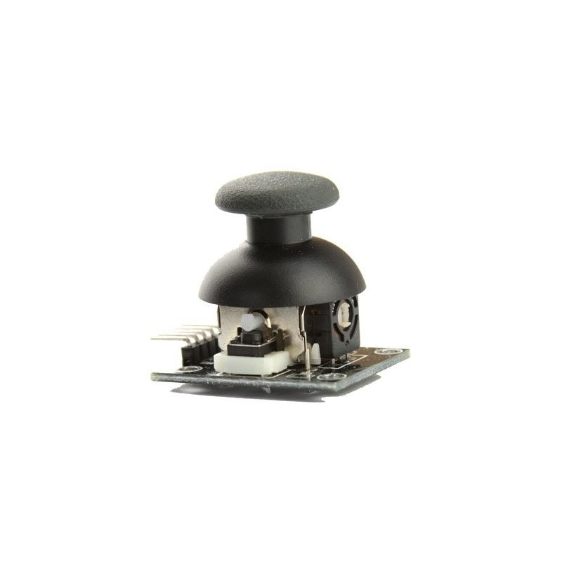
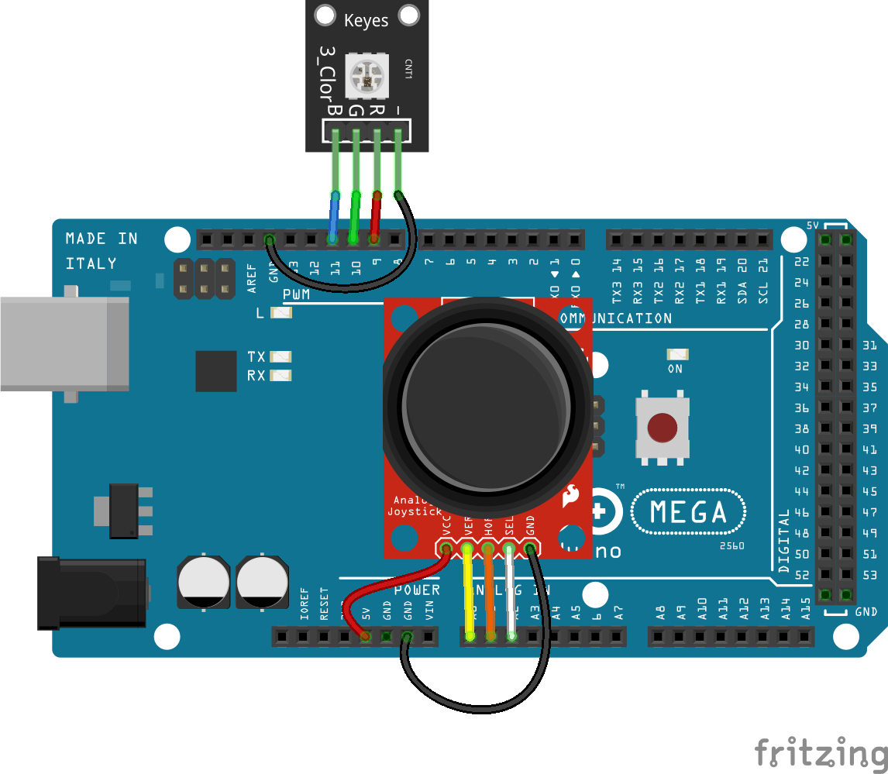
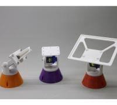

## Joystick XY



Este módulo joystick de doble eje (x e y) y pulsador está formado por 2 potenciómetros que controlan el movimiento en los ejes y un pulsador para cuando lo pulsamos.

Podemos leer su posición con 2 **analogRead**

Hay que tener en cuenta que los potenciómetros tienen conectado unos muelles que hacen que su posición de reposo sea en la mitad, con lo que si no lo tocamos leeremos 511 (aproximadamente en cada uno).

### Ejemplos

#### Control del color de un led RG(B)

Podemos usarlo por tanto como 2 potenciómetros para controlar 2 de los colores de un led RGB y el pulsador para encender/apagar el led:




```C++

void setup(){
    pinMode(A2,INPUT);
}

void loop(){

    int y = analogRead(A1);
    int x = analogRead(A0);

    int R = map(x,0,1023,0,255);
    int G = map(y,0,1023,0,255);

    if (digitalRead(A2) == HIGH) {
        analogWrite(9,R);
        analogWrite(10,G);
    } else {
         analogWrite(9,0);
        analogWrite(10,0);       
    }

}

```

#### Control de servos

Un ejemplo típico es usar un joystick para controlar la posición de la típica torreta que usar 2 servos para controlar la dirección en la apunta y a la que podemos unir un pequeño laser, sensor de ultrasonidos o una cámara.



El código sería muy parecido al anterior, solo que el map tendríamos que hacer en el rango de movimiento de los servos.


