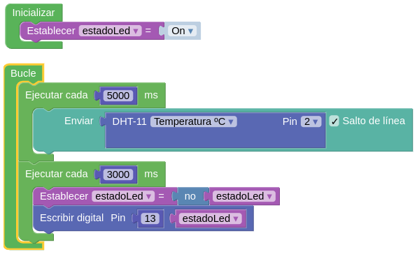

## Funciones relacionadas con el tiempo

### Esperas 

Vamos a repasar las funciones relacionadas con la medida del tiempo. 

Si necesitamos que nuestro programa espere un tiempo (el programa no hace nada mientras está en esta espera) podemos usar:

```C++

delay(espera); // espera expresado en milisegundos

delayMicroseconds(espera); // espera expresado en microsegundos
```

El número máximo que soporta **delayMicroseconds** es 16383, esto es debido a que la función está optimizada para conseguir precisión en el tiempo y no tiene sentido usarla para duraciones mayores, para eso está **delay** 


**Ventaja**: son muy fáciles de usar.

**Inconveniente**: no nos permiten hacer nada mientras esperamos.

Por esto vamos a aprender a medir el tiempo y así no tener que esperar de forma pasiva.

### Medida del tiempo

Arduino nos permite medir el paso del tiempo con su reloj interno, pero no dispone de un reloj "real" que nos permita saber la fecha y hora con precisión:

```C++
long millis() : número de milisegundos desde que se encendió la placa. 
```

Al usar un tipo long, su valor vuelve a  cero cada 50 días aproximadamente.


Lo usaremos así:

```C++
  long ini = millis();
  //hacemos algo
  long millis_pasados = millis()-ini; // milisegundos que han pasado
  long segundos = millis_pasados / 1000;  // Segundos que han pasado
```

### Parpadeo sin Esperas

Vamos a usar lo visto para hacer un programa que  produzca un parpadeo pero sin usar delay y por tanto si hacer esperas (y mientras puedes por ejemplo vigilar el estado de un botón).

El algoritmo será:

* Anoto el tiempo actual en que enciendo el led.
* Hago las otras tareas.
* Vuelvo a medir el tiempo y comparo con el anterior.
* Si ha pasado más del intervalo apago el led y anoto el tiempo actual.
* Si no ha pasado sigo haciendo otras tareas.

El código quedaría así:


```C++
#define PIN_LED 13
#define INTERVALO 1000        // intervalo de parpadeo

int estadoLed = LOW;          // Ultimo estado del led
long anteriorMillis = 0;      // almacena el momento del  ultimo cambio de estado

void setup() {
  pinMode(PIN_LED, OUTPUT);  
}

void loop() {
  unsigned long actualMillis = millis();  // Guardamos el tiempo actual
  if(actualMillis - anteriorMillis > INTERVALO) {
    anteriorMillis = actualMillis;   
    if (estadoLed == LOW) {  // Invertimos el estado estado = !estado
      estadoLed = HIGH;
    } else {
      estadoLed = LOW;
    }
    digitalWrite(PIN_LED, estadoLed);  // Ponemos el nuevo estado
  }
}    
    
```


ArduinoBlocks dispone de un bloque que nos permite hacer fácilmente. Se llama **Ejecutar cada ...**. En [este ejemplo](http://www.arduinoblocks.com/web/project/285661) hacemos que cada 5 segundos se lea el valor de un sensor de temperatura DHT11 conectado al pin 2 y cada 3 segundos se invierte el estado del led del pin 13.



Si vemos el código que se genera veremos que hace algo muy parecido a lo que hemos comentado.

### Librería Time

La librería Time nos permite trabajar cómodamente con tiempos en formato de horas, minutos y fechas. Así podremos usar arduino como un reloj (con poca precisión eso sí).

Un ejemplo sencillo de su uso sería:


```C++
#include <Time.h>

void setup() {   
  Serial.begin(9600);
  setTime(10,23,00,14,3,2018);  // tienes que poner la hora actual!!
}

void loop()  {   
  time_t t = now();

  Serial.print(day(t));
  Serial.print(+ "/") ;
  Serial.print(month(t));
  Serial.print(+ "/") ;
  Serial.print(year(t));
  Serial.print( " ") ;
  Serial.print(hour(t));  
  Serial.print(+ ":") ;
  Serial.print(minute(t));
  Serial.print(":") ;
  Serial.println(second(t));
  delay(1000);
}

```
Si dejas este ejemplo ejecutándose durante un par de días verás que el reloj se desajusta en varios segundos.... Más adelante veremos cómo podemos usar un RTC (reloj de tiempo real) para conseguir una precisión adecuada.
