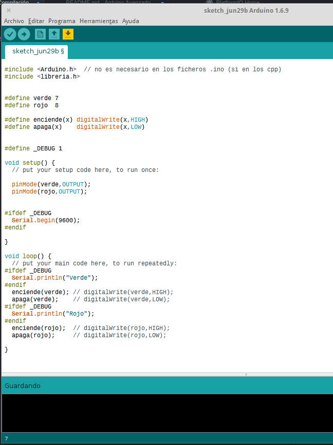

## Proceso de compilación en C++ y en Arduino

Es importante saber cómo es el proceso de compilación de nuestro código para así poder entender el funcionamiento de algunas cosas.

### Fases del proceso de compilación

Se realiza en 3 fases y es muy importante el orden:

#### Preprocesado

* Includes: se incluyen todos los ficheros (de manera recursiva, el include  que include un fichero...).
* Defines: se sustituyen las etiquetas por su valor.
* Directivas de preprocesado: se validan y se decide qué código se usa y cuál no.

### Compilado

* Se valida la sintaxis, se revisan la declaración de todas las variables, se validan los tipos, expresiones, etc...
* Se genera un código objeto.

### Enlazado ("Linkado")
* Se juntan todos los códigos objetos (de los diferentes ficheros) y de las librerías usadas.
* Se verifica que no falten símbolos.
* Se genera el ejecutable.

En este vídeo explicamos el proceso con un [ejemplo](./Preprocesador/Preprocesador.ino)

```C++
#define verde 7
#define rojo  8

#define enciende(x) digitalWrite(x,HIGH)
#define apaga(x)    digitalWrite(x,LOW)


#define _DEBUG 1

void setup() {
  // put your setup code here, to run once:

  pinMode(verde,OUTPUT);
  pinMode(rojo,OUTPUT);


#ifdef _DEBUG
  Serial.begin(9600);
#endif

}

void loop() {
  // put your main code here, to run repeatedly:
#ifdef _DEBUG
  Serial.println("Verde");
#endif
  enciende(verde); // digitalWrite(verde,HIGH);
  apaga(verde);    // digitalWrite(verde,LOW);
#ifdef _DEBUG
  Serial.println("Rojo");
#endif
  enciende(rojo);  // digitalWrite(rojo,HIGH);
  apaga(rojo);     // digitalWrite(rojo,LOW);

}
```

En este [vídeo](https://youtu.be/ODG07Y9SIHc) puedes ver el proceso explicado.


