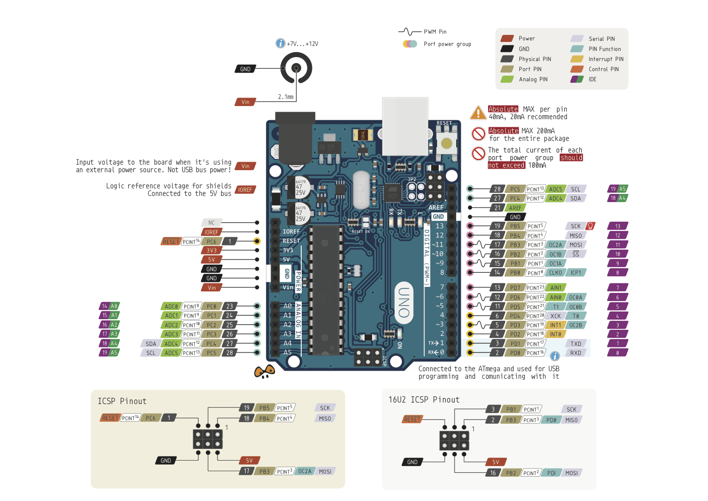
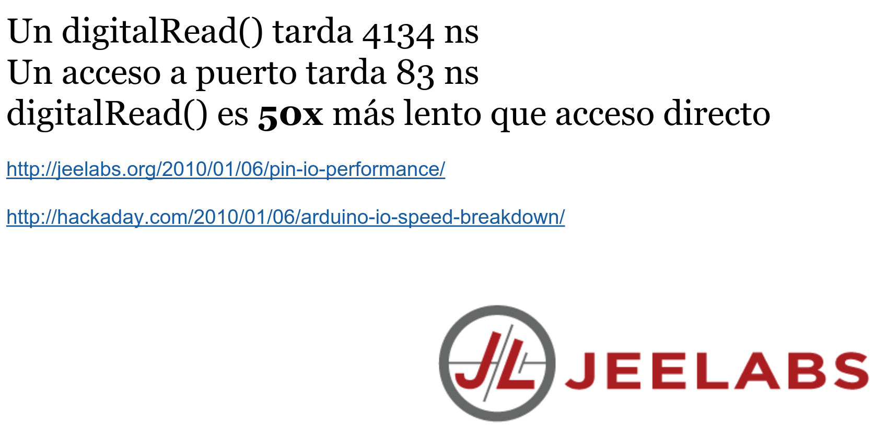
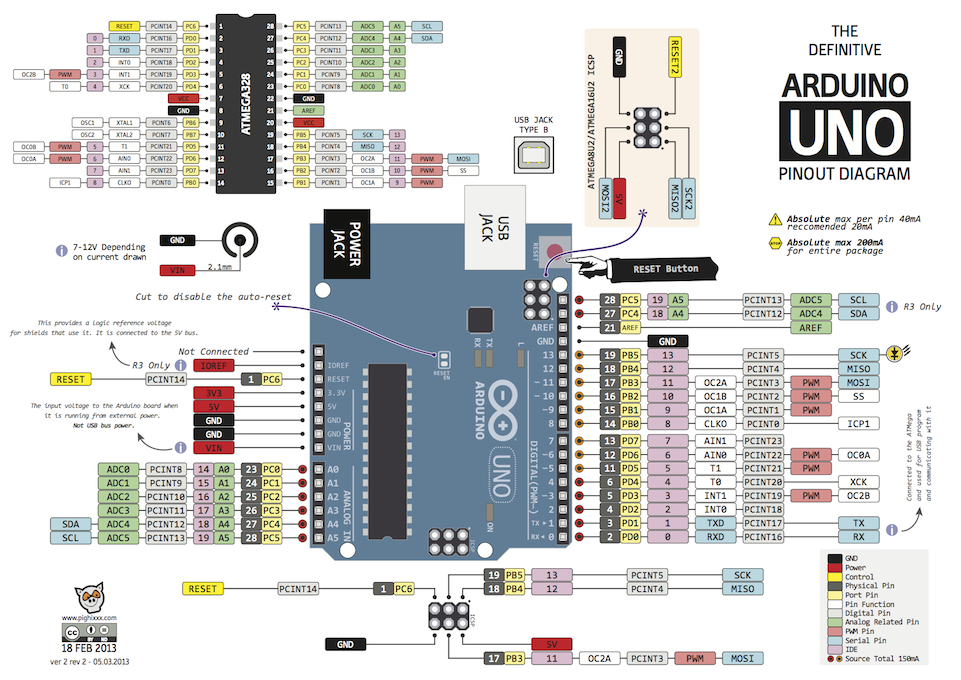
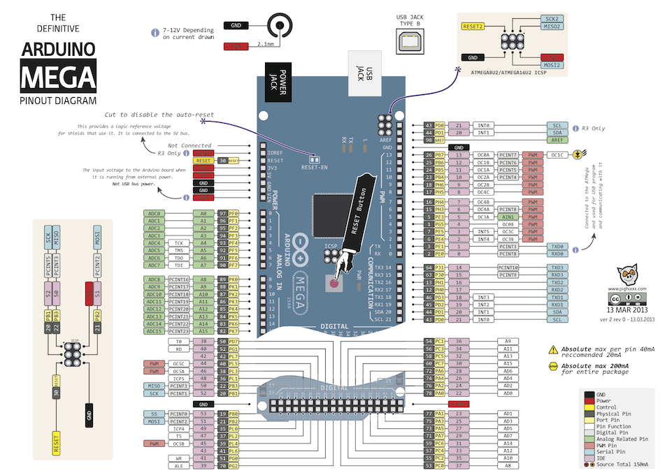
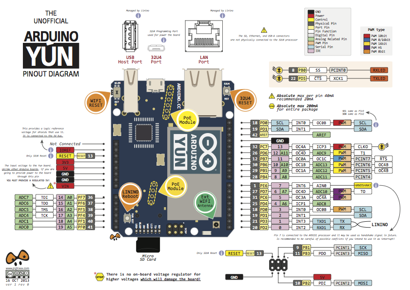
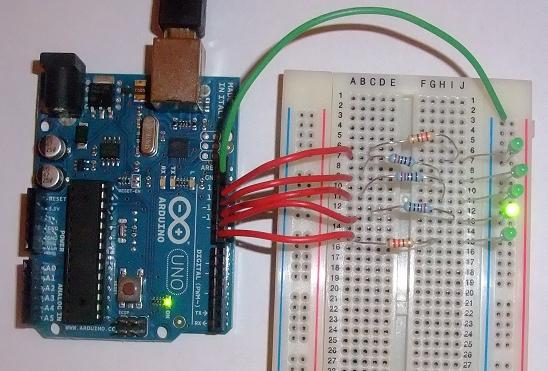

## Uso avanzado de puertos

Hasta ahora todo el acceso a los puertos que hemos hecho ha sido usando las instrucciones  digitalWrite o digitalRead. Con ella sólo podíamos acceder a un pin al mismo tiempo, es decir para hacer varias acceso a diferentes pines teníamos que hacer diferentes llamadas.

Son muchas las ocasiones en las que es necesario el acceder simultáneamente a varios pines como por ejemplo cuando estamos usando muchos leds. O bien cuando accedemos a los bits y podríamos realizar operaciones matemáticas de una forma sencilla para obtener los resultados.

Por otro lado, internamente todos los pines de los microcontroladores están organizados en diferentes palabras o registros.



Por ejemplo, en  Arduino UNO las E/S en los microcontroladores están agrupadas en puertos:

* B (digital pin 8 to 13)
* C (analog input pins)
* D (digital pins 0 to 7)

Cada puerto está controlado por 3 registros donde cada bit representa a un pin:

* DDR  que define si el pin es INPUT o  OUTPUT
* PORT que define el estado en caso de que sea pin de salida HIGH o  LOW
* PIN  que define el estado en caso de que sea entrada INPUT

Otra ventaja que tiene acceder de esta manera que es que el acceso es mucho más rápido.



[Detalles](https://hackaday.com/2010/01/06/arduino-io-speed-breakdown/) y [Más detalles](https://jeelabs.org/2010/01/06/pin-io-performance/)

Se propone comprobar ésto de forma práctica, midiendo la velocidad de acceso directo a puertos y de digitalwrite.

Veamos la estructura de los pines de un Arduino UNO:



Para un arduino Leonardo el diagrama es parecido aunque con diferencias, como por ejemplo los pines SDA y SCL y sobre todo la disposición e los pines de puerto agrupados:


Y no podía faltar el esquema para el Arduino Mega (En el que vemos que los diseñadores no tuvieron mucho cuidado a la hora de colocar cercanos entre sí los pines de un mismo puerto...):



Arduino Yun:



(Esquemas del gran Alberto Piganti @pighixxx)

En el [siguiente vídeo](https://www.youtube.com/embed/xkSOt-tlCmM) vamos a ver cómo usar los pines por medio de los registros.

Vemos esto en más detalles para el Arduino Uno. Para las restantes placas es igual.


* PORTD  Arduino digital pins 0 to 7:

  * DDRD  - Port D Data Direction Register - read/write
  * PORTD - Port D Data Register - read/write
  * PIND -  Port D Input Pins Register - read only


* PORTB  Arduino digital pins 8 to 13:

  * DDRB -  Port B Data Direction Register - read/write
  * PORTB - Port B Data Register - read/write
  * PINB -  Port B Input Pins Register - read only

* PORTC  Arduino analog pins 0 to 5. Pins 6 & 7 sólo en Arduino Mini:

  * DDRC - Port C Data Direction Register - read/write
  * PORTC - Port C Data Register - read/write
  * PINC - Port C Input Pins Register - read only

[Referencia](http://www.arduino.cc/en/Reference/PortManipulation)

### Ejemplo sencillo para Arduino UNO

(Hemos usado Arduino Uno por simplicidad, pero se aplica igual a cualquir placa, sólo hay que buscar los pines de un mismo puerto).

Hemos dicho que PortD mapea los digital pins 0 to 7 (pins 0 y 1 son TX y RX).

DDRD es la dirección del Port D (pines 0 - 7 digitales de Arduino Uno) controla si PORTD se configura como entrada o salidas.

Si en nuestro código hacemos:

```C++
DDRD = B11111110; // 1 to 7 as outputs, pin 0 as input
```

Estaremos haciendo que los pines 1-7 sean salidas y el 0 entrada.

Si ahora hacemos:

```
PORTD = B10101000; // ponemos los pin 7, 5, 3 HIGH
```
Estamos poniendo los pines 7, 5 y 3 en estado alto.

Hay que tener cuidado con los pines 0 y 1 puesto que si los manipulamos con el registro PORTD podemos producir problemas de comunicación puesto que son los pines que se encargan de ello.

Vamos a hacer ahora el típico ejemplo del "coche fantástico o Kit", donde vamos desplazando el led encendido entre los 5 disponibles.

Antes vamos a un truco matemático que se usa mucho. El operador **<<** nos permite rotar hacia la derecha el valor de un registro.

Si tenemos el valor 1 (B00000001 en binario) y lo rotamos una vez tendremos B00000010 (que en decimal equivale al valor 2).

Si queremos hacer que nuestro led "se deplace", sólo tenemos que rotar el valor 1 un cierto número de veces.

El resultado de este operador es multiplicar por 2 el valor orignal.

Del mismo modo existe el operador **>>** que rota en sentido contrario  y que equivale a dividir por 2.



El [código](https://github.com/javacasm/ArduinoCompletoDE2018/blob/master/material/codigo/CylonInterrupcionesHardware.ino) sería

```C++
unsigned char upDown = 1;  // Indica si vamos hacia arriba o hacia abajo

unsigned char cylon = 0; // será el led que encendemos de 0 a 4

void setup() {
    DDRB = B00011111; // Arduino port B pines 0 to 4 como salida
}

void loop() {
  if ( upDown == 1 ) { // Vamos hacia arriba
    cylon++;  // Pasamos al siguiente
    if(cylon >= 4) {  // Si llegamos a 4 tenemos que empezar a ir hacia abajo
        upDown = 0;
    }
  } else {
    cylon--;  // Vamos hacia abajo
    if ( cylon == 0 ) {  // Si llevamos abajo (0) empezamos a subir
      upDown = 1;
    }

  }
  PORTB = 1 << cylon; // Rotamos a la derecha determinado numero de veces el led
  delay(150); // Esperamos un poquito

}
```
