## Tipos de pantallas

Son muchas las posibilidades que tenemos para visualizar nuestros datos. En este capítulo vamos a hablar de 2 básicamente: LCD y LED. Son tecnologías bastante conocidas, cada una con sus ventajas e inconvenientes.

En el [siguiente vídeo](https://www.youtube.com/embed/MciTbzmYwsc) vamos a ver algunas de las posibilidades de visualización que existen para Arduino.

## LCD

Un LCD es la típica pantalla de las máquinas de vending, seguro que lo has visto miles de veces.

Podemos conectarla a Arduino de la siguiente forma:

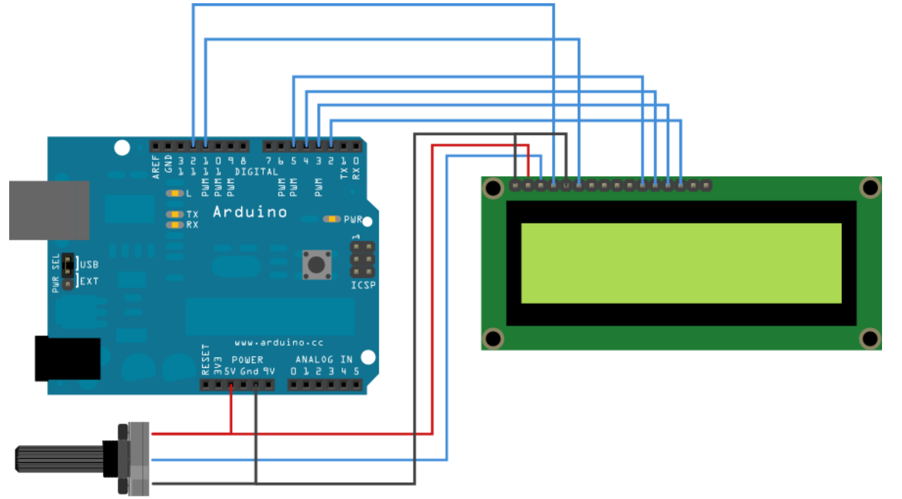

El potenciómetro nos sirve para controlar el contraste.

Para programarlo se usará la librería LiquidCrystal que viene instala por defecto en Arduino.

El código es del ejemplo "Hello world" de la librería es muy sencillo:

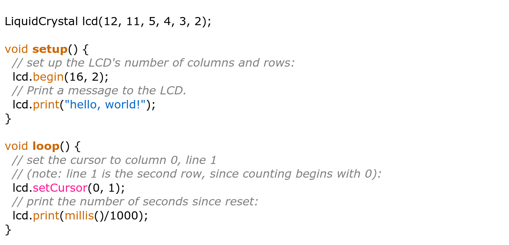

Vemos que la instrucción para mostrar algo (lcd.print) se parece mucho a la instrucción para enviar datos por el puerto serie (Serial.print),  y no es casualidad.

La tecnología LCD tiene como ventaja que su consumo es realmente bajo, por contra requiere de muchos pines de conexión, podemos rebajar a 4 bit de datos y 4 de control. Para solucionar este problema podemos usar otras formas de comunicación I2C o SPI o un 595. Por eso existen muchas versiones de la clase LiquidCrystal, incluida en la librería del mismo nombre. La mayoría de estas clases implementan casi todos los métodos, definiendo así una jerarquía de clases. 

[Vídeo sobre LCD](https://www.youtube.com/embed/c4qsdo6XrnE)

### LCD I2C

Vamos a ver como ahorrar pines usando LCD con una placa externa de tipo I2C:

[Vídeo sobre LCD I2C - LiquidCrystal-I2C](https://www.youtube.com/embed/nIJpE4oVX1Y)

Para ello instalaremos una librería llamada "LiquidCrytal I2C"
Desde el menú **Programa** -> **Incluir librerías** -> **Gestor de Librerias**

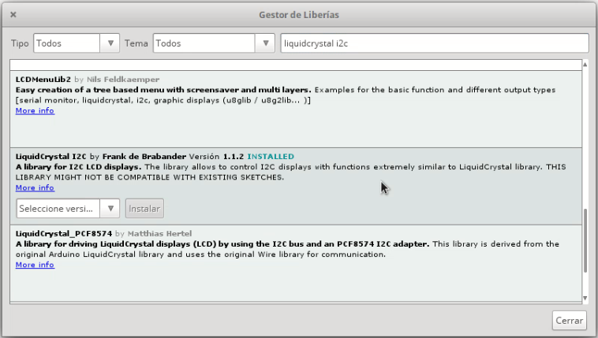

En el buscador ponemos "LiquidCrystal I2C" e instalamos la librería que queremos usar. En este caso os recomiendo la de Frank Brabander que aparece como "Installed" en la imagen.

El uso de la librería I2C es el mismo, solo cambiando el include.

Para empezar a usarla, abrimos el ejemplo de la libreria "LiquidCrystal I2C" HelloWorld , cambiamos la direccion del LCD (Puede ser 0x27 o 0x30 o 0x3F) (Podemos buscar el valor usando "[I2C Scanner](https://github.com/javacasm/ArduinoAvanzadoPriego/blob/master/codigo/i2c_scanner/i2c_scanner.ino)"), conectamos el LCD y ajustamos el contraste con el potenciómetro de la placa.

Vamos a ver ahora un ejemplo más complejo:

```C++
#include <Wire.h>
#include <LiquidCrystal_I2C.h>

// Los usaremos para definir caracteres personalizados
uint8_t heart[8] = {0x0,0xa,0x1f,0x1f,0xe,0x4,0x0};
uint8_t bell[8]  = {0x4,0xe,0xe,0xe,0x1f,0x0,0x4};

LiquidCrystal_I2C lcd(0x3F, 16, 2);  //

void setup() {
  lcd.init();

  lcd.backlight();
  lcd.createChar(0, heart);
  lcd.createChar(1, bell);


  lcd.setCursor(6, 0);  // fila 1, columna 6
  lcd.write(0);  // Mostramos el caracter personalizado 0
  lcd.print("Ejemplo 1");
  lcd.write(0);

  lcd.setCursor(8, 1); // fila 2, columna 8
  lcd.print("Otro texto");
  lcd.write(1); // Mostramos el caracter personalizado 1
}

void loop() {
  lcd.scrollDisplayLeft();  // Movemos hacie la derecha el texto
  delay(1000);
}
```

### Más sobre LCDs

Existen muchas posibilidades de ampliar el uso de los LCD, como por ejemplo utilizando  gráficos de barras con  la [librería lcdBarGraph](http://playground.arduino.cc/Code/LcdBarGraph).  Lo que hace es usar caracteres definidos por el usuario con pequeños rectángulos de tamaños progresivos y cuando dibuja una barra, muestra todas los cuadrados enteros y el resto con el carácter correspondiente. Aunque esta librería funciona con la básica LiquidCrystal se puede implementar sin problema en cualquier versión de liquidcrystal.

Algo en lo que también se puede mejorar el aspecto al trabajar en Menús, dentro de nuestra aplicación.

Veamos las diferentes opciones:

* Menús en librería serie http://playground.arduino.cc/Code/Menu
* Menus en lcd http://forum.arduino.cc/index.php?topic=96104.0
* Menus en lcd http://forum.arduino.cc/index.php?topic=104762.0
* Los mejores y más completos menús https://code.google.com/p/phi-prompt-user-interface-library/

## Matrices de leds

Otra forma de visualización bastante utilizada son las matrices de Leds. En ellas un gran número de leds se colocan normalmente en forma de matriz y realizamos imágenes controlando sus encendidos. 

Veamos en [este vídeo](https://www.youtube.com/embed/EkwyEPTeuI8) el funcionamiento de algunas de ellas y ejemplos de uso y el código asociado.

Las matrices leds están formadas por un conjunto de leds interconectados entre sí, de manera que cuando alimentamos de la manera correcta una fila y una columna, sólo uno de los leds se activará

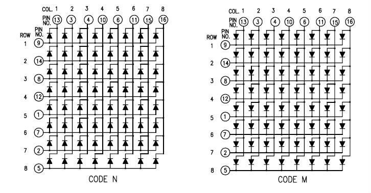

Las llamadas "Code N" tienen conectado el ánodo de los leds y las llamadas "Code M" el cátodo. Nosotros vamos a hacer el ejemplo correspondiente a una de tipo **Cátodo común**.

Para controlarla necesitaremos por lo tanto 8 pines para las filas y 8 para las columnas

Para activar por ejemplo el led de la fila 4, columna 5 tendremos que poner la patilla de la fila 4 en estado alto y la de la columna 5 en estado bajo de manera que el led se active, manteniendo todas las demás patillas de las columnas en estado alto para que no se activen los otros leds.

Si varias columnas estuvieran en estado bajo, se encenderían todos esos led. Si varias filas estuvieran en estado alto se activarán todos los leds correspondientes. 

Por tanto para usar toda la matriz tendremos que ir activando cada fila y sus correspondientes columnas de manera sucesiva.

Cada fabricante conecta los leds como le resulta más sencillo y desgraciadamente los pines no se corresponden siempre de manera directa con las filas y las columnas, con lo que si no lo tenemos tendremos que investigarlo. En este [tutorial de prometec](https://www.prometec.net/matriz-led-8x8/) nos explican como hacerlo.

Una vez conocido el patillaje de la matriz, podemos conectar de una forma similar a esta:

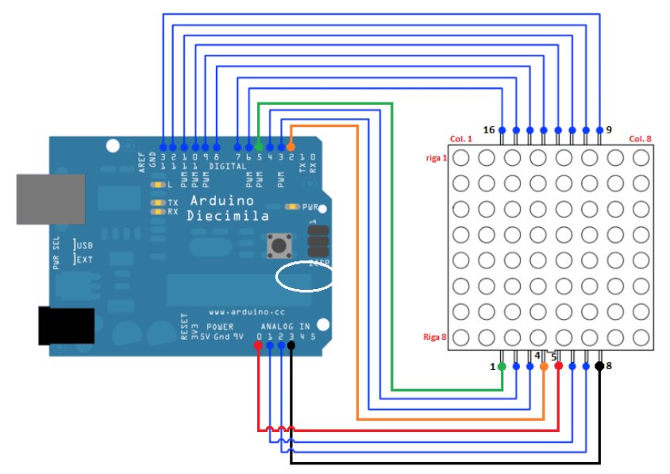


Un programa sencillo sería el siguiente (Tomado de la web de Inven.es)

```C++
// DECLARACIÓN DE VARIABLES 
// En el siguiente array pin[0..16] (la posición 0 es ficticia y sirve para iniciar el indice de la matriz en 1) 
// Se trata de esquematizar la conexión de pines en la matriz LED
// Tenga presente que los pines 14 ... 17 corresponden respectivamente a:
//    A0 => 14-esimo pin de arduino
//    A1 => 15-esimo pin de arduino
//    A2 => 16-esimo pin de arduino
//    A3 => 17-esimo pin de arduino
int pins[17]= {-1, 5, 4, 3, 2, 14, 15, 16, 17, 13, 12, 11, 10, 9, 8, 7, 6};

int cols[8] = {pins[13], pins[3], pins[4], pins[10], pins[06], pins[11], pins[15], pins[16]};
int rows[8] = {pins[9], pins[14], pins[8], pins[12], pins[1], pins[7], pins[2], pins[5]};

// DECLARACIÓN DE FUNCIONES
void AllLedOFF()  // Creamos una función que apaga todos los LEDS
{
  for (int i = 1; i <= 8; i++)
  {
        digitalWrite(cols[i - 1], LOW);
        digitalWrite(rows[i - 1], HIGH);
  }
}

void LedON(int r, int c)      //Encendemos el LED en la posición fila R y columna R
{
  AllLedOFF();
  digitalWrite(cols[c - 1], HIGH);
  digitalWrite(rows[r - 1], LOW);
  delay(100);
}

void AllLedON()     // Creamos una función que enciende todos los LEDS
{
  for (int i = 1; i <= 8; i++)
  {
        digitalWrite(cols[i - 1], HIGH);
        digitalWrite(rows[i - 1], LOW);
  }
  delay(1000);
  AllLedOFF();
}

// INICIALIZACIÓN DEL PROGRAMA (SE EJECUTA SOLO UNA VEZ)
void setup() 
{
  // Definimos todos los pin de Arduino como pines de salida
  for (int i = 1; i <= 16; i++)
      pinMode(pins[i], OUTPUT);
  // Ponemos todos los LED la matriz apagados
  AllLedOFF();
}

// LOOP CENTRAL DEL PROGRAMA (SE EJECUTA CONSTANTEMENTE DE FORMA SECUENCIAL) 
void loop()
{
  int i, c, r;

  // Vamos encendiendo los LED por columnas de izquierda a derecha
  for (c=1; c<=8; c++)
  {
    for (r=1; r<=8; r++)
       digitalWrite(rows[r - 1], LOW);
    digitalWrite(cols[c - 1], HIGH);
    delay(300);
    digitalWrite(cols[c - 1], LOW);
    for (r=1; r<=8; r++)
       digitalWrite(rows[r - 1], HIGH);
  }
  
  // Vamos enciando los LED por filas de abajo a arriba
  for (r=1; r<=8; r++)
  {
    for (c=1; c<=8; c++)
       digitalWrite(cols[c - 1], HIGH);
    digitalWrite(rows[r - 1], LOW);
    delay(300);
    digitalWrite(rows[r - 1], HIGH);
    for (i=1; i<=8; i++)
      digitalWrite(cols[i - 1], LOW);
  }
  
  // Encendemenos cada led independiente desde la primera posición hasta la 64 
  for (r=1; r<=8; r++)
    for (c=1; c<=8; c++)
      LedON(r,c);
  AllLedOFF();
  // AllLedON();   
}

```

### Matrices Leds con max7219

Salvo para practicar el cableado, hoy en día no se suelen montar las matrices leds como hemos visto, sino que se utilizan chips que hacen por nosotros el trabajo complicado. 

Uno de los más utilizado es el llamado MAX7129 que sólo requiere 3 pines de conexión con Arduino y que además podemos encadenar entre sí, de manera que los mismos 3 pines nos permiten conectar hasta 64 matrices al mismo tiempo

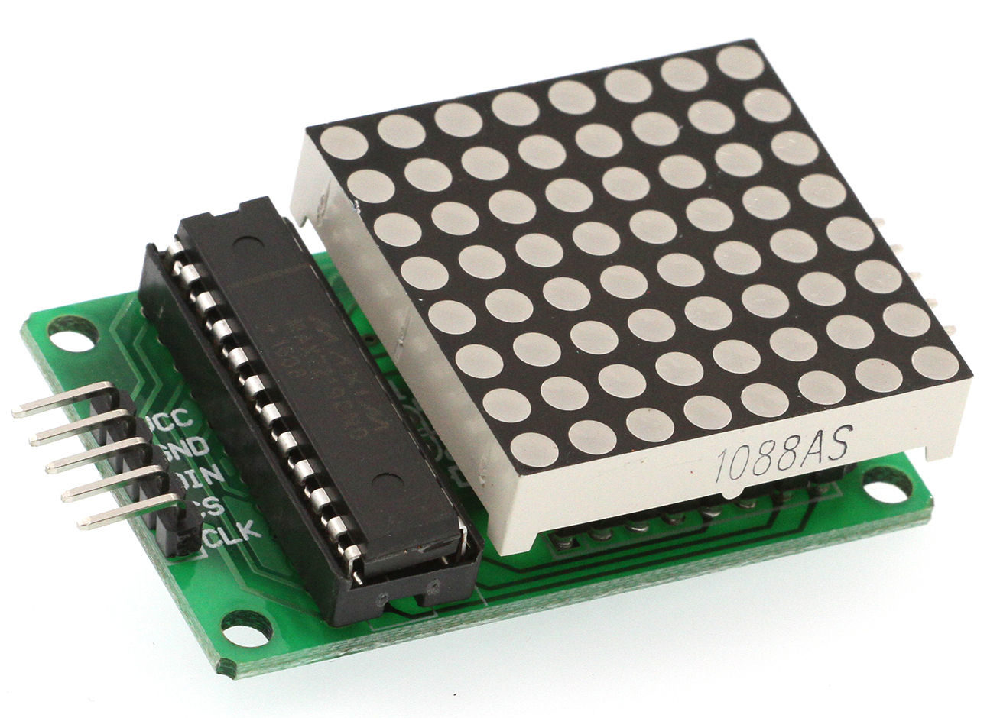

Para programarlo usaremos una librería como la **LedControl** (buscar en el gestor de librerías 7219) cuyo ejemplo **LedDemoMatrix** nos enseña cómo usarlo

### Programación avanzada


La mayoría de estos programas que hemos visto funcionan con lo que se suele llamar arquitectura framebuffer. En ella existen dos variables de tipo matriz que contienen una, la imagen dibujada en un momento dado y la otra la siguiente imagen que queremos dibujar. Cuando esta segunda esté terminada, las intercambiamos  pasando a dibujar la actual. De esta manera minimizamos el tiempo de repintado, evitando parpadeos indeseados.

Tenemos 2 tareas:

* Una asociada a un temporizador que se limita a transferir los pixeles de la pantalla a los puertos. Para evitar parpadeos debería de ser lo más rápida posible, sin cálculos. La llamaremos Copia
* La que va dibujando en función de la "física" del programa. La llamaremos Dibuja

Si el dibujo es complejo tendremos 2 copias del array donde almacenar la pantalla. Copia usará la primera copia para transferir a los puertos (si es viable se pueden usar puertos directamente). Cuando Dibuja termine un frame, cambiará las copias y volverá a empezar a dibujar el frame en el otro.

Este planteamiento se puede usar tanto en matrices como en segmentos. Los segmentos se pueden abstraer como si fueran las filas.

## Hardware específico

Existen determinados chips que nos pueden facilitar el utilizar estas matrices, puesto que se encargan de las tareas de refresco, descargando de esta tarea a Arduino.

### Registros de desplazamiento o 595

Con el Arduino UNO es frecuente que nos quedemos sin pines disponibles. 

Ahí es donde el chip como el 595 nos ayuda pues con solo 3 pines de Arduino podemos controlar 8 salidas. Más aún, los 595 se pueden encadenar y cada 595 que añadamos a la cadena sólo nos costaría 1 pin más y nos daría otros 8 pines mas...

Este tipo de hardaware se llama multiplexores, pues nos permiten controlar (direccionar) muchas salidas con pocos pines de Arduino

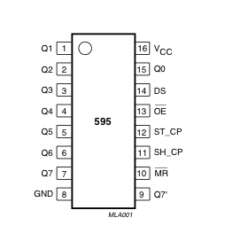

* PINS 1-7, 15 Q0 " Q7 Pines de salidas
* PIN 8 GND Ground
* PIN 9 Q7" Serial Out
* PIN 10 MR Master Reclear, active low
* PIN 11 SH_CP Shift register clock pin
* PIN 12 ST_CP Storage register clock pin (latch pin)
* PIN 13 OE Output enable, active low
* PIN 14 DS Serial data input
* PIN 16 Vcc 

Veamos un vídeo donde se usa un  [registro de desplazamiento 595](https://www.youtube.com/embed/FH3hNBZOvBY)

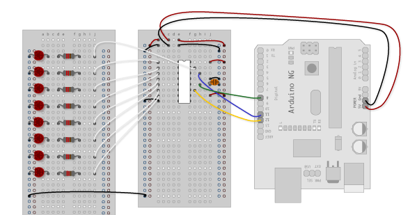

Si conectamos 8 leds (junto con sus resistencias alas salidas Q0 - Q7 y con este código vamos a hacer un contador que cuenta en binario

```C++
//Pin connected to ST_CP of 74HC595
int latchPin = 8;
//Pin connected to SH_CP of 74HC595
int clockPin = 12;
////Pin connected to DS of 74HC595
int dataPin = 11;

void setup() {
  //set pins to output so you can control the shift register
  pinMode(latchPin, OUTPUT);
  pinMode(clockPin, OUTPUT);
  pinMode(dataPin, OUTPUT);
}

void loop() {
  // count from 0 to 255 and display the number
  // on the LEDs
  for (int numberToDisplay = 0; numberToDisplay < 256; numberToDisplay++) {
    // take the latchPin low so
    // the LEDs don't change while you're sending in bits:
    digitalWrite(latchPin, LOW);
    // shift out the bits:
    shiftOut(dataPin, clockPin, MSBFIRST, numberToDisplay);  

    //take the latch pin high so the LEDs will light up:
    digitalWrite(latchPin, HIGH);
    // pause before next value:
    delay(500);
  }
}
```

Vamos a usar ahora un 595 para hacer un indicador luminoso (como los que tenían los equipos de sonido antiguos) que encenderá más o menos leds según el valor del sensor analógico conectado a A0.

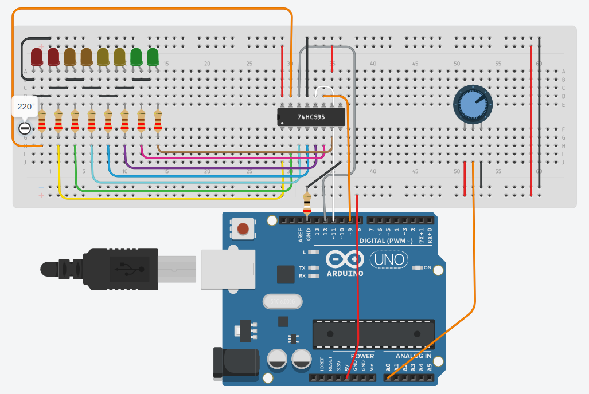

(La resistencia entre GND de Arduino y el GND del 795 es necesaria para limitar la corriente que este envía a los leds. El simulador que es muy puntilloso nos obliga. En un montaje real no sería necesario.)

El programa sería el siguiente:

```C++

int potPin = A0;
  
int LP = 11;      
int CP = 9;   
int DP = 12;   

void updateShiftRegister(byte leds)
{
   digitalWrite(LP, LOW);
   shiftOut(DP, CP, LSBFIRST, leds);
   digitalWrite(LP, HIGH);
}

void setup() 
{
  pinMode(LP, OUTPUT);
  pinMode(DP, OUTPUT);  
  pinMode(CP, OUTPUT);
}

void loop() 
{
  int valorSensor = analogRead(potPin); // entre 0 y 1023
  // En función del valor vamos a encender más o menos sensores
  // uso binario para que se vean los leds que se encienden y los que se apagan
  if (valorSensor<10) {  // Apagamos todos los leds 
     updateShiftRegister(B00000000); 
  } else if (valorSensor<200) { // Encendemos el primer led
     updateShiftRegister(B00000001); 
  } else if (valorSensor<400) { // Encendemos los 2 primeros
     updateShiftRegister(B00000011); 
  } else if (valorSensor<500) { // Encendemos los 3 primeros
     updateShiftRegister(B00000111); 
  } else if (valorSensor<600) { // Encendemos los 4 primeros
     updateShiftRegister(B00001111);     
  } else if (valorSensor<700) { // Encendemos los 5 primeros
     updateShiftRegister(B00111111); 
  } else if (valorSensor<800) { // Encendemos los 6 primeros
     updateShiftRegister( B00111111);     
  } else if (valorSensor<900) { // Encendemos los 7 primeros
     updateShiftRegister(B01111111); 
  } else { // Encendemos todos los leds
  	 updateShiftRegister(B11111111); 
  }
}

```

Lo he montado [en el simulador de Tinkercad](https://www.tinkercad.com/things/g48ROAUai6A)

### 595 y display de 7 segmentos

Vamos a usar ahora el 595 para visualizar un dígito en un display de 7 segmentos. Estos displays no son más 8 leds conectado con una patilla en común, el negativo en nuestro ejemplo. El octavo led es el del punto (DP)

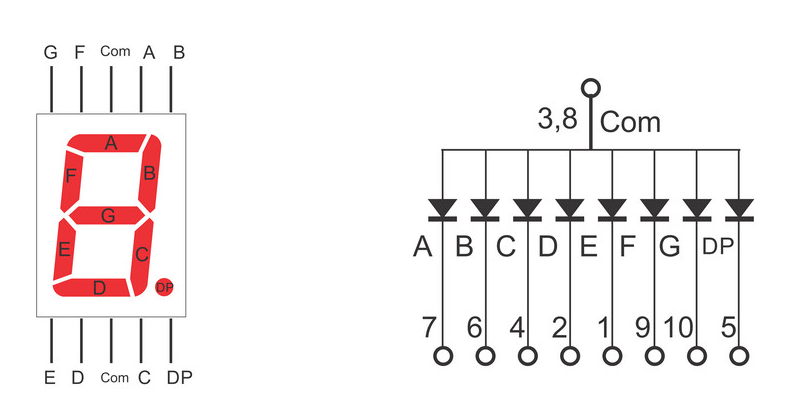

Para mostrar un dígito encenderemos y apagaremos unos leds concretos. Podemos definir en un array el estado de cada leds usando 8 bits que almacenaremos en un byte. Si conectamos las salidas Q0 - Q7 del 595 a los segmentos a - g y DP, el array puede ser el siguiente:

```C++
//    74HC595 pin     Q0,Q1,Q2,Q3,Q4,Q5,Q6,Q7 
//    Segment         a, b, c, d, e, f, g  DP
byte seven_seg_digits[10] = { B11111100,  // = 0
                              B01100000,  // = 1
                              B11011010,  // = 2
                              B11110010,  // = 3
                              B01100110,  // = 4
                              B10110110,  // = 5
                              B10111110,  // = 6
                              B11100000,  // = 7
                              B11111110,  // = 8
                              B11100110   // = 9
                             };

```

Así podemos ver que el para mostrar el **1** sólo tenemos que activar las salidas Q1 y Q2 conectadas a los segmentos B y C

Podemos transformar el montaje anterior cambiando los 8 leds por el display.

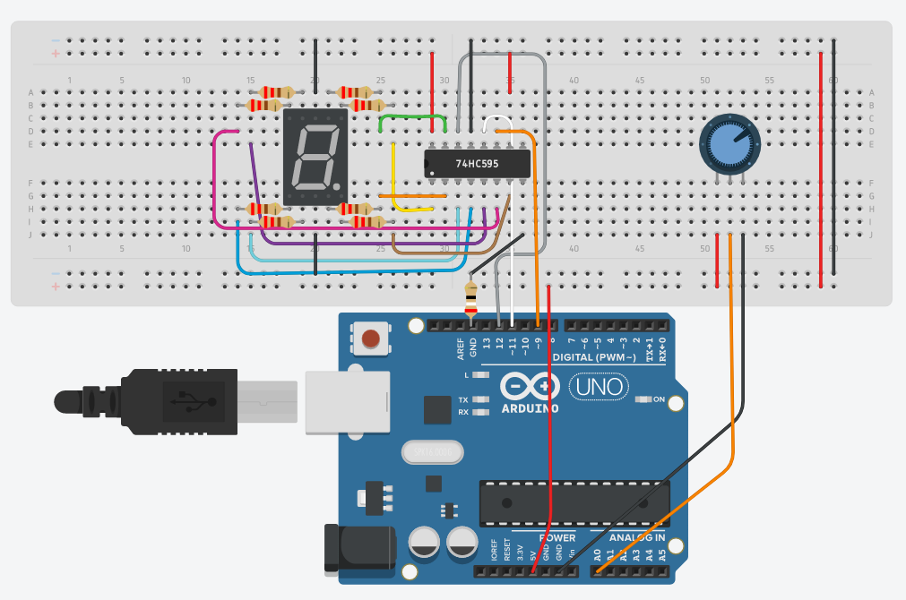

```C++

int potPin = A0;
  
int LP = 11;      
int CP = 9;   
int DP = 12;   

//    74HC595 pin     Q0,Q1,Q2,Q3,Q4,Q5,Q6,Q7 
//    Segment         a, b, c, d, e, f, g  DP
byte seven_seg_digits[10] = { B11111100,  // = 0
                              B01100000,  // = 1
                              B11011010,  // = 2
                              B11110010,  // = 3
                              B01100110,  // = 4
                              B10110110,  // = 5
                              B10111110,  // = 6
                              B11100000,  // = 7
                              B11111110,  // = 8
                              B11100110   // = 9
                             };


void updateShiftRegister(byte leds)
{
   digitalWrite(LP, LOW);
   shiftOut(DP, CP, LSBFIRST, leds);
   digitalWrite(LP, HIGH);
}

void test7Segments(){
  for (byte digit = 10; digit > 0; --digit) {
    updateShiftRegister(seven_seg_digits[digit-1]);
    Serial.println(digit-1);
    delay(1000);
  }
}

void setup() 
{
  pinMode(LP, OUTPUT);
  pinMode(DP, OUTPUT);  
  pinMode(CP, OUTPUT);
  Serial.begin(9600);
  
 // test7Segments();
}

void loop() 
{
  int valorSensor = analogRead(potPin); // entre 0 y 1023
  int numero = map(valorSensor,0,1023,0,9);
  updateShiftRegister(seven_seg_digits[numero]); 
  Serial.println(valorSensor);
  delay(500);
}


```

Ejercicio: define otros caracteres y añadelos al array para poder mostrarlos.

### Encadenando 595

Como hemos dicho podemos encadenar varios 595, sin mas que conectar el **pin 9 Q7" Serial Out** al **pin 14 DS Serial data input**. De esta manera cuando enviemos los datos, el primero pasará los datos sobrantes al siguiente 595

A nivel de programa sólo tenemos que añadir otra llamada a **shiftOut** para enviar todos los datos. A nivel de montaje quedaría algo así:

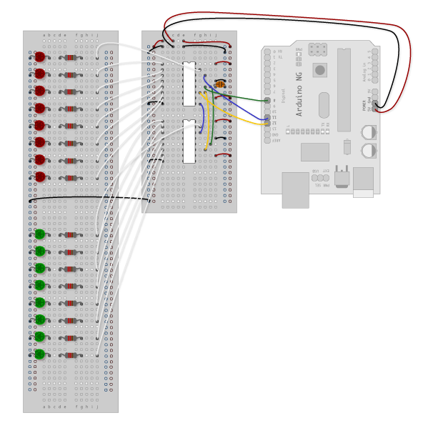

Puedes encontrar más detalles en la [página de shiftout de Arduino](https://www.arduino.cc/en/tutorial/ShiftOut)


### Display de 4 segmentos

Si ahora queremos controlar 4 segmentos tendremos que usar un pequeño truco: encendemos un digito durante un tiempo corto, apagando los otros 3 y vamos rotando. Si lo hacemos suficientemente rápido dará la sensación de que los 4 están encendidos a la vez.

El montaje electrónico requiere de unos transistores para no cargar demasiado los pines de Arduino. Si no tenemos o no queremos usar los transistores, conectaremos directamente los pines correspondientes de Arduino a los pines que seleccionan los dígitos, pero no es conveniente hacerlo porque estamos sobrecargando estos pines y podríamos llegar a estropear nuestra placa.


Puedes ver todos los detalles en [la página de prometec](https://www.prometec.net/display-4digitos/)


El montaje sería el siguiente:

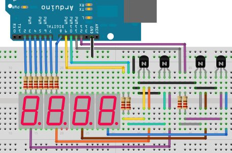

El código sólo se tiene que encargar de ir recorriendo rápidamente los 4 dígitos, activando los segmentos correspondientes de cada uno. Este ejemplo de Inven lo hace así

```C++

// DECLARACIÓN DE VARIABLES 
byte  Digit[10][8] =                // Arduino UNO va muy justo de memoria. Por eso lo
{                                   // definimos como byte y no como int
   { 1,1,1,1,1,1,0,0 },    // 0   
   { 0,1,1,0,0,0,0,0 },    // 1
   { 1,1,0,1,1,0,1,0 },    // 2
   { 1,1,1,1,0,0,1,0 },    // 3
   { 0,0,1,0,0,1,1,0 },    // 4
   { 1,0,1,1,0,1,1,0 },    // 5
   { 1,0,1,1,1,1,1,0 },    // 6
   { 1,1,1,0,0,0,0,0 },    // 7
   { 1,1,1,1,1,1,1,0 },    // 8
   { 1,1,1,0,0,1,1,0 }     // 9
};

// DECLARACIÓN DE FUNCIONES
void Display(int pos, int N)
   {  
       digitalWrite(9 ,LOW);        // Apaga todos los digitos
       digitalWrite(10,LOW);
       digitalWrite(11,LOW);
       digitalWrite(12,LOW);
 
      for (int i= 0 ; i<8 ; i++)    // Esto no cambia de la session anterior
            digitalWrite(i+2 , Digit[N][i]) ;

      digitalWrite(pos + 9, HIGH);      // Enciende el digito pos
  }
void CalculaDigitos( int Num)
   {
    //2386 % 10 = 6          Porque el %  nos devuelve el resto de dividir por 10, o sea 6.
    //2386 % 100 = 86        Ahora hacemos la división entera por 10 o sea 8,los decimales se tiran
    //2386 % 1000 = 386      386 / 100 = 3
    //2386  / 1000 = 2       Directamente, para eso se inventó la división entera.
      int Digit0 = Num %10 ;
      int Digit1 = (Num % 100) / 10 ;
      int Digit2 = (Num % 1000) / 100 ;
      int Digit3 = Num  / 1000)  ;

      Display(3 , Digit3);
      Display(2 , Digit2);
      Display(1 , Digit1);
      Display(0 , Digit0);
   }

// INICIALIZACIÓN DEL PROGRAMA (SE EJECUTA SOLO UNA VEZ)
void setup()
    {
      for (int i= 2; i<13; i++){
        pinMode(i, OUTPUT);
      }
    }


// LOOP CENTRAL DEL PROGRAMA (SE EJECUTA CONSTANTEMENTE DE FORMA SECUENCIAL) 
void loop()
   {
       int n = millis() / 1000 ;       // Lo pasamos a segundos
       int segundos = n % 60  ;
       int minutos =  n / 60  ;

       int k = minutos * 100 + segundos ;
       CalculaDigitos(k) ;
   }


```


### Controlador de leds TLC5940

Otro chip que se usa mucho (por ejemplo en las enormes pantallas leds de los centros comerciales) es el TLC5940.

Veamos un ejemplo usando el chip TLC5940 capaz de controlar 16 led con 4096 niveles de intensidad y con posibilidad de establecer un nivel de iluminación particular para cada uno.

[Vídeo Display led con TLC5940](https://www.youtube.com/embed/LRQ3S20c2kQ)

Ejemplo de montaje de TLC5940

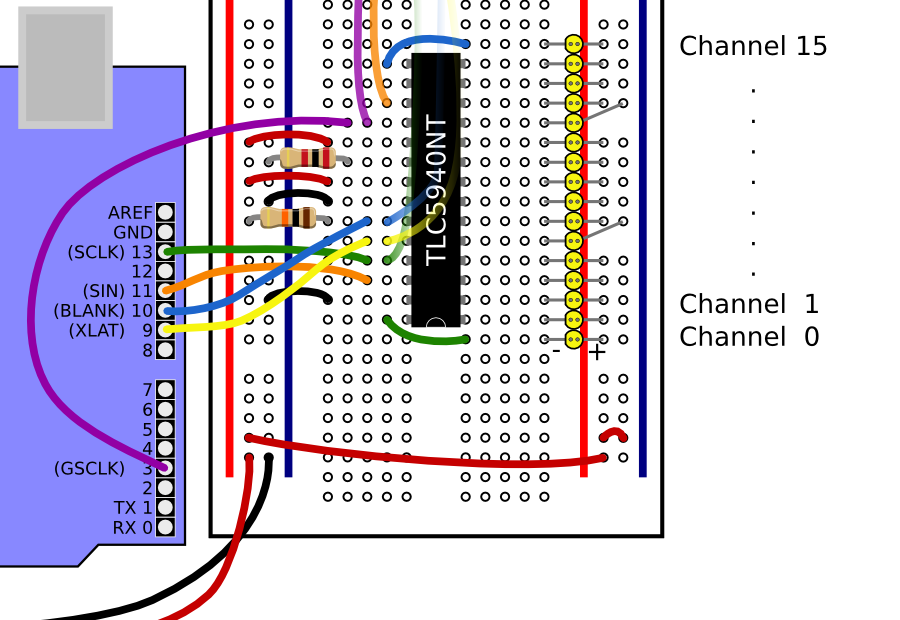

El código usando la librería TLC5940 es sencillo, por ejemplo para repetir nuestro querido ejemplo Kit

```C++
#include "Tlc5940.h"

void setup(){
  Tlc.init();
}

void loop()
{
  int direction = 1;  // Vamos hacia abrriba o abajo
  for (int channel = 0; channel <  16; channel += direction) {

    Tlc.clear();  // apagamos todos

    if (channel == 0) {  // llegamos a un extremo invertimos la direccion
      direction = 1;
    }
    Tlc.set(channel, 4095);  // iluminamos a maximo brillo el que toca
    if (channel == 15) {  // Llegamos al otro extremo invertimos
      direction = -1;
    }

    Tlc.update();  // actualiza los leds con los valores actuales

    delay(75);
  }

}
```
