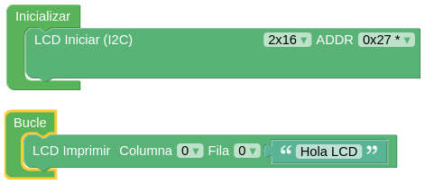
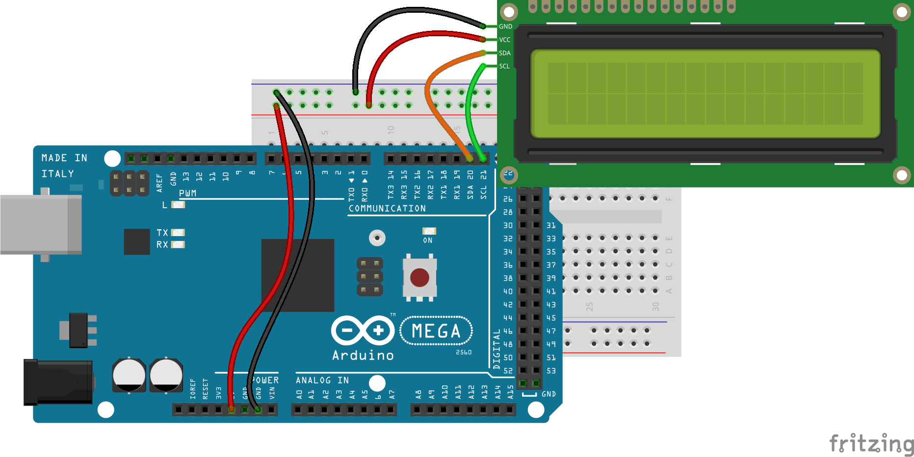
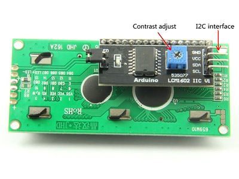
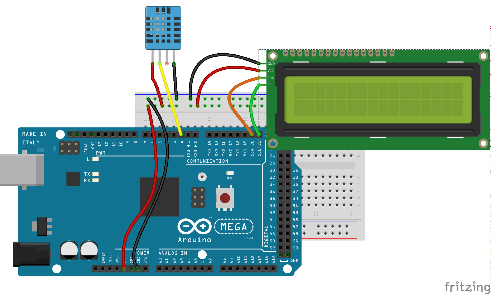
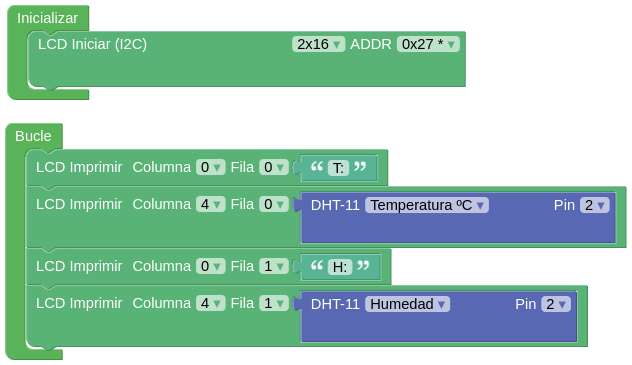
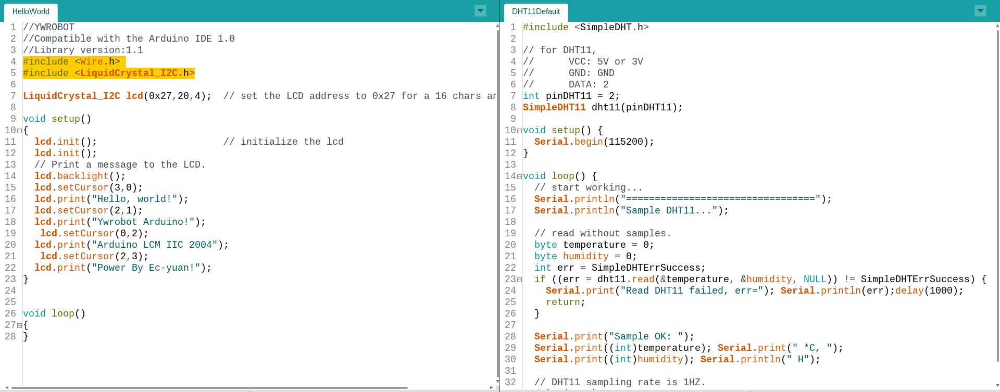
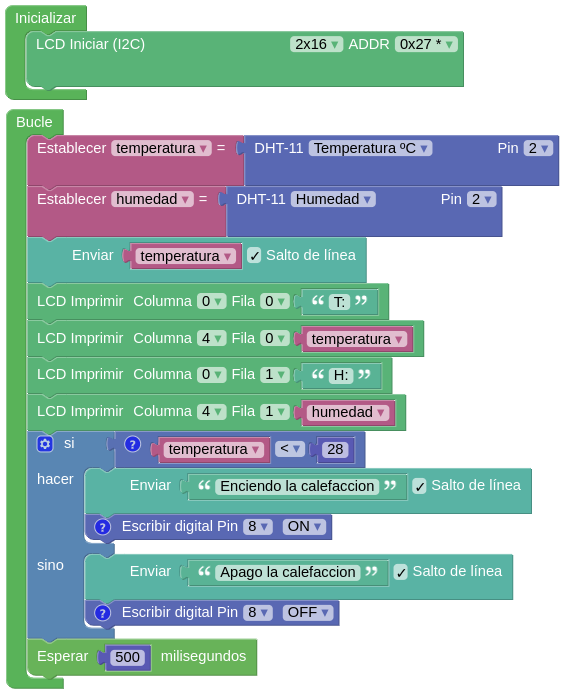
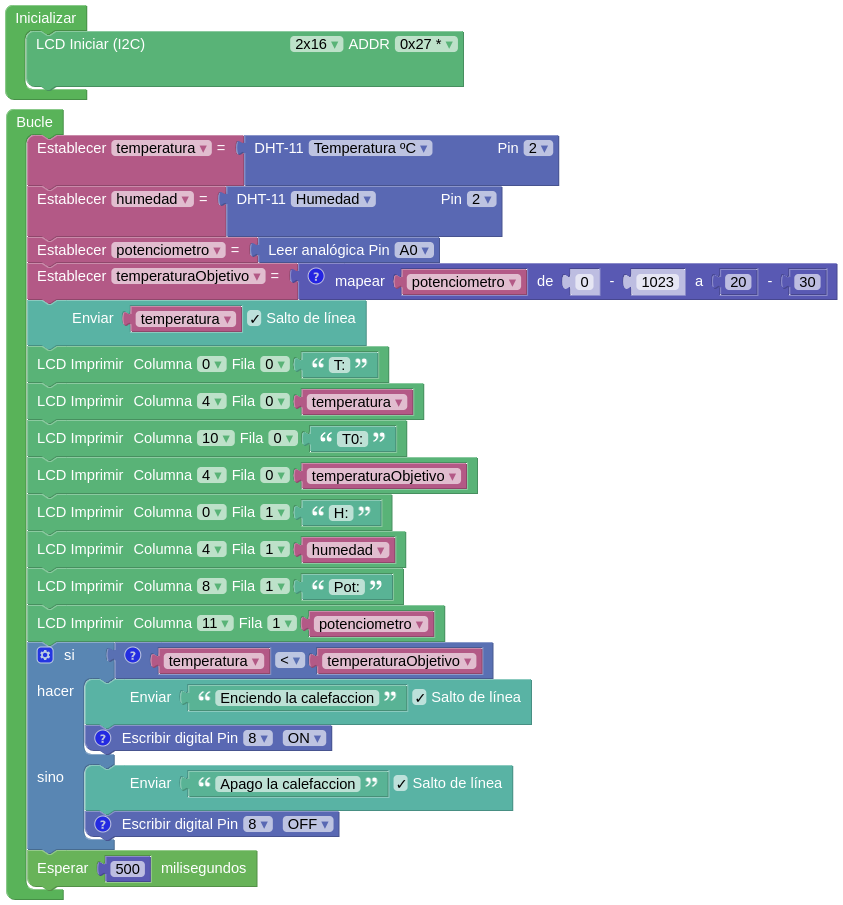

## Proyectos sencillos con pantallas

Vamos a añadir pantallas LCD a algunos de los proyectos que comenzamos en el tema anterior

### Hola LCD I2C

Vamos a hacer un ejemplo sencillo con ArduinoBlocks



Vemos que tenemos que añadir la configuración de nuestra pantalla LCD en la parte de inicializar, donde ponemos todo lo relacionado con la configuración y que se ejecutará al cargar nuestro programa.

Ahí hemos indicado **2x16** que se refiere al número de líneas x columnas de la pantalla y la dirección del fabricante que en nuestro caso es **0x27**

Vemos que usar el LCD es tan sencillo como cuando enviamos los datos vía puerto serie, salvo que este caso tenemos que decidir en qué posición (columna x fila) queremos que se muestren.

El montaje es sencillo: conectamos la alimentación (Vcc y GND) y los pines SCL y SDA de la pantalla y de nuestro Arduino Mega. Si usáramos un Arduino UNO lo pines SCL y SDA están junto al conector USB (están etiquetados por la cara de abajo de la placa).



Al conectarla la pantalla se encenderá. Si al cargar el programa no se ven los caracteres puede ser que tengamos el contraste al mínimo. Podemos ajustarlo con el potenciómetro azul de la parte de atrás:



[Programa ArduinoBlocks para Arduino Mega](http://www.arduinoblocks.com/web/project/286080)

### Mostrando temperatura y humedad en el LCD I2C

Vamos a añadir al montaje un sensor DHT11 para mostrar los valores en el LCD



El programa es sencillo



Sí que puede ocurrir que a veces se queden valores de una escritura para otra (no se borra el LCD y sólo se sobrescriben los caracteres necesarios). Por ello puede ser interesante añadir un bloque **LCD Limpiar**

[Programa para Arduino Mega](http://www.arduinoblocks.com/web/project/286083)


### DHT11 y LCD en Arduino

A partir del ejemplo DHT11Default de la librería SimpleDHT y del HelloWorld de LCD I2C podemos hacer un programa que muestre el valor del sensor DHT11 en la pantalla LCD.

Sólo tenemos que ir uniendo los ejemplos respetando cada una de las regiones y funciones



Quedaría algo así:

```C++
// Includes del DHT
#include <SimpleDHT.h>

// Includes del LCD
#include <Wire.h> 
#include <LiquidCrystal_I2C.h>

// Variables globales del DHT
// for DHT11, 
//      VCC: 5V or 3V
//      GND: GND
//      DATA: 2
int pinDHT11 = 2;
SimpleDHT11 dht11(pinDHT11);


// Variables globales del LCD
LiquidCrystal_I2C lcd(0x27,16,2);  // set the LCD address to 0x27 for a 16 chars and 2 line display


void setup() {
// Setup del DHT
  Serial.begin(115200);
// Setup del LCD  
  lcd.init(); 
  lcd.backlight();
}

void loop() {
  // start working...
  Serial.println("=================================");
  Serial.println("Sample DHT11...");
  
  // read without samples.
  byte temperature = 0;
  byte humidity = 0;
  int err = SimpleDHTErrSuccess;
  if ((err = dht11.read(&temperature, &humidity, NULL)) != SimpleDHTErrSuccess) {
    Serial.print("Read DHT11 failed, err="); Serial.println(err);delay(1000);
    return;
  }
  
  Serial.print("Sample OK: ");
  Serial.print((int)temperature); Serial.print(" *C, "); 
  lcd.setCursor(0,0);  // Para mostrar en el LCD
  lcd.print((int)temperature);
  Serial.print((int)humidity); Serial.println(" H");
  lcd.setCursor(0,1);  // Para mostrar en el LCD
  lcd.print((int)humidity);  
  
  // DHT11 sampling rate is 1HZ.
  delay(1500);
}
```

[Código](./material/codigo/LCDDHT11.ino)


### Termostato

También podemos añadir un LCD a nuestro proyecto de termostato





### Termostato Regulabre

Añadiendo un potenciómetro en A0 podemos hacer regulable nuestro potenciómetro...

