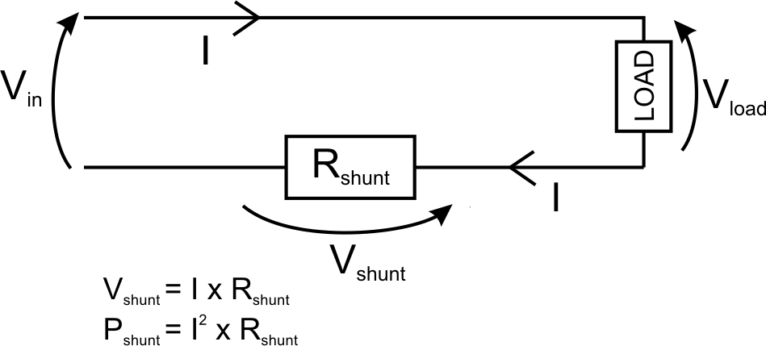

## Sensores

Vamos a ver algunos de los sensores disponibles para conectar con Arduino.

Existen multitud de sensores, y muchos de ellos miden magnitudes semejantes.

Por ejemplo para medir la inclinación podemos usar un simple [Tilt Sensor](http://arduino.cc/es/Tutorial/TiltSensor)  (una bolita que al inclinar el encapsulado hace contacto entre 2 terminales) hasta un avanzado  acelerómetro. Dentro de este último tipo podemos ver varios modelos distintos, cada uno con distinta forma de acceder a sus datos:

* Uno de los más utilizados es el ADXL, podemos ver en el Playground de Arduino, cómo usarlo  http://arduino.cc/en/Tutorial/ADXL3xx

* Otro muy famoso (y de los primeros en integrarse en un único chip) es el “Memsic”. que se usa midiendo la longitud de los pulsos de sus señales en cada salida. En este enlace se puede ver un ejemplo de código. http://arduino.cc/en/Tutorial/Memsic2125

* Otro sistema para medir la inclinación podría ser un mando de consola, como por ejemplo el de la Wii al que podemos conectarnos por I2C.

Podemos ver otro ejemplo de esta variedad sin más que ver que para un mismo sensor podemos encontrar diferentes librerías, con similares características. Por ejemplo para medir distancias con un sensor de ultrasonidos podemos usar la librería Ping  http://arduino.cc/en/Tutorial/Ping?from=Tutorial.UltrasoundSensor y la NewPing http://playground.arduino.cc/Code/NewPing, ambas operativas pero con mejoras la segunda con respecto a la primera.

También podemos encontrar gran diferencia entre la complejidad tecnológica de algunos sensores, frente a la simplicidad manifiesta de otros montajes. Para muestra un botón: un sensor de presión  http://wiki.lvl1.org/Pressure_sensor_with_antistatic_foam realizado con la espuma protectora de los embalajes.

Veamos en [este vídeo](https://www.youtube.com/embed/2foKpM7foXY) una descripción de algunos de los sensores y cómo acceder a ellos.

Continuamos viendo [diferentes tipos de sensores](https://www.youtube.com/embed/jJxwQ3Zlpyo)

Veamos ahora cómo funcionan el sensor de temperatura DS18x20 en [un vídeo](http://www.youtube.com/watch?v=8zr2NwaT5AM&feature=player_embedded)

[Presentación sobre sensores](./Sensores.pdf)

## Sensores de corriente

Un lugar de referencia para el tema de las medidas de corriente es openenergy http://openenergymonitor.org/emon/

Con Arduino podemos medir voltajes por tanto lo que estamos haciendo es convertir la Intensidad que no podemos medir en un Voltaje que si mediremos.

Hemos de tener en cuenta que si vamos a medir grandes corrientes tenemos que estar seguros que la resistencia Shunt que vamos a usar es capaz de disipar la potencia PShunt

Los valores de resistencia de un Shunt deben de ser muy, muy bajos, del orden de los  0,01  Ohmios. Por tanto los Voltajes que tendremos que medir en el ADC de Arduino serán muy pequeños. 

Si tenemos una corriente de  1A tendríamos que medir 0.01V o 10mV. 

Vamos a calcular ahora la resolución de la medida de Arduino. Tenemos que 5V se representan con 1024 valores, lo que equivale a decir que  10mV se representan por 1024*0.01/5=2.

Nuestra experiencia nos dice que las mediciones de ADC de Arduino suelen tener ruido de más de una unidad, lo que  nos lleva a que es totalmente imposible medir estos valores con el Arduino directamente. Para poder hacerlo tendríamos que usar un amplificador operacional. Por ejemplo  AD623 hhttps://www.analog.com/media/en/technical-documentation/data-sheets/AD623.pdf, con el siguiente circuito que nos amplificaría x10 la señal. Con el potenciómetro podemos ajustar la ganancia (el factor multiplicador). Antes de usarlo tendríamos que calibrarlo midiendo la señal con un voltímetro y ajustando los parámetros

[Vídeo sobre Sensores de corriente](https://www.youtube.com/embed/yC_mKsyJCnU)
