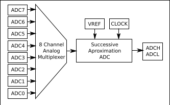

## ADC: Analog to Digital Converter


Un ADC es un sistema electrónico que mide una magnitud analógica proporcionando un valor digital. Se utilizan para medir voltajes normalmente y es el sistema que se usan en las patillas de las entradas analógicas A0 - A5 de Arduino UNO y en A0 - A14 de Arduino Mega.

Puesto que algunos formatos del microcontrolador ATMega328 de Arduino tienen 8 entradas analógicas, hay placas compatibles de Arduino tiene 2 entradas analógicas extras, la A6 y la A8.

En Arduino el ADC es de 10 bits, es decir divide el rango de voltaje que se mide (normalmente 0-5 voltios) en 1024 partes.

Usando el IDE Arduino la forma natural de obtener valores analógicos como ya hemos visto es usando

```C++
  analogRead(EntradaAnalógica)
```

A partir de la lectura podemos hacer fácilmente la conversión a voltios

```C++

int sensorValue = analogRead(analogInPin);   // entre 0 y 1023
float voltios=(5.0*sensorValue) /1023;   // Lo convertimos a voltios

```

Ejercicio: usando una pantalla LCD monta un voltímetro que mida el voltaje conectado a la patilla A0 y lo muestre en pantalla. Para comprobar la calidad de la medida conecta sucesivamente la patilla 5V, la de 3.3V y la de GND a A0, deberías ver en la pantalla los correspondientes voltajes.

### Cambiando el rango de medida

Podemos cambiar el rango de voltaje a medir usando la función **analogReference** que configura el voltaje de referencia usado por la entrada analógica. La función **analogRead** devolverá un valor de 1023 para aquella tensión de entrada que sea igual a la tensión de referencia. Es decir, es como si amplificáramos la señal y en lugar de trabajar entre 0 y 5 voltios lo hiciéramos entre 0 y un valor inferior.

Los posibles valores son:

* **DEFAULT**: Es el valor de referencia analógico que viene por defecto que es de **5 voltios** en placas Arduino y de 3,3 voltios en placas Arduino que funcionen con 3,3 voltios.

* **INTERNAL**: Es una referencia de tensión interna de 1.1 voltios en el ATmega168 o ATmega328 y de 2.56 voltios en elATmega8.

* **INTERNAL1V1**: señal interna de **1.1 voltios**

* **INTERNAL2V56**: señal interna de **2.56 voltios**

* **EXTERNAL**: Se usará una tensión de referencia externa  conectada al pin AREF (debe estar entre 0 y 5 Voltios).

En [este vídeo](https://www.youtube.com/embed/J3vdHNQJI54) se habla del ADC.

### Interioridades del ADC

Aunque en un Arduino UNO disponemos de 6 entradas analógicas, internamente sólo existe un medidor, que mediante un multiplexor accede a cada una de las entradas, guardando la medida de cada patilla



El hardware de Arduino permite leer datos ADC en 2 modos:

* Single Conversion: una sola muestra. Medimos y guardamos en el registro el último valor medido. Es ideal para medidas de valores que cambian rápidamente.
* Free Running: medida continua, se está midiendo todo el rato.

Por defecto se usa la segunda opción. Podría ser deseable usar la primera para bajar el consumo.

DE manera estándar se pueden conseguir 9600 muestras (samples) por segundo con el sistema Arduino UNO. Podemos modificar esta velocidad usando el preescaler (del que ya hablamos cuando lo hicimos sobre los Timers), en [este enlace](http://yaab-arduino.blogspot.com.es/2015/02/fast-sampling-from-analog-input.html) se comenta cómo hacerlo. Para ello tenemos que manipular registros internos del ADC, lo que se sale un poco del nivel de este curso.  

Puedes ver ejemplos de cómo modificar el funcionamiento del ADC en la referencia de [Puertos analógicos avanzados de Enrique Crespo](https://aprendiendoarduino.wordpress.com/2017/09/05/puertos-analogicos-arduino-avanzado/)

### ADC externos

Por supuesto que podemos añadir hardware externo más avanzado con capacidad de usar más bits de resolución y con mayor velocidad, por ejemplo usando el chip ADS1115 podrías alcanzar resoluciones de 16 bits (65536 valores, frente a los 1024 de Arduino) en sus 4 entradas analógicas. Además este chip nos permite amplificar la señal usando lo que se conoce como PGA (Ganancia). Os dejo un [excelente tutorial de Luis Llamas](https://www.luisllamas.es/entrada-analogica-adc-de-16-bits-con-arduino-y-ads1115/) sobre cómo usarlo conectándolo vía I2C.


### Referencias

Para ampliar sobre el tema puedes leer:

[Referencia de Arduino](https://www.arduino.cc/reference/en/language/functions/analog-io/analogreference/)

[Puertos analógicos avanzados by Enrique Crespo](https://aprendiendoarduino.wordpress.com/2017/09/05/puertos-analogicos-arduino-avanzado/)

[Midiendo el propio Vin/Vcc](http://jeelabs.org/2012/05/04/measuring-vcc-via-the-bandgap/)

[ADC Avanzado](https://www.pjrc.com/teensy/adc.html)
