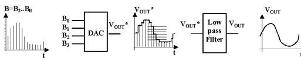
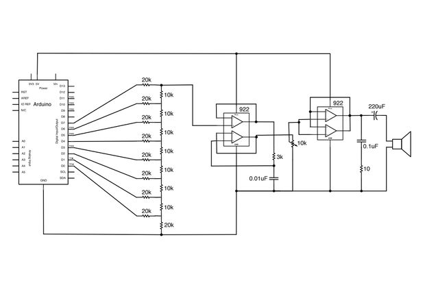
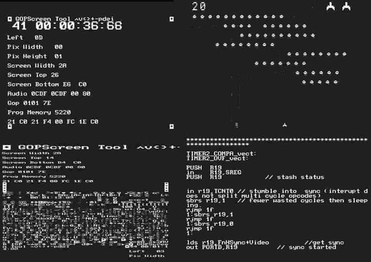

## DAC: Digital to Analog Converter

Podemos decir que el DAC (Digital to Analog Converter) es el proceso inverso al ADC. Es decir a partir de un conjunto de valores digitales obtenemos una señal analógica. Para mejorar la calidad de la señal se la somete  a un filtro paso bajo para suavizar.

El número de bits caracteriza la calidad del DAC, es decir, si usamos un DAC de 10 bits, tendremos una señal con una calidad de V/1024 valores.

Salvo la Arduino DUE, las placas Arduino no disponen de DAC. Como ya vimos si  que nos permiten simularlo con PWM. En todos ellos usaremos la función **analogWrite** para obtener un valor pseudoanalógico.

Sí que podemos crear un DAC usando montajes electrónicos, como una red de resistencias:

Si conectamos este montaje al puerto B (pines 0-7), escribiendo un valor en el puerto, obtendremos un salida analógica proporcional al valor utilizado.

¿Para qué podemos usar un DAC?

* Para producir sonido de más calidad
* Para generar señales más precisas
* Generar señales de vídeo ... Utilizando un sistema de refresco suficientemente rápido y bien sincronizado y un montaje, muy, muy sencillo (sólo 2 resistencias)  se puede generar una señal analógica capaz de visualizarse como vídeo en una TV. Más detalles en [este instructable](http://www.instructables.com/id/MRETV-Video-Stereo-Sound-and-much-more-from-a-s/)

En [este vídeo](https://www.youtube.com/embed/ZNeFd8kK9h0) hablamos del DAC.
