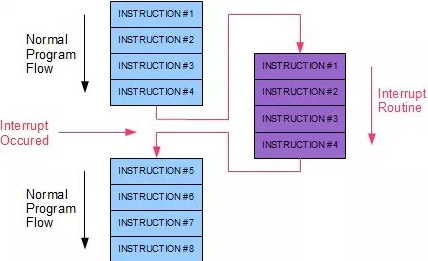
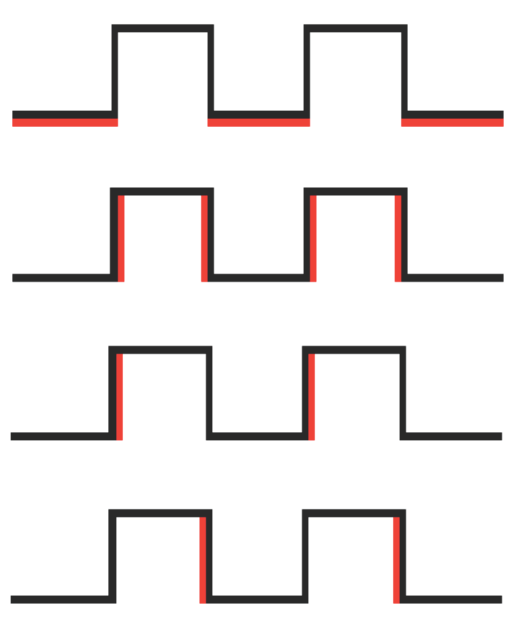

## Interrupciones hardware

A veces es necesario que nuestro microcontrolador detecte de forma muy rápida cambios en los dispositivos externos. Ademas sería ideal si pudiéramos conocer cuando se producen esos cambios sin tener que estar revisando su estado continuamente.

Decimos que hacemos **polling** cuando nuestro programa revisa constantemente un sensor para ver un cambio. El caso contrario sería que el sistema nos avisara cuando se produce un cambio, a esto lo llamamos interrupción hardware. Para que se produzca una interrupción hardware, el microcontrolador debe disponer de una electrónica capaz de hacerlo.

El sistema nos avisará de que se ha producido una interrupción ejecutando inmediatamente la función que nosotros le habremos proporcionado en la llamada, saltando desde el punto del programa principal que se estaba ejecutando y al que volverá al terminar la interrupción.



Los microcontroladores utilizados en Arduino (ATMega) disponen de varias patillas capaces de generar interrupciones hardware ante cambios de su estado. En concreto en Arduino UNO, las interrupciones externas llamadas INT0 e INT1 están asociadas a los pines 2 y 3. El Arduino Mega tiene otras 4: INT2 (pin 21), INT3 (pin 20), INT4 (pin 19) y INT5 (pin 18) )

Podemos configurarlas para que nos avisen dependiendo del cambio de estado como:

* estado bajo -> LOW
* cambio -> CHANGE
* de subida  -> RISING
* de bajada  -> FALLING



Para activar una interrupción sólo tenemos que llamar al método **attachInterrupt** con el  número de interrupción a usar, la función a la que se llamará cuando se produzca y el tipo de cambio a detectar

Veamos un ejemplo donde hemos conectado un led al pin 11 (con su resistencia) y un pulsador en el pin 2 (interrupción hardware 0)

Para obtener el número de interrupción correspondiente a un pin podemos usar la función **digitalPinToInterrupt(PinInterrupcion)**

```C++
const int  led_pin = 11;
volatile int estado = LOW ;

void setup() {
pinMode(led_pin,OUTPUT);
// configuramos interrupcion
attachInterrupt(digitalPinToInterrupt(2) ,parpadeo, CHANGE); // Pin 2
}

void loop() {
    digitalWrite(led_pin , estado);
}

// Funcion que se llamara en la interrupcion
void parpadeo(){
  if(estado == HIGH ) {  // estado = !estado;
    estado = LOW ;
  } else {
    estado = HIGH;
  }
}
```

Donde vemos que la función parpadeo se encarga de cambiar el estado del pin cada vez que pulsamos el pulsador

Podríamos estar tentados de mover la llamada de **digitalWrite** al método parpadeo. Lo hemos dejado así por 2 razones:

* El código ejecutado en las funciones de las interrupciones debe ser lo más corto posible. No olvidemos que estamos interrumpiendo el código "principal"

* Así demostramos que estamos haciendo parte del procesamiento en 2 sitios distintos

Hay que tener cuidado con los cambios que se hacen a las variables en una interrupción pues podrían entrar en conflicto con los valores que tenían, por eso se marcan esas variables como **volatile** para el compilador lo tenga en cuenta.

Vamos a añadir al ejemplo un contador que se incrementará con cada pulsación

```C++
const int  led_pin = 11;
volatile int estado = LOW ;
volatile int contador = 0;

void setup() {
    Serial.begin(9600);
    pinMode(led_pin,OUTPUT);
    // configuramos interrupcion
    attachInterrupt(0 ,parpadeo , CHANGE  ); // Pin 2

}

void loop() {
    digitalWrite(led_pin , estado);
    Serial.println(contador);
    delay(100);
}

// Funcion que se llamara en la interrupcion
void parpadeo(){
  if(estado == HIGH ) {  // estado = !estado;
    estado = LOW ;
  } else {
    estado = HIGH;
  }
  contador = contador +1;
}
```

Los micros ATMega tienen muchas más posibilidades de interrupciones, pero no todas están soportadas por Arduino. En [esta página](https://sites.google.com/site/qeewiki/books/avr-guide/external-interrupts-on-the-atmega328) hablan de ello.


En el [siguiente vídeo](https://www.youtube.com/embed/n5tkYR5PT0c) se habla de interrupciones hardware.

### Interrupciones PCINT

Aunque anteriormente hemos dicho que las interrupciones están vinculadas a pines concretos, los micros de los Arduino soporta un tipo de interrupción hardware menos sensible (menos rápida) y menos precisa llamada **PCINT**

Esta interrupción no nos avisa del pin concreto, sino del puerto. Recuerda que los pines están agrupados en puertos (A, B, C, ...)

Tampoco son tan precisas, puesto que no nos dicen el tipo de cambio sino que el estado se ha modificado.

Para utilizarlas puedes usar la librería [YetAnotherArduinoPcIntLibrary](https://github.com/paulo-raca/YetAnotherArduinoPcIntLibrary) de Paulo Raca

En el [tutorial de Luis Llamas](https://www.luisllamas.es/interrupciones-en-todos-los-pines-de-arduino-con-pcint/) podemos encontrar  un sencillo ejemplo para ver su uso:

```C++
#define PCINT_PIN A5
 
#include <YetAnotherPcInt.h>
 
void pinChanged(const char* message, bool pinstate) {
  Serial.print(message);
  Serial.println(pinstate ? "HIGH" : "LOW");
}
 
void setup() {
  Serial.begin(115200);
  pinMode(PCINT_PIN, INPUT_PULLUP);
  PcInt::attachInterrupt(PCINT_PIN, pinChanged, "Pin has changed to ", CHANGE);
}
 
void loop() {}
```

### Usos de las interrupciones

Veamos algunos ejemplos prácticos: 

* Contador de revoluciones: Para contar las revoluciones de un Spinner https://github.com/javacasm/Spinners Usaremos un sensor de luz o un sensor magnético. Adaptamos código para lcd i2c y añadimos el uso de interrupciones https://www.taringa.net/+hazlo_tu_mismo/arduino-construye-un-contador-de-revoluciones_hw92p

* Tacómetros: medida de la velocidad de giro de un dispositivo https://create.arduino.cc/projecthub/mitov/measure-motor-speed-rpm-with-optocoupler-and-encoder-disk-c3a0e4

* Medida de distancias con precisión: podemos añadir un encoder al eje de la rueda y medir con precisión su desplazamiento. En este ejemplo puedes ver cómo hacerlo con bloque https://zaragozamakerspace.com/index.php/lessons/curso-arduino-y-robotica-sensor-optico-encoder-wheel/

### Documentación

https://www.luisllamas.es/que-son-y-como-usar-interrupciones-en-arduino/

https://aprendiendoarduino.wordpress.com/2016/11/13/interrupciones/
