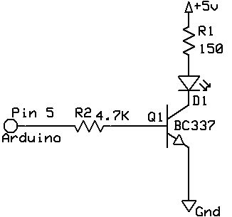
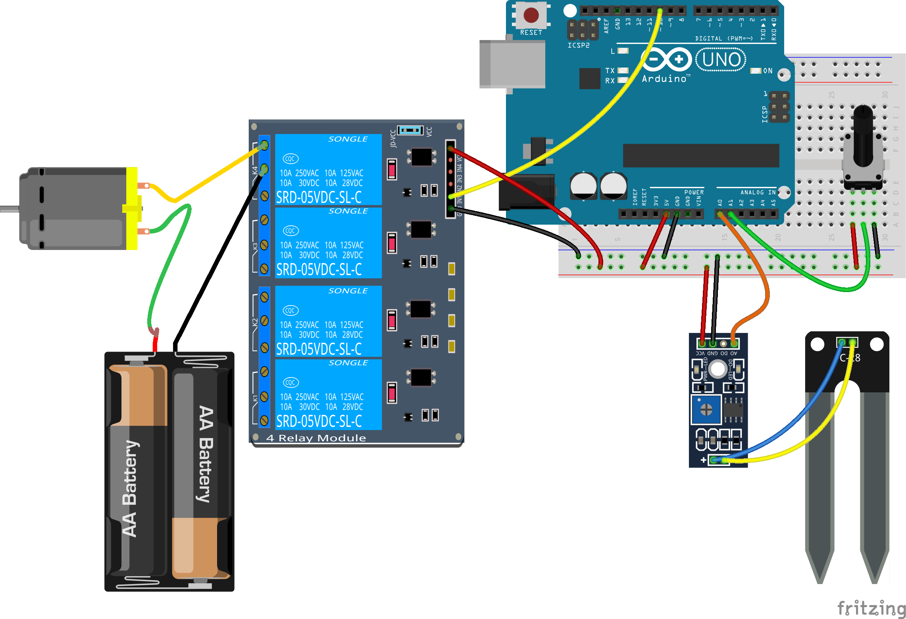
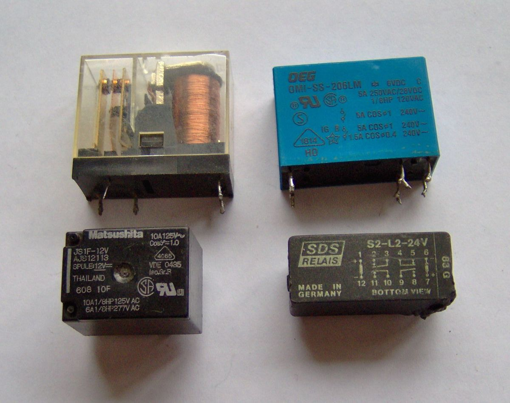
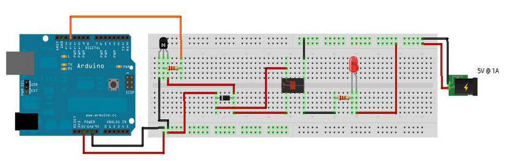

## Tema 9 - Control de potencia

En este tema vamos a aprender a controlar dispositivos que requieren de más potencia para funcionar,como pueden ser los motores o los dispositivos que tenemos en las casas

Empezaremos con una introducción a la electrónica de potencia.


[Vídeo sobre electrónica de potencia](https://youtu.be/8xaS2t1M5R4)

### Controlando la potencia

Cuando necesitemos trabajar con potencia, necesitaremos usar electrónica externa. Usaremos circuitos capaces de soportar esa potencia y que utilicen la salida de Arduino como disparador.

Cómo hemos visto en la parte de electrónica podremos hacer esto con un transistor o con relé.

Usaremos el relé cuando el control que necesitamos es de tipo digital todo/nada o cuando trabajemos con corriente alterna.

El transistor nos va a permitir controlar la cantidad de potencia pero sólo para corriente continua. Si lo controlamos con una señal PWM podemos conseguir que esa señal de pequeña potencia de Arduino se "amplifique" por medio de es transistor.

El montaje típico para un transistor es el siguiente





En primer lugar vamos a ver como lo haríamos con un transistor, vemos como conectamos el pin de Arduino a la base del transistor. Para un led de los que estamos acostumbrados no es necesarios en absoluto, 


### Montajes con transistor

Vamos a ver un típico montaje con transistor: vamos a controlar la iluminación de una tira de leds. Normalmente funcionan a 12V y no a 5 como nuestro Arduino. Además requieren de bastante potencia y además queremos controlar su brillo usando PWM.

Es el trabajo ideal para unos transistores. Como vamos a usar bastante potencia se recomienda usar unos transistores diseñados para ello que se llaman mosfet. 

El montaje sería así:


El programa no cambia, sería el mismo, donde se utiliza el PWM sobre los pines para controlar el color deseado.

#### El relé

Como hemos dicho un relé puede activar circuitos de corriente alterna o continua y funciona como un interruptor

Vamos a ver cómo usar un relé en corriente alterna como interruptor electrónico, por eso hemos cortado el cable negro de la bombilla y lo hemos hecho pasar por los contactos del relé. Cuando activemos el relé se cerrarán los contactos y la alimentación llegará a la bombilla.


# ¡¡ CUIDADO AL USAR VOLTAJES DOMÉSTICOS !!

[¡¡Danger!!](./images/Dangers-of-electric-shock.jpg)

Para activarlo basta con usar la instrucción **digitalWrite** sobre la patilla al que lo hemos conectado

Un montaje más sencillo podía ser este sistema de riego que activa o no la bomba de riego (representada por un motor a pilas)




Con su correspondiente código

```C++
#define SERIAL_BAUD 9600    // Configuracion de conexion serie

#define PIN_HUMEDAD_SUELO A1
#define PIN_POTENCIOMETRO A0

#define PIN_RELE          10

#define ESPERA            1000

void setup() {
  Serial.begin(SERIAL_BAUD);
  pinMode(PIN_RELE,OUTPUT);
}

void loop() {

    int iHumedad=1023-analogRead(PIN_HUMEDAD_SUELO);
    int iPotenciometro=analogRead(PIN_POTENCIOMETRO);

    Serial.print("Potenciometro:");
    Serial.print(iPotenciometro);
    Serial.print(" Humedad:");
    Serial.println(iHumedad);

    if(iPotenciometro>iHumedad){
      enciendeRiego();
    }else{
      apagaRiego();
    }
    delay(ESPERA);
}

void enciendeRiego(){
  digitalWrite(PIN_RELE,HIGH);
  Serial.println("Riego encendido");
}

void apagaRiego(){
  digitalWrite(PIN_RELE,LOW);
  Serial.println("Riego apagado");
}
```

En [este vídeo](https://www.youtube.com/embed/ce6yDScD_Nk) vamos a ver cómo trabajar con un relé

### Ejercicios

Actualizar los ejemplos que hemos hecho de termostatos, sistemas de riego, .... con relé

### Usando un componente de relé



Si queremos controlar un relé usando el componente (no un módulo que ya trae electrónica) vamos a necesitar un transistor, porque la salida de la patilla de Arduino no es suficiente. El transistor sí que es capaz de entregar suficiente potencia para activar el relé. Para activar un relé, sustituiremos la resistencia y el led por la bobina de activación del relé. Podemos ver cómo conectarlo en una breadboard.



En el circuito aparece también un diodo que actúa como protección de nuestra placa Arduino.
