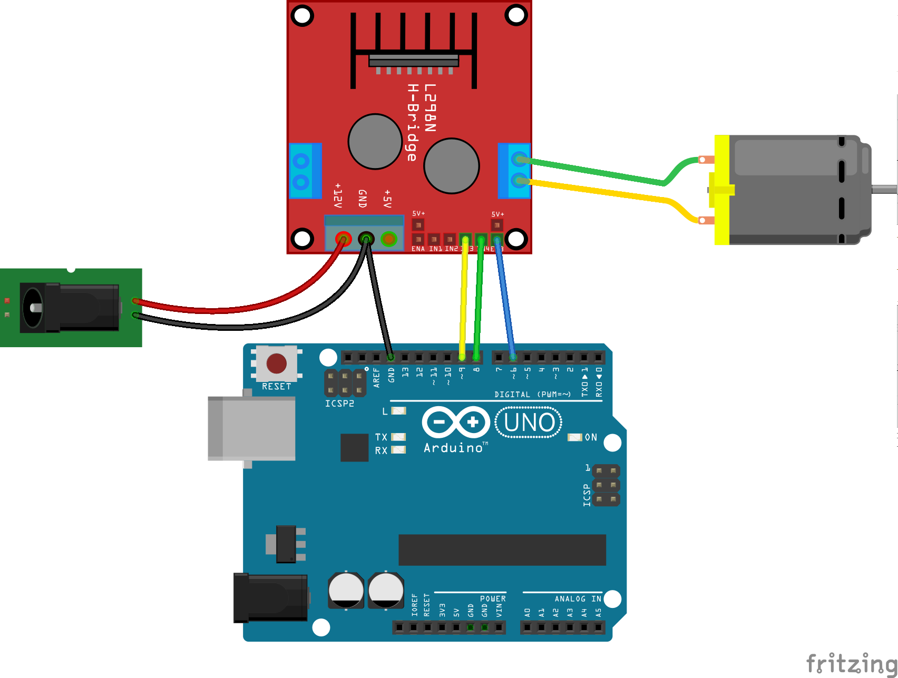

### Motores

Existen diferentes tipos de motores según queramos velocidad o precisión de movimiento. Cada uno de estos tipos tiene sus características y se controla de diferente manera.

En [este vídeo](https://www.youtube.com/embed/X16wCRL1F0s) vamos a ver también un resumen de los diferentes tipos de motores disponibles

Para controlarlos se suelen usar módulos o shields. Veamos algunos de ellos y cómo usarlos en [este vídeo](https://www.youtube.com/embed/8EddjPe2ZVk)

### Motores de corriente continua (CC)

Son los típicos motores que suelen venir en los juguetes y que se alimentan con corriente continua. Tienen la característica que si se les da más potencia (más voltaje o un % de PWM mayor) giran más deprisa.

Para controlarlos se suele usar un driver de tipo L298 o L293

Veamos como se hace con el L298, capaz de controlar 2 motores, aunque nosotros en el esquema solo usamos 1



Para controlarlo usaremos los pines IN3 y IN4 con los controlaremos la dirección de giro del motor y el EnB que nos permitirá controlar la velocidad.

Este sería el código:

```C++
    // Variables globales

    const int EnB=6;
    const int In3=9;
    const int In4=8;

    // Valores de velocidad maxima y minima
    const int Max_Speed=255;
    const int Min_Speed=0;


    void setup() {
      pinMode(In3,OUTPUT);  // Establecemos los pines In3 e In4 como salida
      pinMode(In4,OUTPUT);
    }
    // Establece la velocidad con el valor del PWM del pin EnB
    void setSpeed(int speed){
      analogWrite(EnB,speed);
    }

    // Arrancamos a maxima velocidad
    void start(){
        analogWrite(EnB,Max_Speed);
    }

    // Paramos el motor
    void stop(){
       analogWrite(EnB,Min_Speed);
    }

    // El motor gira en sentido horario
    void clockWise(){
      digitalWrite(In3,HIGH);
      digitalWrite(In4,LOW);
    }

    // El motor gira en sentido antihorario
    void antiClockWise(){
      digitalWrite(In3,LOW);
      digitalWrite(In4,HIGH);
    }

    void loop() {
      clockWise();
      // Vamos aumentando la velocidad
      for(int i=0;i<=255;i+=5){
        setSpeed(i);
        delay(200);  
      }
      stop();
      delay(1000);
      antiClockWise();
      // Vamos aumentando la velocidad
      for(int i=0;i<=255;i+=5){
        setSpeed(i);
        delay(200);  
      }
      stop();
      delay(1000);
    }
```

### Motores paso a paso (steppers)

En [este vídeo](https://www.youtube.com/embed/wYrhoYnbLmo) hablamos de los motores paso a paso o Steppers

Son muchas las librerías que existen para ayudarnos a manejar los motores paso a paso:

* [Stepper](http://arduino.cc/en/Reference/Stepper)

* [AFMotor](http://learn.adafruit.com/adafruit-motor-shield)

* [AccellStepper](http://www.airspayce.com/mikem/arduino/AccelStepper/) , con unas característica como que permite acelerar (ahorrando consumo) y funcionamiento asíncrono

Un problema que nos encontramos a veces es que no conocemos la estructura interna y el cableado de un motor paso a paso. Veamos [un vídeo sobre cómo averiguar la estructura interna de un motor paso a paso](https://www.youtube.com/embed/ynLkdyOZYmk)

Veamos un ejemplo de control de un stepper


Para hacerlo girar podríamos usar una secuencia adecuada de digitalWrites (como hacen en [este ejemplo](https://raw.githubusercontent.com/osoyoo/Osoyoo-development-kits/master/Osoyoo%20lessons%20for%20Arduino/Stepper.zip))


O podemos usar la librería Stepper

```C++
      #include <Stepper.h>

      int in1Pin =11;
      int in2Pin =10;
      int in3Pin =9;
      int in4Pin =8;

      Stepper motor(512, in1Pin, in2Pin, in3Pin, in4Pin);

      void setup()
      {
        pinMode(in1Pin, OUTPUT);
        pinMode(in2Pin, OUTPUT);
        pinMode(in3Pin, OUTPUT);
        pinMode(in4Pin, OUTPUT);

        Serial.begin(9600);
        motor.setSpeed(20);
      }

      void loop()
      {
        if(Serial.available())
        {
          int steps =Serial.parseInt();
          motor.step(steps);
        }
      }
```
O controlar su velocidad con un potenciómetro

```C++
    #include <Stepper.h>

    #define STEPS 512

    Stepper stepper(STEPS, 8, 10, 9, 11);

    int Pval = 0;
    int potVal = 0;

    void setup() {
      Serial.begin(9600);
      stepper.setSpeed(200);
    }

    void loop() {

      potVal = map(analogRead(A0),0,1024,0,500);
      if (potVal>Pval)
        stepper.step(5);
      if (potVal<Pval)
        stepper.step(-5);

      Pval = potVal;

      Serial.println(Pval); //for debugging
    }
```

### Referencia

En [este enlace](http://www.solarbotics.net/library/pieces/parts_mech_steppers.html) se habla sobre motores paso a paso o steppers.

[Control de un stepper barato](https://www.luisllamas.es/motor-paso-paso-28byj-48-arduino-driver-uln2003/)

[Sobre motores](https://aprendiendoarduino.wordpress.com/2016/07/04/motores/)
